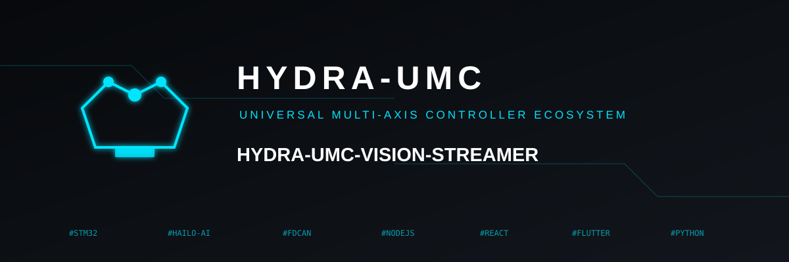
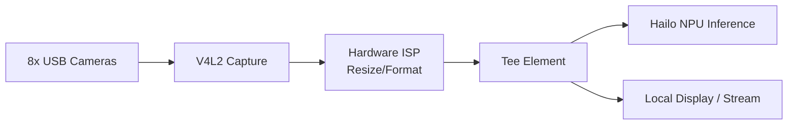

<p align="center">
  
</p>

# 📹 HYDRA-UMC-VISION-STREAMER

<p align="center">🇺🇸 <b>English</b> | <a href="README_spa.md">🇪🇸 Español</a> | <a href="README_fra.md">🇫🇷 Français</a> | <a href="README_ita.md">🇮🇹 Italiano</a> | <a href="README_deu.md">🇩🇪 Deutsch</a> | <a href="README_zho.md">🇨🇳 简体中文</a> | <a href="README_jpn.md">🇯🇵 日本語</a></p>

### 🚀 Optimized GStreamer Pipeline for Multi-Camera Edge AI

<p align="left">
  
  
  
  
  
</p>

---

## 1. 🛠️ TECHNICAL OVERVIEW

**HYDRA-UMC-VISION-STREAMER** is intended to be the high-performance media ingestion layer of the Vision AI Node family. Its job is the low-level capture, pre-processing, and distribution of up to 8 concurrent USB 3.0 camera streams, using the hardware-accelerated ISP of the Broadcom BCM2712 (CM5) to do color-space conversion, resizing, and normalization before frames reach the Hailo-8 NPU.

This is one of the 4 children of **[HYDRA-UMC-VISION-NODE](https://github.com/JuanenRac/HYDRA-UMC-VISION-NODE)**, the family's integration parent: this project owns capture/pre-processing only, and does not run its own Hailo-8 inference, gRPC API, or safety logic - that is deliberately split across its 3 siblings.

### Key Points

* ✅ **Real v0 - config, pipeline, and relay generation:** `config.py` validates a per-camera JSON config (device, resolution, fps, format); `pipeline.py` generates the exact GStreamer pipeline description for a camera; `mediamtx_config.py` generates the matching MediaMTX `paths.yml`. Exposed via `config validate`/`config gst`/`config mediamtx` below - no GStreamer runtime, V4L2, or physical camera needed to run or test any of it.
* 📡 **RTSP/WebRTC Support (partially planned):** the RTSP relay path (`rtspclientsink` → MediaMTX) is designed and its config is generated for real above; actually running it needs the GStreamer runtime this environment doesn't have. WebRTC output remains fully planned.
* ⚡ **Zero-Copy Pipeline (planned):** buffer handoff between V4L2 and HailoRT designed to avoid unnecessary frame copies. *(future work - needs the real V4L2/HailoRT runtime this environment doesn't have.)*
* 🌈 **Hardware Pre-processing (planned):** real-time resizing and pixel format conversion using the Pi's ISP, offloading work the CPU would otherwise have to do per frame. *(future work, same reason.)*
* 🛠️ **Dynamic Configuration:** per-camera resolution, framerate, and pixel format are real and validated today (`config.py`); exposure/gain control needs the real V4L2 device and is future work.
* 🧩 **Why it exists as its own project:** capture/ISP tuning is a different skill and a different failure domain than model inference or safety logic - keeping it in its own process means a capture bug cannot take down [HYDRA-UMC-SAFETY-ZONES](https://github.com/JuanenRac/HYDRA-UMC-SAFETY-ZONES), and the two can be developed/tested independently.

**Honesty check - what actually runs today:** the config validation, GStreamer pipeline description generation, and MediaMTX relay config generation (`config.py`, `pipeline.py`, `mediamtx_config.py`) are real and tested (24 tests). None of it opens a V4L2 device, imports GStreamer, or talks to a physical camera - actually running the generated pipeline needs that real runtime and hardware, which this environment doesn't have. See [`CHANGELOG.md`](CHANGELOG.md) for exactly what has shipped so far, and "Current Status & Next Steps" below for what remains open.

---

## 2. 🔄 INTENDED PIPELINE ARCHITECTURE

The diagram below is the target data flow this project is being built towards - the *shape* of it (which element feeds which, the `Tee` split) is fixed by `pipeline.py` and generated as real `gst-launch-1.0` syntax today, but nothing in this diagram executes yet: that needs the real V4L2/GStreamer/Hailo-8 runtime and physical USB cameras.



---

## 3. 🧠 ADVANCED TECHNICAL INFORMATION

### Why no `hardware/`, `firmware/`, `os/` or `models/` here

CM5 + Hailo-8 is off-the-shelf hardware with no board of its own to design, unlike the custom STM32H745/STM32G474 boards inside [HYDRA-UMC](https://github.com/JuanenRac/HYDRA-UMC) - so no `hardware/`/`firmware/` folder exists in any of the 5 Vision AI Node projects. `os/` (the shared HydraOS image) and `models/` (the compiled `.hef` files actually served to the NPU) live only in the integration parent, [HYDRA-UMC-VISION-NODE](https://github.com/JuanenRac/HYDRA-UMC-VISION-NODE), since it is the process that owns the CM5 host image and the Hailo-8 device handle - carrying separate copies here would just be extra state to keep in sync for no benefit.

### Planned pipeline shape

The `Tee` element in the diagram above is the key design decision already made ahead of implementation: captured/pre-processed frames are meant to fan out to two consumers at once - the Hailo-8 inference path (feeding [HYDRA-UMC-VISION-NODE](https://github.com/JuanenRac/HYDRA-UMC-VISION-NODE)) and an optional local display/RTSP-WebRTC stream for human monitoring - without the monitoring path adding latency to the inference path.

### Design decisions already made

* **Version read from installed package metadata, not hardcoded** - `main.py` calls `importlib.metadata.version("hydra-umc-vision-streamer")` instead of a second `__version__` string, so `bump_version.py` only ever has one place to edit and the two can never drift apart.
* **The odometer bump only ever touches `PATCH`/`MINOR` automatically** - `bump_version.py` carries `PATCH` into `MINOR` past 9 and `MINOR` into `MAJOR` past 9, but never bumps `MAJOR` itself; that is a deliberate human decision, same convention as `HYDRA-UMC-EDITOR-URDF/bump_version.py` and `HYDRA-UMC-SUITE/bump_version.py`.
* **MediaMTX YAML is hand-rolled, not built on PyYAML** - `mediamtx_config.py`'s output shape (a flat `paths:` map, one `source: publisher` entry per camera) is simple and fixed enough that a real dependency isn't justified yet. Revisit if per-camera config grows nested/list-valued fields.
* **The pipeline and MediaMTX config must agree on one RTSP path per camera** - `rtsp_url_for()` is the single place that derives it (from the camera name), so `config gst` and `config mediamtx` can never disagree about where a camera's stream lives.

---

## 📂 DIRECTORY STRUCTURE

```text
HYDRA-UMC-VISION-STREAMER/
├── src/                 # Source code (hydra_umc_vision_streamer package)
│   └── hydra_umc_vision_streamer/
│       ├── config.py           # Per-camera config parsing/validation
│       ├── pipeline.py         # GStreamer pipeline description generation
│       ├── mediamtx_config.py  # MediaMTX paths.yml generation
│       └── main.py             # CLI entry point (bare invocation + `config`)
├── tests/               # Real pytest suite (config, pipeline, mediamtx, CLI)
├── docs/                # Documentation and tuning guides
├── build/               # Build output (local .venv lives here too)
├── images/              # Media and diagrams
├── scripts/             # Utility scripts
├── pyproject.toml       # Package metadata, dependencies, odometer version
├── bump_version.py      # Odometer-style version bump (run by build.sh/.bat)
├── build.sh / build.bat # venv + editable install + compile-check + tests
├── run.sh / run.bat     # Runs the entry point from the local venv
└── CHANGELOG.md         # Version-by-version history (odometer scheme, no dates)
```

No `hardware/`, `firmware/`, `os/` or `models/` folder - see "Advanced Technical Information" above for why. `os/` and `models/` live only in the integration parent, [HYDRA-UMC-VISION-NODE](https://github.com/JuanenRac/HYDRA-UMC-VISION-NODE).

---

## 🏗️ BUILD & RUN

### Prerequisites

* **Python 3.10 or newer** on your `PATH` (the scripts try `python3` then fall back to `python`).
* No GStreamer, V4L2 tooling, or other native dependency is required yet - **zero third-party runtime dependencies** at this stage (`dependencies = []` in `pyproject.toml`).
* A few tens of MB of disk space for a local virtual environment under `.venv/`.

### Step by step

```bash
# Linux / macOS
./build.sh
```

1. **Odometer version bump** - runs `bump_version.py`, incrementing `PATCH` in `pyproject.toml` on every build (carrying into `MINOR`/`MAJOR` per the rule above).
2. **Virtual environment** - creates `.venv/` if missing; reuses it otherwise.
3. **Editable install** - `pip install -e ".[dev]"` so `src/` edits take effect immediately, installs `pytest`, and registers the `hydra-umc-vision-streamer` console entry point.
4. **Compile-check** - `python -m compileall -q src` byte-compiles every file under `src/`, catching syntax errors ecosystem-wide even in files `main.py` never imports.
5. **Real test suite** - `python -m pytest tests/ -q` (24 tests covering config, pipeline, MediaMTX generation, and the CLI).

`set -euo pipefail` stops the script at the first failing step; the build only reports success if all 5 pass.

```bash
./run.sh
```

Locates the interpreter inside `.venv` (handling both the POSIX and Windows `.venv` layouts) and runs `python -m hydra_umc_vision_streamer.main`, forwarding any arguments - bare invocation prints name + version + role.

Real example - validate a camera config, generate its GStreamer pipeline, and generate the matching MediaMTX relay config:

```bash
./run.sh config validate --config cameras.json
# 2 camera(s) in cameras.json
#   cam0: /dev/video0 1920x1080@30 MJPG
#   cam1: /dev/video1 640x480@15 YUYV
# config OK

./run.sh config gst --config cameras.json --camera cam0
# v4l2src device=/dev/video0 ! image/jpeg,width=1920,height=1080,framerate=30/1 ! jpegdec ! videoconvert ! tee name=t t. ! queue ! appsink name=cam0_hailo_sink t. ! queue ! rtspclientsink location=rtsp://localhost:8554/cam0

./run.sh config mediamtx --config cameras.json
# paths:
#   cam0:
#     source: publisher
#   cam1:
#     source: publisher
```

```bat
:: Windows - identical steps, batch syntax
build.bat
run.bat
```

### Troubleshooting

* **`python`/`python3` not found** - install Python 3.10+ and ensure it is on `PATH`.
* **`compileall` fails** - a real syntax error was introduced under `src/`; the build stops without touching the install, on purpose.
* **"No `.venv` found" from `run.sh`/`run.bat`** - run `build.sh`/`build.bat` at least once first; `run` never creates the environment itself.
* **Stale editable install** - delete `.venv/` and rebuild; rarely needed since `pip install -e .` normally picks up source changes live.

---

## 🚀 Current Status & Next Steps

**What works today:** per-camera config validation, GStreamer pipeline description generation, and MediaMTX relay config generation (`config.py`, `pipeline.py`, `mediamtx_config.py`, 24 tests), plus a real, installable Python package with a verified entry point and an odometer-style version bump wired into the build. See [`CHANGELOG.md`](CHANGELOG.md) for the captured build/run output.

**What is still open, in no particular order, with no committed timeline, and blocked on real hardware:**

* Actually running the generated pipeline through a real GStreamer/PyGObject runtime and a physical V4L2 device.
* Hardware ISP resize/format conversion (needs the real CM5 ISP).
* The zero-copy handoff into the Hailo-8 runtime owned by [HYDRA-UMC-VISION-NODE](https://github.com/JuanenRac/HYDRA-UMC-VISION-NODE).
* WebRTC output, and per-camera exposure/gain control (needs the real V4L2 device).

---

## 🔗 Related Projects

This project is part of a larger robotics ecosystem by the same author (JuanenRac / Electro Hobby 3D), spanning firmware, control software, AI nodes, and fleet tooling. Worth knowing about, since a request might actually be about one of these rather than this repository.

### Family

**Parent:** **[HYDRA-UMC-VISION-NODE](https://github.com/JuanenRac/HYDRA-UMC-VISION-NODE)** — the integration parent this pipeline feeds.

**Siblings:**
- **[HYDRA-UMC-DETECTION-HEF](https://github.com/JuanenRac/HYDRA-UMC-DETECTION-HEF)** — compiles the `.hef` models the parent loads onto its Hailo-8 NPU.
- **[HYDRA-UMC-SAFETY-ZONES](https://github.com/JuanenRac/HYDRA-UMC-SAFETY-ZONES)** — turns the parent's perception into intrusion detection and E-STOP triggers.
- **[HYDRA-UMC-VISUAL-SERVOING-API](https://github.com/JuanenRac/HYDRA-UMC-VISUAL-SERVOING-API)** — turns the parent's perception into kinematic pose corrections.

This project has no relation directly outside the Vision AI Node family (per the ecosystem's own relationship map) - see "Rest of the Ecosystem" below for everything else.

### Rest of the Ecosystem

**HYDRA-UMC platform** — the multi-robot micro-factory cell
- **[HYDRA-UMC](https://github.com/JuanenRac/HYDRA-UMC)** — the CM5 + STM32H745 motherboard orchestrating up to 8 robot arms.
- **[HYDRA-UMC-SERVER](https://github.com/JuanenRac/HYDRA-UMC-SERVER)** — the Express/WebSocket backend every control client talks to.
- **[HYDRA-UMC-STUDIO](https://github.com/JuanenRac/HYDRA-UMC-STUDIO)** — web-based control dashboard, multi-robot 3D visualization.
- **[HYDRA-UMC-ANDROID-CONTROL](https://github.com/JuanenRac/HYDRA-UMC-ANDROID-CONTROL)** — Android control app over Wi-Fi/Bluetooth.
- **[HYDRA-UMC-IOS-CONTROL](https://github.com/JuanenRac/HYDRA-UMC-IOS-CONTROL)** — iOS/iPadOS control app built in Flutter.
- **[HYDRA-UMC-SUITE](https://github.com/JuanenRac/HYDRA-UMC-SUITE)** — desktop swarm command center (Python/PySide6).
- **[HYDRA-UMC-EDITOR-URDF](https://github.com/JuanenRac/HYDRA-UMC-EDITOR-URDF)** — desktop URDF model editor for the robot catalog.
- **[HYDRA-UMC-DSI](https://github.com/JuanenRac/HYDRA-UMC-DSI)** — native touch UI for the onboard DSI touchscreen.

**URTC platform** — the tool head controller every HYDRA-UMC robot arm carries
- **[URTC](https://github.com/JuanenRac/URTC)** — CAN bus tool head controller, 25 tool profiles.
- **[URTC-FLASHER](https://github.com/JuanenRac/URTC-FLASHER)** — desktop CAN-OTA + SWD/JTAG flashing tool.
- **[URTC-TESTER](https://github.com/JuanenRac/URTC-TESTER)** — desktop live CAN-bus diagnostic tool.
- **[URTC-WEB-STUDIO](https://github.com/JuanenRac/URTC-WEB-STUDIO)** — browser-based alternative via Web Serial API.

**🧠 Cognitive AI Node (Hailo-10)**
- [HYDRA-UMC-COGNITIVE-NODE](https://github.com/JuanenRac/HYDRA-UMC-COGNITIVE-NODE)
- [HYDRA-UMC-VLA-ENGINE](https://github.com/JuanenRac/HYDRA-UMC-VLA-ENGINE)
- [HYDRA-UMC-VOICE-UI](https://github.com/JuanenRac/HYDRA-UMC-VOICE-UI)
- [HYDRA-UMC-SEMANTIC-PLANNER](https://github.com/JuanenRac/HYDRA-UMC-SEMANTIC-PLANNER)
- [HYDRA-UMC-DOCS-QA](https://github.com/JuanenRac/HYDRA-UMC-DOCS-QA)

**🐝 Orchestration & Swarm**
- [HYDRA-UMC-ORCHESTRATOR](https://github.com/JuanenRac/HYDRA-UMC-ORCHESTRATOR)
- [HYDRA-UMC-SWARM-SYNC](https://github.com/JuanenRac/HYDRA-UMC-SWARM-SYNC)
- [HYDRA-UMC-PATH-PLANNER-3D](https://github.com/JuanenRac/HYDRA-UMC-PATH-PLANNER-3D)
- [HYDRA-UMC-JOB-DISPATCHER](https://github.com/JuanenRac/HYDRA-UMC-JOB-DISPATCHER)
- [HYDRA-UMC-NODE-HEALING](https://github.com/JuanenRac/HYDRA-UMC-NODE-HEALING)

**🎮 Digital Twin & Simulation**
- [HYDRA-UMC-TWIN](https://github.com/JuanenRac/HYDRA-UMC-TWIN)
- [HYDRA-UMC-PHYSICS-REPLICA](https://github.com/JuanenRac/HYDRA-UMC-PHYSICS-REPLICA)
- [HYDRA-UMC-HIL-BRIDGE](https://github.com/JuanenRac/HYDRA-UMC-HIL-BRIDGE)
- [HYDRA-UMC-SYNTHETIC-DATA-GEN](https://github.com/JuanenRac/HYDRA-UMC-SYNTHETIC-DATA-GEN)

**📊 Data & Analytics**
- [HYDRA-UMC-DATALAKE](https://github.com/JuanenRac/HYDRA-UMC-DATALAKE)
- [HYDRA-UMC-TELEMETRY-COLLECTOR](https://github.com/JuanenRac/HYDRA-UMC-TELEMETRY-COLLECTOR)
- [HYDRA-UMC-ANOMALY-DETECTOR](https://github.com/JuanenRac/HYDRA-UMC-ANOMALY-DETECTOR)
- [HYDRA-UMC-PRODUCTION-REPORTS](https://github.com/JuanenRac/HYDRA-UMC-PRODUCTION-REPORTS)

**🏭 Industrial Gateway**
- [HYDRA-UMC-GATEWAY-INDUSTRIAL](https://github.com/JuanenRac/HYDRA-UMC-GATEWAY-INDUSTRIAL)
- [HYDRA-UMC-OPCUA-SERVER](https://github.com/JuanenRac/HYDRA-UMC-OPCUA-SERVER)
- [HYDRA-UMC-MQTT-BROKER](https://github.com/JuanenRac/HYDRA-UMC-MQTT-BROKER)
- [HYDRA-UMC-MTCONNECT-ADAPTER](https://github.com/JuanenRac/HYDRA-UMC-MTCONNECT-ADAPTER)

**🛠️ Complementary Tools**
- [URTC-SMART-RACK](https://github.com/JuanenRac/URTC-SMART-RACK)
- [URTC-VISION-TOOL](https://github.com/JuanenRac/URTC-VISION-TOOL)
- [HYDRA-UMC-WATCH](https://github.com/JuanenRac/HYDRA-UMC-WATCH)
- [HYDRA-UMC-TOOL-CLI](https://github.com/JuanenRac/HYDRA-UMC-TOOL-CLI)
- [HYDRA-UMC-DASHBOARD-AI](https://github.com/JuanenRac/HYDRA-UMC-DASHBOARD-AI)

---

## 👤 AUTHOR
**JuanenRac** (Electro Hobby 3D)
📧 electrohobby3d@gmail.com

## 📜 LICENSE
GPL-3.0 - See LICENSE for details.

## 🛠️ BUILD & RUN

Use the non-versioning build check before a release build:

| Action | Windows | Linux / macOS |
|---|---|---|
| Build check (no version or CHANGELOG change) | `build-test.bat` | `./build-test.sh` |
| Run / development (when provided) | `run*.bat` or `dev*.bat` | `./run*.sh` or `./dev*.sh` |

`build-test.bat` and `build-test.sh` compile or validate the project stack without incrementing `hydra-umc.project.json` or modifying `CHANGELOG.md`. They may create normal compiler output only. Existing `build*.bat`, `build*.sh`, `run*` and `dev*` scripts retain their project-specific, versioned or runtime behavior; use them when that behavior is required.