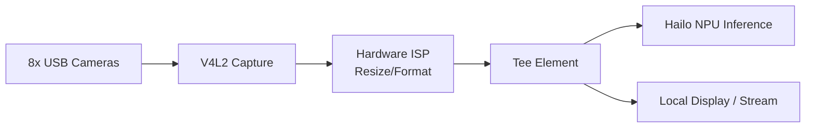

<p align="center">
  
</p>

# 📹 HYDRA-UMC-VISION-STREAMER

<p align="center">🇺🇸 <b>English</b> | <a href="README_spa.md">🇪🇸 Español</a> | <a href="README_fra.md">🇫🇷 Français</a> | <a href="README_ita.md">🇮🇹 Italiano</a> | <a href="README_deu.md">🇩🇪 Deutsch</a> | <a href="README_zho.md">🇨🇳 简体中文</a> | <a href="README_jpn.md">🇯🇵 日本語</a></p>

### 🚀 Optimized GStreamer Pipeline for Multi-Camera Edge AI

<p align="left">
  
  
  
  
  
</p>

---

## 1. 🛠️ TECHNICAL OVERVIEW

**HYDRA-UMC-VISION-STREAMER** is intended to be the high-performance media ingestion layer of the Vision AI Node family. Its job is the low-level capture, pre-processing, and distribution of up to 8 concurrent USB 3.0 camera streams, using the hardware-accelerated ISP of the Broadcom BCM2712 (CM5) to do color-space conversion, resizing, and normalization before frames reach the Hailo-8 NPU.

This is one of the 4 children of **[HYDRA-UMC-VISION-NODE](https://github.com/JuanenRac/HYDRA-UMC-VISION-NODE)**, the family's integration parent: this project owns capture/pre-processing only, and does not run its own Hailo-8 inference, gRPC API, or safety logic - that is deliberately split across its 3 siblings.

### Key Points

* ✅ **Real v0 - config, pipeline, and relay generation:** `config.py` validates a per-camera JSON config (device, resolution, fps, format); `pipeline.py` generates the exact GStreamer pipeline description for a camera; `mediamtx_config.py` generates the matching MediaMTX `paths.yml`. Exposed via `config validate`/`config gst`/`config mediamtx` below - no GStreamer runtime, V4L2, or physical camera needed to run or test any of it.
* 🔁 **Real v0 - bounded buffering and reconnection:** `buffer.py`'s `FrameBuffer` is a fixed-capacity queue that drops the OLDEST frame (never the newest) once full - the real backpressure policy a live relay needs so a slow consumer can never make this process's memory grow without bound. `reconnect.py`'s `ConnectionTracker` is a real, deterministic exponential-backoff reconnect policy for a dropped camera/relay link. Exposed via `stream simulate` below - fully testable without GStreamer or a physical camera.
* 📡 **RTSP/WebRTC Support (partially planned):** the RTSP relay path (`rtspclientsink` → MediaMTX) is designed and its config is generated for real above; actually running it needs the GStreamer runtime this environment doesn't have. WebRTC output remains fully planned.
* ⚡ **Zero-Copy Pipeline (planned):** buffer handoff between V4L2 and HailoRT designed to avoid unnecessary frame copies. *(future work - needs the real V4L2/HailoRT runtime this environment doesn't have.)*
* 🔌 **HailoRT integration boundary, prepared ahead of the module:** `hailo_runtime.py` is written against the real, confirmed `hailo_platform` API (`VDevice`, `HEF`, `ConfigureParams`) - lazily imported so this repo installs/tests cleanly with no `hailort` package or Hailo-8 module present - plus real pre-flight validation that a camera's configured resolution actually matches a loaded model's input tensor shape, before a single frame is ever pushed at the device. *(implemented, integration boundary only - actually running inference and parsing a real model's NMS output is still future work.)*
* 🌈 **Hardware Pre-processing (planned):** real-time resizing and pixel format conversion using the Pi's ISP, offloading work the CPU would otherwise have to do per frame. *(future work, same reason.)*
* 🛠️ **Dynamic Configuration:** per-camera resolution, framerate, and pixel format are real and validated today (`config.py`); exposure/gain control needs the real V4L2 device and is future work.
* 🧩 **Why it exists as its own project:** capture/ISP tuning is a different skill and a different failure domain than model inference or safety logic - keeping it in its own process means a capture bug cannot take down [HYDRA-UMC-SAFETY-ZONES](https://github.com/JuanenRac/HYDRA-UMC-SAFETY-ZONES), and the two can be developed/tested independently.

**Honesty check - what actually runs today:** the config validation, GStreamer pipeline description generation, MediaMTX relay config generation, the real buffer/reconnect policy, and the HailoRT integration boundary (`config.py`, `pipeline.py`, `mediamtx_config.py`, `buffer.py`, `reconnect.py`, `hailo_runtime.py`) are real and tested (65 tests). None of it opens a V4L2 device, imports GStreamer, or talks to a physical camera or Hailo-8 module - actually running the generated pipeline and real inference needs that real runtime and hardware, which this environment doesn't have. See [`CHANGELOG.md`](CHANGELOG.md) for exactly what has shipped so far, and "Current Status & Next Steps" below for what remains open.

---

## 2. 🔄 INTENDED PIPELINE ARCHITECTURE

The diagram below is the target data flow this project is being built towards - the *shape* of it (which element feeds which, the `Tee` split) is fixed by `pipeline.py` and generated as real `gst-launch-1.0` syntax today, but nothing in this diagram executes yet: that needs the real V4L2/GStreamer/Hailo-8 runtime and physical USB cameras.



---

## 3. 🧠 ADVANCED TECHNICAL INFORMATION

### Why no `hardware/`, `firmware/`, `os/` or `models/` here

CM5 + Hailo-8 is off-the-shelf hardware with no board of its own to design, unlike the custom STM32H745/STM32G474 boards inside [HYDRA-UMC](https://github.com/JuanenRac/HYDRA-UMC) - so no `hardware/`/`firmware/` folder exists in any of the 5 Vision AI Node projects. `os/` (the shared HydraOS image) and `models/` (the compiled `.hef` files actually served to the NPU) live only in the integration parent, [HYDRA-UMC-VISION-NODE](https://github.com/JuanenRac/HYDRA-UMC-VISION-NODE), since it is the process that owns the CM5 host image and the Hailo-8 device handle - carrying separate copies here would just be extra state to keep in sync for no benefit.

### Planned pipeline shape

The `Tee` element in the diagram above is the key design decision already made ahead of implementation: captured/pre-processed frames are meant to fan out to two consumers at once - the Hailo-8 inference path (feeding [HYDRA-UMC-VISION-NODE](https://github.com/JuanenRac/HYDRA-UMC-VISION-NODE)) and an optional local display/RTSP-WebRTC stream for human monitoring - without the monitoring path adding latency to the inference path.

### Design decisions already made

* **Version read from installed package metadata, not hardcoded** - `main.py` calls `importlib.metadata.version("hydra-umc-vision-streamer")` instead of a second `__version__` string, so `bump_version.py` only ever has one place to edit and the two can never drift apart.
* **The odometer bump only ever touches `PATCH`/`MINOR` automatically** - `bump_version.py` carries `PATCH` into `MINOR` past 9 and `MINOR` into `MAJOR` past 9, but never bumps `MAJOR` itself; that is a deliberate human decision, same convention as `HYDRA-UMC-EDITOR-URDF/bump_version.py` and `HYDRA-UMC-SUITE/bump_version.py`.
* **MediaMTX YAML is hand-rolled, not built on PyYAML** - `mediamtx_config.py`'s output shape (a flat `paths:` map, one `source: publisher` entry per camera) is simple and fixed enough that a real dependency isn't justified yet. Revisit if per-camera config grows nested/list-valued fields.
* **The pipeline and MediaMTX config must agree on one RTSP path per camera** - `rtsp_url_for()` is the single place that derives it (from the camera name), so `config gst` and `config mediamtx` can never disagree about where a camera's stream lives.
* **`FrameBuffer` drops the oldest frame, not the newest, once full.** Live video has no use for a growing backlog of stale frames - the freshest frame is always the useful one. A queue that blocked producers instead would risk the real capture thread itself, and a queue that just kept growing would risk exactly the unbounded-memory failure this gate exists to prevent.
* **`reconnect.py` never sleeps or touches a real socket itself.** `ConnectionTracker` only tracks state and returns how long a caller should wait - that split is what makes the entire backoff schedule (including giving up after `max_attempts`) exactly reproducible in a test, with no real clock or real camera link involved.

---

## 📂 DIRECTORY STRUCTURE

```text
HYDRA-UMC-VISION-STREAMER/
├── src/                 # Source code (hydra_umc_vision_streamer package)
│   └── hydra_umc_vision_streamer/
│       ├── config.py           # Per-camera config parsing/validation
│       ├── pipeline.py         # GStreamer pipeline description generation
│       ├── mediamtx_config.py  # MediaMTX paths.yml generation
│       ├── buffer.py           # Real bounded frame buffer (drop-oldest backpressure)
│       ├── reconnect.py        # Real deterministic reconnect/backoff policy
│       ├── hailo_runtime.py    # Real HailoRT (hailo_platform) inference integration boundary, lazily imported
│       ├── mjpeg_server.py     # Real MJPEG server - actually serves a USB webcam's picture over HTTP
│       └── main.py             # CLI entry point (bare invocation + `config`/`stream`)
├── tests/               # Real pytest suite (config, pipeline, mediamtx, buffer, reconnect, hailo_runtime, mjpeg_server, CLI)
├── docs/                # Documentation and tuning guides
├── build/               # Build output (local .venv lives here too)
├── images/              # Media and diagrams
├── systemd/
│   ├── hydra-umc-vision-streamer@.service  # Per-camera instantiated systemd unit
│   └── cameras.env.example                 # Example per-instance environment file
├── tools/
│   ├── build_test.py    # Non-versioning build/compile check (no version/CHANGELOG bump)
│   └── ci_validate.py   # Manifest/CHANGELOG/docs validation used by CI
├── pyproject.toml       # Package metadata, dependencies, odometer version
├── bump_version.py      # Odometer-style native version bump (run by build.sh/.bat)
├── bump_manifest_version.py # Syncs hydra-umc.project.json's version to the native one (--sync)
├── build.sh / build.bat # venv + editable install + compile-check + tests
├── run.sh / run.bat     # Runs the entry point from the local venv
└── CHANGELOG.md         # Version-by-version history (odometer scheme, no dates)
```

No `hardware/`, `firmware/`, `os/` or `models/` folder - see "Advanced Technical Information" above for why. `os/` and `models/` live only in the integration parent, [HYDRA-UMC-VISION-NODE](https://github.com/JuanenRac/HYDRA-UMC-VISION-NODE).

---

## 🏗️ BUILD & RUN GUIDE

### Prerequisites

* **Python 3.10 or newer** on your `PATH` (the scripts try `python3` then fall back to `python`).
* No GStreamer, V4L2 tooling, or other native dependency is required yet - **zero third-party runtime dependencies** at this stage (`dependencies = []` in `pyproject.toml`).
* A few tens of MB of disk space for a local virtual environment under `.venv/`.

### Step by step

```bash
# Linux / macOS
./build.sh
```

1. **Odometer version bump** - runs `bump_version.py`, incrementing `PATCH` in `pyproject.toml` on every build (carrying into `MINOR`/`MAJOR` per the rule above).
2. **Virtual environment** - creates `.venv/` if missing; reuses it otherwise.
3. **Editable install** - `pip install -e ".[dev]"` so `src/` edits take effect immediately, installs `pytest`, and registers the `hydra-umc-vision-streamer` console entry point.
4. **Compile-check** - `python -m compileall -q src` byte-compiles every file under `src/`, catching syntax errors ecosystem-wide even in files `main.py` never imports.
5. **Real test suite** - `python -m pytest tests/ -q` (65 tests covering config, pipeline, MediaMTX generation, the buffer/reconnect policy, the HailoRT integration boundary, and the CLI).

`set -euo pipefail` stops the script at the first failing step; the build only reports success if all 5 pass.

```bash
./run.sh
```

Locates the interpreter inside `.venv` (handling both the POSIX and Windows `.venv` layouts) and runs `python -m hydra_umc_vision_streamer.main`, forwarding any arguments - bare invocation prints name + version + role.

Real example - validate a camera config, generate its GStreamer pipeline, and generate the matching MediaMTX relay config:

```bash
./run.sh config validate --config cameras.json
# 2 camera(s) in cameras.json
#   cam0: /dev/video0 1920x1080@30 MJPG
#   cam1: /dev/video1 640x480@15 YUYV
# config OK

./run.sh config gst --config cameras.json --camera cam0
# v4l2src device=/dev/video0 ! image/jpeg,width=1920,height=1080,framerate=30/1 ! jpegdec ! videoconvert ! tee name=t t. ! queue ! appsink name=cam0_hailo_sink t. ! queue ! rtspclientsink location=rtsp://localhost:8554/cam0

./run.sh config mediamtx --config cameras.json
# paths:
#   cam0:
#     source: publisher
#   cam1:
#     source: publisher
```

Real example - simulate a slow consumer against a bounded buffer, and a dropped connection driven through the real reconnect policy:

```bash
./run.sh stream simulate --buffer-size 8 --frames 1000 --consumer-rate 1000
# Pushed 1000 frame(s) through a buffer capped at 8
# Max buffer size observed: 8 (must never exceed 8)
# Frames dropped by backpressure: 972
#
# Simulated disconnect at frame 500
# Reconnect backoff schedule (s): [0.5, 1.0, 2.0, 4.0]
# Final connection state: given_up
```

```bat
:: Windows - identical steps, batch syntax
build.bat
run.bat
```

### Troubleshooting

* **`python`/`python3` not found** - install Python 3.10+ and ensure it is on `PATH`.
* **`compileall` fails** - a real syntax error was introduced under `src/`; the build stops without touching the install, on purpose.
* **"No `.venv` found" from `run.sh`/`run.bat`** - run `build.sh`/`build.bat` at least once first; `run` never creates the environment itself.
* **Stale editable install** - delete `.venv/` and rebuild; rarely needed since `pip install -e .` normally picks up source changes live.

---

## 🚀 Current Status & Next Steps

**What works today:** per-camera config validation, GStreamer pipeline description generation, and MediaMTX relay config generation (`config.py`, `pipeline.py`, `mediamtx_config.py`), a real, provably-bounded frame buffer and a real deterministic reconnect policy (`buffer.py`, `reconnect.py`, `stream simulate`), a real HailoRT integration boundary (`hailo_runtime.py`) ready for a real Hailo-8 module the moment it plugs in, and a real v0 capture+serve path (`mjpeg_server.py`, `stream serve`) that opens a real V4L2 device via OpenCV and serves real MJPEG over HTTP - installable on a CM5 via `HYDRA-UMC-OS`'s own `provisioning/install_vision_streamer.sh` (one systemd instance per admin-assigned camera slot, `systemd/hydra-umc-vision-streamer@.service`) and already consumed live by `HYDRA-UMC-SERVER`'s `GET /api/camera/:id/stream` proxy and `HYDRA-UMC-STUDIO`'s camera views - 65 tests total, plus a real, installable Python package with a verified entry point and an odometer-style version bump wired into the build. See [`CHANGELOG.md`](CHANGELOG.md) for the captured build/run output.

**What is still open, in no particular order, with no committed timeline, and blocked on real hardware:**

* Actually running the *generated pipeline* - the full GStreamer/PyGObject tee into a Hailo-8 inference branch, not the simpler OpenCV `stream serve` v0 above - through a real runtime.
* Hardware ISP resize/format conversion (needs the real CM5 ISP).
* Actually running inference through `hailo_runtime.py` (needs a real Hailo-8 module and a real compiled `.hef`), and parsing that real model's NMS output format - deliberately not guessed at without the device to verify it against.
* WebRTC output, and per-camera exposure/gain control (needs the real V4L2 device).
* `stream serve` has not yet been verified against a real, physically-connected USB camera - only against `cv2.VideoCapture` mocked at the module boundary (see `tests/test_mjpeg_server.py`).

---

## 🔗 Related Projects

This project is part of the HYDRA-UMC robotics ecosystem by the same author (JuanenRac / Electro Hobby 3D). Worth knowing about, since a request might actually be about one of these rather than this repository.

**Parent Project**
- **[HYDRA-UMC-VISION-NODE](https://github.com/JuanenRac/HYDRA-UMC-VISION-NODE)** — integration hub for the Hailo-8 vision pipeline, with a real per-stage hardware-readiness check; the parent this repo is one specific stage or consumer of, within its own perception pipeline.

**Sibling Projects** — the other stages/consumers of HYDRA-UMC-VISION-NODE's own Hailo-8 perception pipeline
- **[HYDRA-UMC-DETECTION-HEF](https://github.com/JuanenRac/HYDRA-UMC-DETECTION-HEF)** — real compiled-model registry with Hailo-architecture/checksum safe-load verification.
- **[HYDRA-UMC-SAFETY-ZONES](https://github.com/JuanenRac/HYDRA-UMC-SAFETY-ZONES)** — real zone-breach checking and E-STOP requesting, with calibration-freshness enforcement.
- **[HYDRA-UMC-VISUAL-SERVOING-API](https://github.com/JuanenRac/HYDRA-UMC-VISUAL-SERVOING-API)** — real Position-Based Visual Servoing correction law, safety-gated on upstream zone state.

**Also Part of the Ecosystem**

*Core Hardware & Platform*
- **[HYDRA-UMC](https://github.com/JuanenRac/HYDRA-UMC)** — the physical robot-arm motherboard: CM5 host + dual-core STM32H745, orchestrating up to 8 tool arms over CAN-OTA/SPI-OTA.
- **[HYDRA-UMC-OS](https://github.com/JuanenRac/HYDRA-UMC-OS)** — reproducible Raspberry Pi OS product layer for the CM5: read-only agent, validated config/profiles, WiFi first-contact provisioning.
- **[HYDRA-UMC-SDK](https://github.com/JuanenRac/HYDRA-UMC-SDK)** — the shared JSON-Schema contract and safety-gate boundary every bridge validates its commands against.

*Core Backend & Clients*
- **[HYDRA-UMC-SERVER](https://github.com/JuanenRac/HYDRA-UMC-SERVER)** — the real headless backend (REST/WebSocket) every control client actually talks to.
- **[HYDRA-UMC-STUDIO](https://github.com/JuanenRac/HYDRA-UMC-STUDIO)** — web control dashboard with real-time multi-robot 3D visualization.
- **[HYDRA-UMC-SUITE](https://github.com/JuanenRac/HYDRA-UMC-SUITE)** — desktop (PySide6) swarm command center for multiple servers at once, packaged as a standalone executable.
- **[HYDRA-UMC-ANDROID-CONTROL](https://github.com/JuanenRac/HYDRA-UMC-ANDROID-CONTROL)** — native Android control app with biometric login and a paired Wear OS companion.
- **[HYDRA-UMC-IOS-CONTROL](https://github.com/JuanenRac/HYDRA-UMC-IOS-CONTROL)** — iOS/iPadOS control app (Flutter) with real-time WebSocket sync.
- **[HYDRA-UMC-DSI](https://github.com/JuanenRac/HYDRA-UMC-DSI)** — native touch UI for the onboard 7" DSI touchscreen, embedded on the CM5 itself.
- **[HYDRA-UMC-EDITOR-URDF](https://github.com/JuanenRac/HYDRA-UMC-EDITOR-URDF)** — desktop graphical URDF creator/editor that pushes finished models into STUDIO's own catalog.
- **[HYDRA-UMC-BRIDGE-AMR](https://github.com/JuanenRac/HYDRA-UMC-BRIDGE-AMR)** — coordination boundary for AGV/AMR fleets via a real VDA 5050 MQTT publisher.
- **[HYDRA-UMC-BRIDGE-CNC](https://github.com/JuanenRac/HYDRA-UMC-BRIDGE-CNC)** — high-level CNC-cell coordinator with real GRBL status/control-byte access.
- **[HYDRA-UMC-BRIDGE-DROIDS](https://github.com/JuanenRac/HYDRA-UMC-BRIDGE-DROIDS)** — coordination boundary for legged/humanoid droids, with a real Boston Dynamics Spot command sender.
- **[HYDRA-UMC-BRIDGE-LASER](https://github.com/JuanenRac/HYDRA-UMC-BRIDGE-LASER)** — laser-cell safety coordinator reading 3 real key/enclosure/interlock GPIO safeguards.
- **[HYDRA-UMC-BRIDGE-OPENPNP](https://github.com/JuanenRac/HYDRA-UMC-BRIDGE-OPENPNP)** — safe high-level board-flow coordinator for OpenPnP pick-and-place.
- **[HYDRA-UMC-BRIDGE-PRINTER3D](https://github.com/JuanenRac/HYDRA-UMC-BRIDGE-PRINTER3D)** — safe coordination boundary for Moonraker/Klipper 3D printers, with real gated job commands.
- **[HYDRA-UMC-BRIDGE-ROS2](https://github.com/JuanenRac/HYDRA-UMC-BRIDGE-ROS2)** — safety coordinator with a real, lazily-imported rclpy ROS 2 transport.
- **[HYDRA-UMC-BRIDGE-UAV](https://github.com/JuanenRac/HYDRA-UMC-BRIDGE-UAV)** — coordination boundary for camera-equipped UAVs, with a real MAVLink command sender.

*URTC Tool Platform*
- **[URTC](https://github.com/JuanenRac/URTC)** — firmware for the physical Universal Robot Tool Controller PCB, 25+ tool profiles over CAN bus.
- **[URTC-FLASHER](https://github.com/JuanenRac/URTC-FLASHER)** — desktop GUI flashing tool for URTC boards, CAN-OTA plus full-chip SWD/JTAG.
- **[URTC-TESTER](https://github.com/JuanenRac/URTC-TESTER)** — desktop live CAN-bus diagnostic tool for URTC boards, one panel per tool profile.
- **[URTC-WEB-STUDIO](https://github.com/JuanenRac/URTC-WEB-STUDIO)** — browser-based alternative to URTC-TESTER via the Web Serial API, no local install needed.

*Cognitive AI Node (Hailo-10)*
- **[HYDRA-UMC-COGNITIVE-NODE](https://github.com/JuanenRac/HYDRA-UMC-COGNITIVE-NODE)** — integration hub for the Hailo-10 cognitive pipeline (LLM/VLA/voice orchestration).
- **[HYDRA-UMC-VLA-ENGINE](https://github.com/JuanenRac/HYDRA-UMC-VLA-ENGINE)** — real action-token encoding/decoding and trajectory generation for a Vision-Language-Action model.
- **[HYDRA-UMC-VOICE-UI](https://github.com/JuanenRac/HYDRA-UMC-VOICE-UI)** — real voice front-end (VAD + intent parser) with a bounded, confirmation-gated Watch relay.
- **[HYDRA-UMC-SEMANTIC-PLANNER](https://github.com/JuanenRac/HYDRA-UMC-SEMANTIC-PLANNER)** — real rule-based task decomposition and semantic error recovery over MCU error codes.
- **[HYDRA-UMC-DOCS-QA](https://github.com/JuanenRac/HYDRA-UMC-DOCS-QA)** — real stdlib-only TF-IDF document search over this ecosystem's own Markdown docs.

*Orchestration & Swarm*
- **[HYDRA-UMC-ORCHESTRATOR](https://github.com/JuanenRac/HYDRA-UMC-ORCHESTRATOR)** — integration hub with a real gRPC/Protobuf health-report contract and mission state machine.
- **[HYDRA-UMC-JOB-DISPATCHER](https://github.com/JuanenRac/HYDRA-UMC-JOB-DISPATCHER)** — real priority-based job queue with deduplication, over a real HTTP API.
- **[HYDRA-UMC-NODE-HEALING](https://github.com/JuanenRac/HYDRA-UMC-NODE-HEALING)** — real gRPC-based fleet health watchdog with retry/backoff and identity-mismatch detection.
- **[HYDRA-UMC-PATH-PLANNER-3D](https://github.com/JuanenRac/HYDRA-UMC-PATH-PLANNER-3D)** — real RRT-based 3D path planner with real obstacle/workspace collision validation.
- **[HYDRA-UMC-SWARM-SYNC](https://github.com/JuanenRac/HYDRA-UMC-SWARM-SYNC)** — real CRDT LWW-Element-Map state sync, property-tested for multi-cell convergence.

*Digital Twin & Simulation*
- **[HYDRA-UMC-TWIN](https://github.com/JuanenRac/HYDRA-UMC-TWIN)** — integration hub for the digital-twin engine, with a real version-compatibility sync contract.
- **[HYDRA-UMC-HIL-BRIDGE](https://github.com/JuanenRac/HYDRA-UMC-HIL-BRIDGE)** — real hardware-in-the-loop safety interlock routing commands between simulation and real hardware.
- **[HYDRA-UMC-PHYSICS-REPLICA](https://github.com/JuanenRac/HYDRA-UMC-PHYSICS-REPLICA)** — real forward kinematics and joint-limit validation over a real URDF subset.
- **[HYDRA-UMC-SYNTHETIC-DATA-GEN](https://github.com/JuanenRac/HYDRA-UMC-SYNTHETIC-DATA-GEN)** — real procedural 2D scene generator with YOLO/COCO annotation export.

*Data & Analytics*
- **[HYDRA-UMC-DATALAKE](https://github.com/JuanenRac/HYDRA-UMC-DATALAKE)** — real sqlite3-backed time-series store with a real ingest/query HTTP API.
- **[HYDRA-UMC-ANOMALY-DETECTOR](https://github.com/JuanenRac/HYDRA-UMC-ANOMALY-DETECTOR)** — real FFT + statistical baseline anomaly detector with drift monitoring.
- **[HYDRA-UMC-PRODUCTION-REPORTS](https://github.com/JuanenRac/HYDRA-UMC-PRODUCTION-REPORTS)** — real OEE/availability calculation over DATALAKE history, with reproducible CSV export.
- **[HYDRA-UMC-TELEMETRY-COLLECTOR](https://github.com/JuanenRac/HYDRA-UMC-TELEMETRY-COLLECTOR)** — real CAN/WebSocket ingestion pipeline into DATALAKE, with sequence deduplication.

*Industrial Gateway*
- **[HYDRA-UMC-GATEWAY-INDUSTRIAL](https://github.com/JuanenRac/HYDRA-UMC-GATEWAY-INDUSTRIAL)** — integration hub relaying to industrial protocols, with a real command allowlist/backpressure layer.
- **[HYDRA-UMC-OPCUA-SERVER](https://github.com/JuanenRac/HYDRA-UMC-OPCUA-SERVER)** — real OPC-UA address space, verified with a real binary-protocol client session.
- **[HYDRA-UMC-MQTT-BROKER](https://github.com/JuanenRac/HYDRA-UMC-MQTT-BROKER)** — real MQTT broker with optional per-client authentication and topic ACLs.
- **[HYDRA-UMC-MTCONNECT-ADAPTER](https://github.com/JuanenRac/HYDRA-UMC-MTCONNECT-ADAPTER)** — real MTConnect `/probe` and `/current` XML endpoints with degraded-mode output.

*Complementary Tools & Ecosystem Operations*
- **[HYDRA-UMC-DASHBOARD-AI](https://github.com/JuanenRac/HYDRA-UMC-DASHBOARD-AI)** — Smart Summaries and Anomaly Highlighting panels over DATALAKE/ANOMALY-DETECTOR, with an honest statistical fallback.
- **[HYDRA-UMC-TOOL-CLI](https://github.com/JuanenRac/HYDRA-UMC-TOOL-CLI)** — fleet CLI with a real, stable exit-code contract, a genuine live client of HYDRA-UMC-SERVER's own API.
- **[HYDRA-UMC-WATCH](https://github.com/JuanenRac/HYDRA-UMC-WATCH)** — WearOS companion app with real haptic alerts and a paired-phone voice relay.
- **[URTC-SMART-RACK](https://github.com/JuanenRac/URTC-SMART-RACK)** — firmware for a board-mounting rack with real tool-ID decoding and Smart Idle pre-heating logic.
- **[URTC-VISION-TOOL](https://github.com/JuanenRac/URTC-VISION-TOOL)** — firmware plus a real Python vision companion for a thermal/RGB inspection tool head.
- **[HYDRA-UMC-UPDATER](https://github.com/JuanenRac/HYDRA-UMC-UPDATER)** — administrative desktop tool that discovers, clones and updates every repo in this ecosystem.

---

## 📚 Documentation & Community

- **[CONTRIBUTING.md](CONTRIBUTING.md)** — tech stack and coding guidelines for a pull request.
- **[CODE_OF_CONDUCT.md](CODE_OF_CONDUCT.md)** — the standards of behavior expected in this community.
- **[SECURITY.md](SECURITY.md)** — how to report a vulnerability, and this project's own real security focus areas.
- **[SUPPORT.md](SUPPORT.md)** — where to ask questions and report bugs.
- **[LICENSE.md](LICENSE.md)** — this project's own license.

## 👤 AUTHOR
**JuanenRac** (Electro Hobby 3D)
📧 electrohobby3d@gmail.com
📺 [youtube.com/@electrohobby3d](https://youtube.com/@electrohobby3d)

## 📜 LICENSE
GPL-3.0 - See LICENSE for details.
