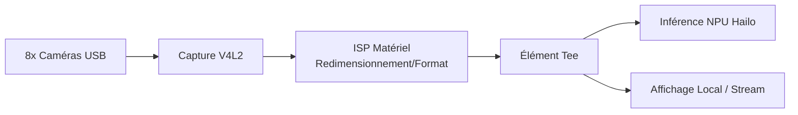

<p align="center">
  
</p>

# 📹 HYDRA-UMC-VISION-STREAMER

<p align="center"><a href="README.md">🇺🇸 English</a> | <a href="README_spa.md">🇪🇸 Español</a> | 🇫🇷 <b>Français</b> | <a href="README_ita.md">🇮🇹 Italiano</a> | <a href="README_deu.md">🇩🇪 Deutsch</a> | <a href="README_zho.md">🇨🇳 简体中文</a> | <a href="README_jpn.md">🇯🇵 日本語</a></p>

### 🚀 Pipeline GStreamer Optimisé pour IA de Périphérie Multi-Caméra

<p align="left">
  
  
  
  
  
</p>

---

## 1. 🛠️ VUE D'ENSEMBLE TECHNIQUE

**HYDRA-UMC-VISION-STREAMER** est destiné à être la couche d'ingestion média haute performance de la famille Vision AI Node. Son rôle est la capture bas niveau, le pré-traitement et la distribution de jusqu'à 8 flux caméra USB 3.0 concurrents, en utilisant l'ISP accéléré matériellement du Broadcom BCM2712 (CM5) pour la conversion d'espace colorimétrique, le redimensionnement et la normalisation avant que les images n'atteignent le NPU Hailo-8.

C'est l'un des 4 enfants de **[HYDRA-UMC-VISION-NODE](https://github.com/JuanenRac/HYDRA-UMC-VISION-NODE)**, le parent d'intégration de la famille : ce projet ne possède que la capture/pré-traitement, et n'exécute ni sa propre inférence Hailo-8, ni API gRPC, ni logique de sécurité - c'est délibérément réparti entre ses 3 frères et sœurs.

### Points Clés

* ✅ **Réel v0 - génération de config, pipeline et relais :** `config.py` valide une config JSON par caméra (périphérique, résolution, fps, format) ; `pipeline.py` génère la description réelle du pipeline GStreamer pour une caméra ; `mediamtx_config.py` génère le `paths.yml` MediaMTX correspondant. Exposé via `config validate`/`config gst`/`config mediamtx` ci-dessous - aucun runtime GStreamer, V4L2, ou caméra physique nécessaire pour l'exécuter ou le tester.
* 🔁 **Réel v0 - mise en tampon bornée et reconnexion :** `FrameBuffer` de `buffer.py` est une file à capacité fixe qui rejette l'élément le PLUS ANCIEN (jamais le plus récent) une fois pleine - la vraie politique de contre-pression dont un relais en direct a besoin pour qu'un consommateur lent ne puisse jamais faire croître indéfiniment la mémoire de ce processus. `ConnectionTracker` de `reconnect.py` est une vraie politique de reconnexion déterministe à backoff exponentiel pour un lien caméra/relais tombé. Exposé via `stream simulate` ci-dessous - entièrement testable sans GStreamer ni caméra physique.
* 📡 **Support RTSP/WebRTC (partiellement prévu) :** le chemin de relais RTSP (`rtspclientsink` → MediaMTX) est conçu et sa config est réellement générée ci-dessus ; l'exécuter réellement nécessite le runtime GStreamer que cet environnement n'a pas. La sortie WebRTC reste entièrement prévue.
* 🔌 **Limite d'intégration HailoRT, préparée en amont du module :** `hailo_runtime.py` est écrit contre l'API réelle et confirmée `hailo_platform` (`VDevice`, `HEF`, `ConfigureParams`) - importée paresseusement afin que ce dépôt s'installe/se teste proprement sans le paquet `hailort` ni module Hailo-8 présent - plus une véritable validation préalable que la résolution configurée d'une caméra correspond réellement à la forme du tenseur d'entrée d'un modèle chargé, avant qu'une seule image ne soit envoyée au périphérique. *(implémenté, limite d'intégration seulement - exécuter réellement l'inférence et analyser la sortie NMS réelle d'un modèle reste un travail futur.)*
* ⚡ **Pipeline Zero-Copy (prévu) :** transfert de buffers entre V4L2 et HailoRT conçu pour éviter les copies d'images inutiles. *(travail futur - nécessite le vrai runtime V4L2/HailoRT que cet environnement n'a pas.)*
* 🌈 **Pré-traitement matériel (prévu) :** redimensionnement et conversion de format de pixel en temps réel via l'ISP de la Pi, déchargeant un travail que le CPU devrait sinon faire par image. *(travail futur, même raison.)*
* 🛠️ **Configuration dynamique :** la résolution, le framerate et le format de pixel par caméra sont réels et validés aujourd'hui (`config.py`) ; le contrôle de l'exposition/gain nécessite le vrai périphérique V4L2 et reste un travail futur.
* 🧩 **Pourquoi c'est un projet séparé :** le réglage capture/ISP est une compétence différente et un domaine de défaillance différent de l'inférence de modèle ou de la logique de sécurité - le garder dans son propre processus signifie qu'un bug de capture ne peut pas faire tomber [HYDRA-UMC-SAFETY-ZONES](https://github.com/JuanenRac/HYDRA-UMC-SAFETY-ZONES), et les deux peuvent être développés/testés indépendamment.

**Vérification d'honnêteté - ce qui fonctionne réellement aujourd'hui :** la validation de config, la génération de la description du pipeline GStreamer, la génération de la config de relais MediaMTX, et la vraie politique de tampon/reconnexion, et la vraie frontière d'intégration HailoRT (`config.py`, `pipeline.py`, `mediamtx_config.py`, `buffer.py`, `reconnect.py`, `hailo_runtime.py`) sont réelles et testées (65 tests). Rien de tout cela n'ouvre un périphérique V4L2, n'importe GStreamer, ni ne parle à une caméra physique - exécuter réellement le pipeline généré nécessite ce vrai runtime et ce vrai matériel, que cet environnement n'a pas. Voir [`CHANGELOG.md`](CHANGELOG.md) pour ce qui a été livré exactement jusqu'à présent, et « État Actuel et Prochaines Étapes » ci-dessous pour ce qui reste ouvert.

---

## 2. 🔄 ARCHITECTURE DE PIPELINE PRÉVUE

Le diagramme ci-dessous est le flux de données cible vers lequel ce projet est construit - sa *forme* (quel élément alimente lequel, la bifurcation `Tee`) est fixée par `pipeline.py` et générée sous forme de syntaxe réelle `gst-launch-1.0` aujourd'hui, mais rien de ce diagramme ne s'exécute encore : cela nécessite le vrai runtime V4L2/GStreamer/Hailo-8 et de vraies caméras USB physiques.



---

## 3. 🧠 INFORMATIONS TECHNIQUES AVANCÉES

### Pourquoi il n'y a pas de `hardware/`, `firmware/`, `os/` ni `models/` ici

CM5 + Hailo-8 est du matériel existant sur étagère sans carte propre à concevoir, contrairement aux cartes STM32H745/STM32G474 sur mesure à l'intérieur de [HYDRA-UMC](https://github.com/JuanenRac/HYDRA-UMC) - donc aucun dossier `hardware/`/`firmware/` n'existe dans aucun des 5 projets Vision AI Node. `os/` (l'image HydraOS partagée) et `models/` (les `.hef` compilés réellement servis au NPU) ne vivent que dans le parent d'intégration, [HYDRA-UMC-VISION-NODE](https://github.com/JuanenRac/HYDRA-UMC-VISION-NODE), car c'est le processus propriétaire de l'image de l'hôte CM5 et du handle du périphérique Hailo-8 - porter des copies séparées ici ne serait qu'un état supplémentaire à synchroniser sans aucun bénéfice.

### Forme de pipeline prévue

L'élément `Tee` dans le diagramme ci-dessus est la décision de conception clé déjà prise avant l'implémentation : les images capturées/pré-traitées sont censées se diviser vers deux consommateurs à la fois - le chemin d'inférence Hailo-8 (alimentant [HYDRA-UMC-VISION-NODE](https://github.com/JuanenRac/HYDRA-UMC-VISION-NODE)) et un flux local/RTSP-WebRTC optionnel pour la surveillance humaine - sans que le chemin de surveillance n'ajoute de latence au chemin d'inférence.

### Décisions de conception déjà prises

* **La version est lue depuis les métadonnées du paquet installé, pas codée en dur** - `main.py` appelle `importlib.metadata.version("hydra-umc-vision-streamer")` plutôt qu'une seconde chaîne `__version__`, donc `bump_version.py` n'a qu'un seul endroit à modifier et les deux ne peuvent jamais diverger.
* **L'incrément « compteur kilométrique » ne touche automatiquement que `PATCH`/`MINOR`** - `bump_version.py` reporte `PATCH` vers `MINOR` au-delà de 9 et `MINOR` vers `MAJOR` au-delà de 9, mais n'incrémente jamais `MAJOR` lui-même ; c'est une décision humaine délibérée, même convention que `HYDRA-UMC-EDITOR-URDF/bump_version.py` et `HYDRA-UMC-SUITE/bump_version.py`.
* **Le YAML MediaMTX est fait à la main, pas basé sur PyYAML** - la forme de sortie de `mediamtx_config.py` (une carte plate `paths:`, une entrée `source: publisher` par caméra) est assez simple et fixe pour qu'une vraie dépendance ne soit pas encore justifiée. À revoir si la config par caméra gagne des champs imbriqués ou de type liste.
* **Le pipeline et la config MediaMTX doivent s'accorder sur un seul chemin RTSP par caméra** - `rtsp_url_for()` est le seul endroit qui le dérive (à partir du nom de la caméra), donc `config gst` et `config mediamtx` ne peuvent jamais être en désaccord sur l'endroit où vit le flux d'une caméra.
* **`FrameBuffer` rejette l'élément le plus ancien, pas le plus récent, une fois plein.** La vidéo en direct n'a aucune utilité pour un arriéré croissant de trames obsolètes - la trame la plus fraîche est toujours la seule utile. Une file qui bloquerait les producteurs à la place mettrait en péril le vrai thread de capture lui-même, et une file qui grossirait simplement mettrait en péril exactement l'échec de mémoire non bornée que cette barrière existe pour empêcher.
* **`reconnect.py` ne dort jamais et ne touche jamais un vrai socket lui-même.** `ConnectionTracker` se contente de suivre l'état et de renvoyer combien de temps l'appelant doit attendre - cette séparation est ce qui rend tout le calendrier de backoff (y compris l'abandon honnête après `max_attempts`) exactement reproductible dans un test, sans horloge réelle ni vrai lien caméra impliqué.

---

## 📂 STRUCTURE DES RÉPERTOIRES

```text
HYDRA-UMC-VISION-STREAMER/
├── src/                 # Code source (paquet hydra_umc_vision_streamer)
│   └── hydra_umc_vision_streamer/
│       ├── config.py           # Analyse/validation de la config par caméra
│       ├── pipeline.py         # Génération de la description du pipeline GStreamer
│       ├── buffer.py           # Vrai tampon borné (contre-pression drop-oldest)
│       ├── reconnect.py        # Vraie politique déterministe de reconnexion/backoff
│       ├── mediamtx_config.py  # Génération du paths.yml MediaMTX
│       ├── hailo_runtime.py    # Véritable limite d'intégration HailoRT (hailo_platform), importée paresseusement
│       ├── mjpeg_server.py     # Vrai serveur MJPEG - sert réellement l'image d'une webcam USB via HTTP
│       └── main.py             # Point d'entrée CLI (invocation nue + `config`/`stream`)
├── tests/               # Suite pytest réelle (config, pipeline, mediamtx, buffer, reconnect, hailo_runtime, mjpeg_server, CLI)
├── docs/                # Documentation et guides de réglage
├── build/               # Sortie de build (le .venv local y vit aussi)
├── images/              # Médias et diagrammes
├── systemd/
│   ├── hydra-umc-vision-streamer@.service  # Unité systemd instanciée par caméra
│   └── cameras.env.example                 # Fichier d'environnement d'exemple par instance
├── tools/
│   ├── build_test.py    # Vérification de build sans versionnage
│   └── ci_validate.py   # Validation manifeste/CHANGELOG/docs utilisée par CI
├── pyproject.toml       # Métadonnées du paquet, dépendances, version compteur kilométrique
├── bump_manifest_version.py # Synchronise la version de hydra-umc.project.json avec la version native (--sync)
├── bump_version.py      # Incrément de version type compteur kilométrique (build.sh/.bat)
├── build.sh / build.bat # venv + installation éditable + compile-check + tests
├── run.sh / run.bat     # Exécute le point d'entrée depuis le venv local
└── CHANGELOG.md         # Historique version par version (schéma compteur kilométrique, sans dates)
```

Aucun dossier `hardware/`, `firmware/`, `os/` ni `models/` - voir « Informations Techniques Avancées » ci-dessus pour le pourquoi. `os/` et `models/` ne vivent que dans le parent d'intégration, [HYDRA-UMC-VISION-NODE](https://github.com/JuanenRac/HYDRA-UMC-VISION-NODE).

---

## 🏗️ BUILD ET EXÉCUTION

### Prérequis

* **Python 3.10 ou plus récent** sur le `PATH` (les scripts essaient `python3` puis se replient sur `python`).
* Aucun GStreamer, outillage V4L2 ou autre dépendance native n'est requis pour l'instant - **zéro dépendance tierce à l'exécution** à ce stade (`dependencies = []` dans `pyproject.toml`).
* Quelques dizaines de Mo d'espace disque pour un environnement virtuel local sous `.venv/`.

### Étape par étape

```bash
# Linux / macOS
./build.sh
```

1. **Incrément de version compteur kilométrique** - exécute `bump_version.py`, incrémentant `PATCH` dans `pyproject.toml` à chaque build (avec report vers `MINOR`/`MAJOR` selon la règle ci-dessus).
2. **Environnement virtuel** - crée `.venv/` s'il manque ; le réutilise sinon.
3. **Installation éditable** - `pip install -e ".[dev]"` pour que les modifications sous `src/` prennent effet immédiatement, installe `pytest`, et enregistre le point d'entrée console `hydra-umc-vision-streamer`.
4. **Compile-check** - `python -m compileall -q src` compile en bytecode chaque fichier sous `src/`, détectant les erreurs de syntaxe dans tout le paquet.
5. **Suite de tests réelle** - `python -m pytest tests/ -q` (65 tests couvrant config, pipeline, génération MediaMTX, la politique de tampon/reconnexion, la frontière d'intégration HailoRT, et le CLI).

`set -euo pipefail` arrête le script à la première étape en échec ; le build ne signale un succès que si les 5 étapes réussissent.

```bash
./run.sh
```

Localise l'interpréteur dans `.venv` (gère les deux dispositions, POSIX et Windows) et exécute `python -m hydra_umc_vision_streamer.main`, en relayant tout argument - l'invocation nue affiche nom + version + rôle.

Exemple réel - valider une config de caméras, générer son pipeline GStreamer, et générer la config de relais MediaMTX correspondante :

```bash
./run.sh config validate --config cameras.json
# 2 camera(s) in cameras.json
#   cam0: /dev/video0 1920x1080@30 MJPG
#   cam1: /dev/video1 640x480@15 YUYV
# config OK

./run.sh config gst --config cameras.json --camera cam0
# v4l2src device=/dev/video0 ! image/jpeg,width=1920,height=1080,framerate=30/1 ! jpegdec ! videoconvert ! tee name=t t. ! queue ! appsink name=cam0_hailo_sink t. ! queue ! rtspclientsink location=rtsp://localhost:8554/cam0

./run.sh config mediamtx --config cameras.json
# paths:
#   cam0:
#     source: publisher
#   cam1:
#     source: publisher
```

Exemple réel - simule un consommateur lent face à un tampon borné, et une connexion perdue traitée par la vraie politique de reconnexion :

```bash
./run.sh stream simulate --buffer-size 8 --frames 1000 --consumer-rate 1000
# Pushed 1000 frame(s) through a buffer capped at 8
# Max buffer size observed: 8 (must never exceed 8)
# Frames dropped by backpressure: 972
#
# Simulated disconnect at frame 500
# Reconnect backoff schedule (s): [0.5, 1.0, 2.0, 4.0]
# Final connection state: given_up
```

```bat
:: Windows - mêmes étapes, syntaxe batch
build.bat
run.bat
```

### Dépannage

* **`python`/`python3` introuvable** - installez Python 3.10+ et assurez-vous qu'il est sur le `PATH`.
* **`compileall` échoue** - une vraie erreur de syntaxe a été introduite sous `src/` ; le build s'arrête sans toucher à l'installation, volontairement.
* **« No `.venv` found » depuis `run.sh`/`run.bat`** - exécutez `build.sh`/`build.bat` au moins une fois avant ; `run` ne crée jamais l'environnement lui-même.
* **Installation éditable obsolète** - supprimez `.venv/` et reconstruisez ; rarement nécessaire.

---

## 🚀 État Actuel et Prochaines Étapes

**Ce qui fonctionne aujourd'hui :** la validation de config par caméra, la génération de la description du pipeline GStreamer, et la génération de la config de relais MediaMTX (`config.py`, `pipeline.py`, `mediamtx_config.py`), un vrai tampon prouvablement borné et une vraie politique déterministe de reconnexion (`buffer.py`, `reconnect.py`, `stream simulate`), une vraie frontière d'intégration HailoRT (`hailo_runtime.py`) prête pour un vrai module Hailo-8 dès qu'il est branché, et un vrai chemin v0 de capture+diffusion (`mjpeg_server.py`, `stream serve`) qui ouvre un vrai périphérique V4L2 via OpenCV et diffuse du vrai MJPEG en HTTP - installable sur une CM5 via `provisioning/install_vision_streamer.sh` de `HYDRA-UMC-OS` (une instance systemd par emplacement de caméra assigné par l'administrateur, `systemd/hydra-umc-vision-streamer@.service`) et déjà consommé en direct par le proxy `GET /api/camera/:id/stream` de `HYDRA-UMC-SERVER` et les vues caméra de `HYDRA-UMC-STUDIO` - 65 tests au total, plus un vrai paquet Python installable avec un point d'entrée vérifié et un incrément de version compteur kilométrique intégré au build. Voir [`CHANGELOG.md`](CHANGELOG.md) pour la sortie de build/run capturée.

**Ce qui reste ouvert, sans ordre particulier, sans calendrier engagé, et bloqué par du vrai matériel :**

* Exécuter réellement le *pipeline généré* - le tee GStreamer/PyGObject complet vers une branche d'inférence Hailo-8, pas le v0 OpenCV plus simple ci-dessus (`stream serve`) - via un vrai runtime.
* Le redimensionnement/conversion de format par ISP matériel (nécessite le vrai ISP du CM5).
* Exécuter réellement l'inférence via `hailo_runtime.py` (nécessite un vrai module Hailo-8 et un `.hef` compilé réel), et analyser le format de sortie NMS réel de ce modèle - délibérément non deviné sans le périphérique pour le vérifier.
* La sortie WebRTC, et le contrôle de l'exposition/gain par caméra (nécessite le vrai périphérique V4L2).
* `stream serve` n'a pas encore été vérifié contre une caméra USB réellement branchée - seulement contre un `cv2.VideoCapture` simulé à la frontière du module (voir `tests/test_mjpeg_server.py`).

---

## 🔗 Projets Liés

Ce projet fait partie d'un écosystème robotique plus large du même auteur (JuanenRac / Electro Hobby 3D), couvrant firmware, logiciel de contrôle, nœuds d'IA et outillage de flotte. Bon à savoir, car une demande pourrait en réalité concerner l'un de ces projets plutôt que ce dépôt.

### Famille

**Parent :** **[HYDRA-UMC-VISION-NODE](https://github.com/JuanenRac/HYDRA-UMC-VISION-NODE)** — le parent d'intégration que ce pipeline alimente.

**Frères et sœurs :**
- **[HYDRA-UMC-DETECTION-HEF](https://github.com/JuanenRac/HYDRA-UMC-DETECTION-HEF)** — compile les modèles `.hef` que le parent charge sur son NPU Hailo-8.
- **[HYDRA-UMC-SAFETY-ZONES](https://github.com/JuanenRac/HYDRA-UMC-SAFETY-ZONES)** — transforme la perception du parent en détection d'intrusion et déclenchement d'E-STOP.
- **[HYDRA-UMC-VISUAL-SERVOING-API](https://github.com/JuanenRac/HYDRA-UMC-VISUAL-SERVOING-API)** — transforme la perception du parent en corrections cinématiques de pose.

Ce projet n'a pas de relation directe hors de la famille Vision AI Node (selon la carte de relations de l'écosystème) - voir « Reste de l'Écosystème » ci-dessous pour tout le reste.

### Reste de l'Écosystème

**Plateforme HYDRA-UMC** — la cellule de micro-usine multi-robot
- **[HYDRA-UMC](https://github.com/JuanenRac/HYDRA-UMC)** — la carte mère CM5 + STM32H745 orchestrant jusqu'à 8 bras robotiques.
- **[HYDRA-UMC-SERVER](https://github.com/JuanenRac/HYDRA-UMC-SERVER)** — le backend Express/WebSocket auquel parle chaque client de contrôle.
- **[HYDRA-UMC-STUDIO](https://github.com/JuanenRac/HYDRA-UMC-STUDIO)** — tableau de bord de contrôle web, visualisation 3D multi-robot.
- **[HYDRA-UMC-ANDROID-CONTROL](https://github.com/JuanenRac/HYDRA-UMC-ANDROID-CONTROL)** — application de contrôle Android via Wi-Fi/Bluetooth.
- **[HYDRA-UMC-IOS-CONTROL](https://github.com/JuanenRac/HYDRA-UMC-IOS-CONTROL)** — application de contrôle iOS/iPadOS construite en Flutter.
- **[HYDRA-UMC-SUITE](https://github.com/JuanenRac/HYDRA-UMC-SUITE)** — centre de commande d'essaim de bureau (Python/PySide6).
- **[HYDRA-UMC-EDITOR-URDF](https://github.com/JuanenRac/HYDRA-UMC-EDITOR-URDF)** — éditeur de modèles URDF de bureau pour le catalogue de robots.
- **[HYDRA-UMC-DSI](https://github.com/JuanenRac/HYDRA-UMC-DSI)** — interface tactile native pour l'écran DSI embarqué.

**Plateforme URTC** — le contrôleur de tête d'outil que porte chaque bras HYDRA-UMC
- **[URTC](https://github.com/JuanenRac/URTC)** — contrôleur de tête d'outil sur bus CAN, 25 profils d'outil.
- **[URTC-FLASHER](https://github.com/JuanenRac/URTC-FLASHER)** — outil de bureau de flashage CAN-OTA + SWD/JTAG.
- **[URTC-TESTER](https://github.com/JuanenRac/URTC-TESTER)** — outil de bureau de diagnostic CAN en direct.
- **[URTC-WEB-STUDIO](https://github.com/JuanenRac/URTC-WEB-STUDIO)** — alternative basée navigateur via l'API Web Serial.

**🧠 Nœud Cognitif IA (Hailo-10)**
- [HYDRA-UMC-COGNITIVE-NODE](https://github.com/JuanenRac/HYDRA-UMC-COGNITIVE-NODE)
- [HYDRA-UMC-VLA-ENGINE](https://github.com/JuanenRac/HYDRA-UMC-VLA-ENGINE)
- [HYDRA-UMC-VOICE-UI](https://github.com/JuanenRac/HYDRA-UMC-VOICE-UI)
- [HYDRA-UMC-SEMANTIC-PLANNER](https://github.com/JuanenRac/HYDRA-UMC-SEMANTIC-PLANNER)
- [HYDRA-UMC-DOCS-QA](https://github.com/JuanenRac/HYDRA-UMC-DOCS-QA)

**🐝 Orchestration et Essaim**
- [HYDRA-UMC-ORCHESTRATOR](https://github.com/JuanenRac/HYDRA-UMC-ORCHESTRATOR)
- [HYDRA-UMC-SWARM-SYNC](https://github.com/JuanenRac/HYDRA-UMC-SWARM-SYNC)
- [HYDRA-UMC-PATH-PLANNER-3D](https://github.com/JuanenRac/HYDRA-UMC-PATH-PLANNER-3D)
- [HYDRA-UMC-JOB-DISPATCHER](https://github.com/JuanenRac/HYDRA-UMC-JOB-DISPATCHER)
- [HYDRA-UMC-NODE-HEALING](https://github.com/JuanenRac/HYDRA-UMC-NODE-HEALING)

**🎮 Jumeau Numérique et Simulation**
- [HYDRA-UMC-TWIN](https://github.com/JuanenRac/HYDRA-UMC-TWIN)
- [HYDRA-UMC-PHYSICS-REPLICA](https://github.com/JuanenRac/HYDRA-UMC-PHYSICS-REPLICA)
- [HYDRA-UMC-HIL-BRIDGE](https://github.com/JuanenRac/HYDRA-UMC-HIL-BRIDGE)
- [HYDRA-UMC-SYNTHETIC-DATA-GEN](https://github.com/JuanenRac/HYDRA-UMC-SYNTHETIC-DATA-GEN)

**📊 Données et Analytique**
- [HYDRA-UMC-DATALAKE](https://github.com/JuanenRac/HYDRA-UMC-DATALAKE)
- [HYDRA-UMC-TELEMETRY-COLLECTOR](https://github.com/JuanenRac/HYDRA-UMC-TELEMETRY-COLLECTOR)
- [HYDRA-UMC-ANOMALY-DETECTOR](https://github.com/JuanenRac/HYDRA-UMC-ANOMALY-DETECTOR)
- [HYDRA-UMC-PRODUCTION-REPORTS](https://github.com/JuanenRac/HYDRA-UMC-PRODUCTION-REPORTS)

**🏭 Passerelle Industrielle**
- [HYDRA-UMC-GATEWAY-INDUSTRIAL](https://github.com/JuanenRac/HYDRA-UMC-GATEWAY-INDUSTRIAL)
- [HYDRA-UMC-OPCUA-SERVER](https://github.com/JuanenRac/HYDRA-UMC-OPCUA-SERVER)
- [HYDRA-UMC-MQTT-BROKER](https://github.com/JuanenRac/HYDRA-UMC-MQTT-BROKER)
- [HYDRA-UMC-MTCONNECT-ADAPTER](https://github.com/JuanenRac/HYDRA-UMC-MTCONNECT-ADAPTER)

**🛠️ Outils Complémentaires**
- [URTC-SMART-RACK](https://github.com/JuanenRac/URTC-SMART-RACK)
- [URTC-VISION-TOOL](https://github.com/JuanenRac/URTC-VISION-TOOL)
- [HYDRA-UMC-WATCH](https://github.com/JuanenRac/HYDRA-UMC-WATCH)
- [HYDRA-UMC-TOOL-CLI](https://github.com/JuanenRac/HYDRA-UMC-TOOL-CLI)
- [HYDRA-UMC-DASHBOARD-AI](https://github.com/JuanenRac/HYDRA-UMC-DASHBOARD-AI)

---

## 👤 AUTEUR
**JuanenRac** (Electro Hobby 3D)
📧 electrohobby3d@gmail.com
📺 [youtube.com/@electrohobby3d](https://youtube.com/@electrohobby3d)

## 📜 LICENCE
GPL-3.0 - Voir le fichier LICENSE pour les détails.
