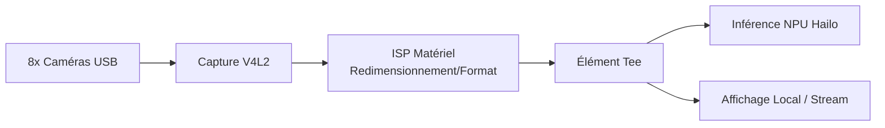

<p align="center">
  
</p>

# 📹 HYDRA-UMC-VISION-STREAMER

<p align="center"><a href="README.md">🇺🇸 English</a> | <a href="README_spa.md">🇪🇸 Español</a> | 🇫🇷 <b>Français</b> | <a href="README_ita.md">🇮🇹 Italiano</a> | <a href="README_deu.md">🇩🇪 Deutsch</a> | <a href="README_zho.md">🇨🇳 简体中文</a> | <a href="README_jpn.md">🇯🇵 日本語</a></p>

### 🚀 Pipeline GStreamer Optimisé pour IA de Périphérie Multi-Caméra

<p align="left">
  
  
  
  
  
</p>

---

## 1. 🛠️ VUE D'ENSEMBLE TECHNIQUE

**HYDRA-UMC-VISION-STREAMER** est destiné à être la couche d'ingestion média haute performance de la famille Vision AI Node. Son rôle est la capture bas niveau, le pré-traitement et la distribution de jusqu'à 8 flux caméra USB 3.0 concurrents, en utilisant l'ISP accéléré matériellement du Broadcom BCM2712 (CM5) pour la conversion d'espace colorimétrique, le redimensionnement et la normalisation avant que les images n'atteignent le NPU Hailo-8.

C'est l'un des 4 enfants de **[HYDRA-UMC-VISION-NODE](https://github.com/JuanenRac/HYDRA-UMC-VISION-NODE)**, le parent d'intégration de la famille : ce projet ne possède que la capture/pré-traitement, et n'exécute ni sa propre inférence Hailo-8, ni API gRPC, ni logique de sécurité - c'est délibérément réparti entre ses 3 frères et sœurs.

### Points Clés

* ⚡ **Pipeline Zero-Copy (prévu) :** transfert de buffers entre V4L2 et HailoRT conçu pour éviter les copies d'images inutiles.
* 🌈 **Pré-traitement matériel (prévu) :** redimensionnement et conversion de format de pixel en temps réel via l'ISP de la Pi, déchargeant un travail que le CPU devrait sinon faire par image.
* 📡 **Support RTSP/WebRTC (prévu) :** streaming sortant optionnel à faible latence, pour la surveillance à distance sans passer par tout le pipeline de détection.
* 🛠️ **Configuration dynamique (prévu) :** contrôle de l'exposition, du gain et de la résolution par caméra.
* 🧩 **Pourquoi c'est un projet séparé :** le réglage capture/ISP est une compétence différente et un domaine de défaillance différent de l'inférence de modèle ou de la logique de sécurité - le garder dans son propre processus signifie qu'un bug de capture ne peut pas faire tomber [HYDRA-UMC-SAFETY-ZONES](https://github.com/JuanenRac/HYDRA-UMC-SAFETY-ZONES), et les deux peuvent être développés/testés indépendamment.

**Vérification d'honnêteté - ce qui fonctionne réellement aujourd'hui :** ce dépôt est à l'étape squelette. Le point d'entrée réel (`src/hydra_umc_vision_streamer/main.py`) affiche le nom du projet, sa version installée et une description de rôle en une ligne, puis se termine avec le code 0. Rien du pipeline GStreamer, de la capture V4L2, de l'intégration ISP ou de la logique de streaming décrite ci-dessus n'existe encore dans le code. Voir [`CHANGELOG.md`](CHANGELOG.md) pour ce qui a été livré exactement jusqu'à présent, et « État Actuel et Prochaines Étapes » ci-dessous pour ce qui reste ouvert.

---

## 2. 🔄 ARCHITECTURE DE PIPELINE PRÉVUE

Le diagramme ci-dessous est le flux de données cible vers lequel ce squelette est construit, pas un pipeline fonctionnel aujourd'hui.



---

## 3. 🧠 INFORMATIONS TECHNIQUES AVANCÉES

### Pourquoi il n'y a pas de `hardware/`, `firmware/`, `os/` ni `models/` ici

CM5 + Hailo-8 est du matériel existant sur étagère sans carte propre à concevoir, contrairement aux cartes STM32H745/STM32G474 sur mesure à l'intérieur de [HYDRA-UMC](https://github.com/JuanenRac/HYDRA-UMC) - donc aucun dossier `hardware/`/`firmware/` n'existe dans aucun des 5 projets Vision AI Node. `os/` (l'image HydraOS partagée) et `models/` (les `.hef` compilés réellement servis au NPU) ne vivent que dans le parent d'intégration, [HYDRA-UMC-VISION-NODE](https://github.com/JuanenRac/HYDRA-UMC-VISION-NODE), car c'est le processus propriétaire de l'image de l'hôte CM5 et du handle du périphérique Hailo-8 - porter des copies séparées ici ne serait qu'un état supplémentaire à synchroniser sans aucun bénéfice.

### Forme de pipeline prévue

L'élément `Tee` dans le diagramme ci-dessus est la décision de conception clé déjà prise avant l'implémentation : les images capturées/pré-traitées sont censées se diviser vers deux consommateurs à la fois - le chemin d'inférence Hailo-8 (alimentant [HYDRA-UMC-VISION-NODE](https://github.com/JuanenRac/HYDRA-UMC-VISION-NODE)) et un flux local/RTSP-WebRTC optionnel pour la surveillance humaine - sans que le chemin de surveillance n'ajoute de latence au chemin d'inférence.

### Décisions de conception déjà prises dans ce squelette

* **La version est lue depuis les métadonnées du paquet installé, pas codée en dur** - `main.py` appelle `importlib.metadata.version("hydra-umc-vision-streamer")` plutôt qu'une seconde chaîne `__version__`, donc `bump_version.py` n'a qu'un seul endroit à modifier et les deux ne peuvent jamais diverger.
* **L'incrément « compteur kilométrique » ne touche automatiquement que `PATCH`/`MINOR`** - `bump_version.py` reporte `PATCH` vers `MINOR` au-delà de 9 et `MINOR` vers `MAJOR` au-delà de 9, mais n'incrémente jamais `MAJOR` lui-même ; c'est une décision humaine délibérée, même convention que `HYDRA-UMC-EDITOR-URDF/bump_version.py` et `HYDRA-UMC-SUITE/bump_version.py`.

---

## 📂 STRUCTURE DES RÉPERTOIRES

```text
HYDRA-UMC-VISION-STREAMER/
├── src/                 # Code source (paquet hydra_umc_vision_streamer)
├── docs/                # Documentation et guides de réglage
├── build/               # Sortie de build (le .venv local y vit aussi)
├── images/              # Médias et diagrammes
├── scripts/             # Scripts utilitaires
├── pyproject.toml       # Métadonnées du paquet, dépendances, version compteur kilométrique
├── bump_version.py      # Incrément de version type compteur kilométrique (build.sh/.bat)
├── build.sh / build.bat # venv + installation éditable + compile-check
├── run.sh / run.bat     # Exécute le point d'entrée depuis le venv local
└── CHANGELOG.md         # Historique version par version (schéma compteur kilométrique, sans dates)
```

Aucun dossier `hardware/`, `firmware/`, `os/` ni `models/` - voir « Informations Techniques Avancées » ci-dessus pour le pourquoi. `os/` et `models/` ne vivent que dans le parent d'intégration, [HYDRA-UMC-VISION-NODE](https://github.com/JuanenRac/HYDRA-UMC-VISION-NODE).

---

## 🏗️ BUILD ET EXÉCUTION

### Prérequis

* **Python 3.10 ou plus récent** sur le `PATH` (les scripts essaient `python3` puis se replient sur `python`).
* Aucun GStreamer, outillage V4L2 ou autre dépendance native n'est requis pour l'instant - **zéro dépendance tierce à l'exécution** à ce stade (`dependencies = []` dans `pyproject.toml`).
* Quelques dizaines de Mo d'espace disque pour un environnement virtuel local sous `.venv/`.

### Étape par étape

```bash
# Linux / macOS
./build.sh
```

1. **Incrément de version compteur kilométrique** - exécute `bump_version.py`, incrémentant `PATCH` dans `pyproject.toml` à chaque build (avec report vers `MINOR`/`MAJOR` selon la règle ci-dessus).
2. **Environnement virtuel** - crée `.venv/` s'il manque ; le réutilise sinon.
3. **Installation éditable** - `pip install -e .` pour que les modifications sous `src/` prennent effet immédiatement, et enregistre le point d'entrée console `hydra-umc-vision-streamer`.
4. **Compile-check** - `python -m compileall -q src` compile en bytecode chaque fichier sous `src/`, détectant les erreurs de syntaxe dans tout le paquet.

`set -euo pipefail` arrête le script à la première étape en échec ; `== Build OK ==` ne s'affiche que si les 4 étapes réussissent.

```bash
./run.sh
```

Localise l'interpréteur dans `.venv` (gère les deux dispositions, POSIX et Windows) et exécute `python -m hydra_umc_vision_streamer.main`, affichant nom + version + rôle.

```bat
:: Windows - mêmes étapes, syntaxe batch
build.bat
run.bat
```

### Dépannage

* **`python`/`python3` introuvable** - installez Python 3.10+ et assurez-vous qu'il est sur le `PATH`.
* **`compileall` échoue** - une vraie erreur de syntaxe a été introduite sous `src/` ; le build s'arrête sans toucher à l'installation, volontairement.
* **« No `.venv` found » depuis `run.sh`/`run.bat`** - exécutez `build.sh`/`build.bat` au moins une fois avant ; `run` ne crée jamais l'environnement lui-même.
* **Installation éditable obsolète** - supprimez `.venv/` et reconstruisez ; rarement nécessaire.

---

## 🚀 État Actuel et Prochaines Étapes

**Ce qui fonctionne aujourd'hui :** un vrai paquet Python installable avec un point d'entrée vérifié (voir [`CHANGELOG.md`](CHANGELOG.md) pour la sortie de build/run capturée) et un incrément de version compteur kilométrique intégré au build.

**Ce qui reste ouvert, sans ordre particulier et sans calendrier engagé :**

* Le vrai pipeline GStreamer (capture, `Tee`, intégration ISP).
* La capture V4L2 de jusqu'à 8 caméras USB 3.0 et le redimensionnement/conversion de format par ISP matériel.
* Le transfert zero-copy vers le runtime Hailo-8 possédé par [HYDRA-UMC-VISION-NODE](https://github.com/JuanenRac/HYDRA-UMC-VISION-NODE).
* La sortie RTSP/WebRTC optionnelle et la configuration dynamique par caméra (exposition, gain, résolution).

---

## 🔗 Projets Liés

Ce projet fait partie d'un écosystème robotique plus large du même auteur (JuanenRac / Electro Hobby 3D), couvrant firmware, logiciel de contrôle, nœuds d'IA et outillage de flotte. Bon à savoir, car une demande pourrait en réalité concerner l'un de ces projets plutôt que ce dépôt.

### Famille

**Parent :** **[HYDRA-UMC-VISION-NODE](https://github.com/JuanenRac/HYDRA-UMC-VISION-NODE)** — le parent d'intégration que ce pipeline alimente.

**Frères et sœurs :**
- **[HYDRA-UMC-DETECTION-HEF](https://github.com/JuanenRac/HYDRA-UMC-DETECTION-HEF)** — compile les modèles `.hef` que le parent charge sur son NPU Hailo-8.
- **[HYDRA-UMC-SAFETY-ZONES](https://github.com/JuanenRac/HYDRA-UMC-SAFETY-ZONES)** — transforme la perception du parent en détection d'intrusion et déclenchement d'E-STOP.
- **[HYDRA-UMC-VISUAL-SERVOING-API](https://github.com/JuanenRac/HYDRA-UMC-VISUAL-SERVOING-API)** — transforme la perception du parent en corrections cinématiques de pose.

Ce projet n'a pas de relation directe hors de la famille Vision AI Node (selon la carte de relations de l'écosystème) - voir « Reste de l'Écosystème » ci-dessous pour tout le reste.

### Reste de l'Écosystème

**Plateforme HYDRA-UMC** — la cellule de micro-usine multi-robot
- **[HYDRA-UMC](https://github.com/JuanenRac/HYDRA-UMC)** — la carte mère CM5 + STM32H745 orchestrant jusqu'à 8 bras robotiques.
- **[HYDRA-UMC-SERVER](https://github.com/JuanenRac/HYDRA-UMC-SERVER)** — le backend Express/WebSocket auquel parle chaque client de contrôle.
- **[HYDRA-UMC-STUDIO](https://github.com/JuanenRac/HYDRA-UMC-STUDIO)** — tableau de bord de contrôle web, visualisation 3D multi-robot.
- **[HYDRA-UMC-ANDROID-CONTROL](https://github.com/JuanenRac/HYDRA-UMC-ANDROID-CONTROL)** — application de contrôle Android via Wi-Fi/Bluetooth.
- **[HYDRA-UMC-IOS-CONTROL](https://github.com/JuanenRac/HYDRA-UMC-IOS-CONTROL)** — application de contrôle iOS/iPadOS construite en Flutter.
- **[HYDRA-UMC-SUITE](https://github.com/JuanenRac/HYDRA-UMC-SUITE)** — centre de commande d'essaim de bureau (Python/PySide6).
- **[HYDRA-UMC-EDITOR-URDF](https://github.com/JuanenRac/HYDRA-UMC-EDITOR-URDF)** — éditeur de modèles URDF de bureau pour le catalogue de robots.
- **[HYDRA-UMC-DSI](https://github.com/JuanenRac/HYDRA-UMC-DSI)** — interface tactile native pour l'écran DSI embarqué.

**Plateforme URTC** — le contrôleur de tête d'outil que porte chaque bras HYDRA-UMC
- **[URTC](https://github.com/JuanenRac/URTC)** — contrôleur de tête d'outil sur bus CAN, 25 profils d'outil.
- **[URTC-FLASHER](https://github.com/JuanenRac/URTC-FLASHER)** — outil de bureau de flashage CAN-OTA + SWD/JTAG.
- **[URTC-TESTER](https://github.com/JuanenRac/URTC-TESTER)** — outil de bureau de diagnostic CAN en direct.
- **[URTC-WEB-STUDIO](https://github.com/JuanenRac/URTC-WEB-STUDIO)** — alternative basée navigateur via l'API Web Serial.

**🧠 Cognitive AI Node (Hailo-10)**
- [HYDRA-UMC-COGNITIVE-NODE](https://github.com/JuanenRac/HYDRA-UMC-COGNITIVE-NODE)
- [HYDRA-UMC-VLA-ENGINE](https://github.com/JuanenRac/HYDRA-UMC-VLA-ENGINE)
- [HYDRA-UMC-VOICE-UI](https://github.com/JuanenRac/HYDRA-UMC-VOICE-UI)
- [HYDRA-UMC-SEMANTIC-PLANNER](https://github.com/JuanenRac/HYDRA-UMC-SEMANTIC-PLANNER)
- [HYDRA-UMC-DOCS-QA](https://github.com/JuanenRac/HYDRA-UMC-DOCS-QA)

**🐝 Orchestration & Swarm**
- [HYDRA-UMC-ORCHESTRATOR](https://github.com/JuanenRac/HYDRA-UMC-ORCHESTRATOR)
- [HYDRA-UMC-SWARM-SYNC](https://github.com/JuanenRac/HYDRA-UMC-SWARM-SYNC)
- [HYDRA-UMC-PATH-PLANNER-3D](https://github.com/JuanenRac/HYDRA-UMC-PATH-PLANNER-3D)
- [HYDRA-UMC-JOB-DISPATCHER](https://github.com/JuanenRac/HYDRA-UMC-JOB-DISPATCHER)
- [HYDRA-UMC-NODE-HEALING](https://github.com/JuanenRac/HYDRA-UMC-NODE-HEALING)

**🎮 Digital Twin & Simulation**
- [HYDRA-UMC-TWIN](https://github.com/JuanenRac/HYDRA-UMC-TWIN)
- [HYDRA-UMC-PHYSICS-REPLICA](https://github.com/JuanenRac/HYDRA-UMC-PHYSICS-REPLICA)
- [HYDRA-UMC-HIL-BRIDGE](https://github.com/JuanenRac/HYDRA-UMC-HIL-BRIDGE)
- [HYDRA-UMC-SYNTHETIC-DATA-GEN](https://github.com/JuanenRac/HYDRA-UMC-SYNTHETIC-DATA-GEN)

**📊 Data & Analytics**
- [HYDRA-UMC-DATALAKE](https://github.com/JuanenRac/HYDRA-UMC-DATALAKE)
- [HYDRA-UMC-TELEMETRY-COLLECTOR](https://github.com/JuanenRac/HYDRA-UMC-TELEMETRY-COLLECTOR)
- [HYDRA-UMC-ANOMALY-DETECTOR](https://github.com/JuanenRac/HYDRA-UMC-ANOMALY-DETECTOR)
- [HYDRA-UMC-PRODUCTION-REPORTS](https://github.com/JuanenRac/HYDRA-UMC-PRODUCTION-REPORTS)

**🏭 Industrial Gateway**
- [HYDRA-UMC-GATEWAY-INDUSTRIAL](https://github.com/JuanenRac/HYDRA-UMC-GATEWAY-INDUSTRIAL)
- [HYDRA-UMC-OPCUA-SERVER](https://github.com/JuanenRac/HYDRA-UMC-OPCUA-SERVER)
- [HYDRA-UMC-MQTT-BROKER](https://github.com/JuanenRac/HYDRA-UMC-MQTT-BROKER)
- [HYDRA-UMC-MTCONNECT-ADAPTER](https://github.com/JuanenRac/HYDRA-UMC-MTCONNECT-ADAPTER)

**🛠️ Complementary Tools**
- [URTC-SMART-RACK](https://github.com/JuanenRac/URTC-SMART-RACK)
- [URTC-VISION-TOOL](https://github.com/JuanenRac/URTC-VISION-TOOL)
- [HYDRA-UMC-WATCH](https://github.com/JuanenRac/HYDRA-UMC-WATCH)
- [HYDRA-UMC-TOOL-CLI](https://github.com/JuanenRac/HYDRA-UMC-TOOL-CLI)
- [HYDRA-UMC-DASHBOARD-AI](https://github.com/JuanenRac/HYDRA-UMC-DASHBOARD-AI)

---

## 👤 AUTEUR
**JuanenRac** (Electro Hobby 3D)
📧 electrohobby3d@gmail.com

## 📜 LICENCE
GPL-3.0 - Voir le fichier LICENSE pour les détails.
