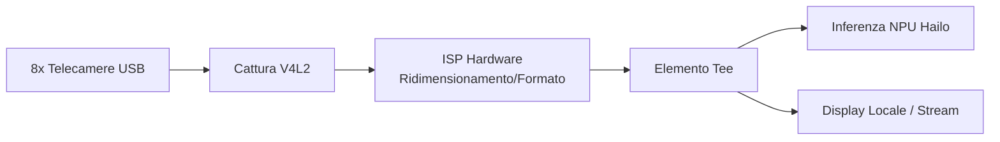

<p align="center">
  
</p>

# 📹 HYDRA-UMC-VISION-STREAMER

<p align="center"><a href="README.md">🇺🇸 English</a> | <a href="README_spa.md">🇪🇸 Español</a> | <a href="README_fra.md">🇫🇷 Français</a> | 🇮🇹 <b>Italiano</b> | <a href="README_deu.md">🇩🇪 Deutsch</a> | <a href="README_zho.md">🇨🇳 简体中文</a> | <a href="README_jpn.md">🇯🇵 日本語</a></p>

### 🚀 Pipeline GStreamer Ottimizzata per IA Edge Multi-Camera

<p align="left">
  
  
  
  
  
</p>

---

## 1. 🛠️ PANORAMICA TECNICA

**HYDRA-UMC-VISION-STREAMER** è pensato per essere lo strato di ingestione media ad alte prestazioni della famiglia Vision AI Node. Il suo compito è la cattura a basso livello, il pre-processamento e la distribuzione fino a 8 flussi camera USB 3.0 concorrenti, usando l'ISP accelerato via hardware del Broadcom BCM2712 (CM5) per conversione dello spazio colore, ridimensionamento e normalizzazione prima che i fotogrammi raggiungano la NPU Hailo-8.

Questo è uno dei 4 figli di **[HYDRA-UMC-VISION-NODE](https://github.com/JuanenRac/HYDRA-UMC-VISION-NODE)**, il genitore di integrazione della famiglia: questo progetto possiede solo cattura/pre-processamento, e non esegue la propria inferenza Hailo-8, API gRPC o logica di sicurezza - questo è deliberatamente suddiviso tra i suoi 3 fratelli.

### Punti Chiave

* ⚡ **Pipeline Zero-Copy (previsto):** trasferimento di buffer tra V4L2 e HailoRT progettato per evitare copie di fotogrammi non necessarie.
* 🌈 **Pre-elaborazione Hardware (previsto):** ridimensionamento e conversione del formato pixel in tempo reale usando l'ISP della Pi, scaricando lavoro che la CPU dovrebbe altrimenti fare per fotogramma.
* 📡 **Supporto RTSP/WebRTC (previsto):** streaming in uscita opzionale a bassa latenza, per il monitoraggio remoto senza passare per l'intera pipeline di rilevamento.
* 🛠️ **Configurazione Dinamica (previsto):** controllo di esposizione, guadagno e risoluzione per camera.
* 🧩 **Perché esiste come progetto separato:** la messa a punto di cattura/ISP è un'abilità diversa e un dominio di guasto diverso rispetto all'inferenza dei modelli o alla logica di sicurezza - mantenerlo nel proprio processo significa che un bug di cattura non può far cadere [HYDRA-UMC-SAFETY-ZONES](https://github.com/JuanenRac/HYDRA-UMC-SAFETY-ZONES), e i due possono essere sviluppati/testati indipendentemente.

**Verifica di onestà - cosa funziona davvero oggi:** questo repository è in fase scheletro. L'entry point reale (`src/hydra_umc_vision_streamer/main.py`) stampa il nome del progetto, la sua versione installata e una descrizione di ruolo di una riga, quindi esce con codice 0. Nulla della pipeline GStreamer, della cattura V4L2, dell'integrazione ISP o della logica di streaming descritta sopra esiste ancora nel codice. Vedi [`CHANGELOG.md`](CHANGELOG.md) per ciò che è stato consegnato esattamente finora, e "Stato Attuale e Prossimi Passi" più sotto per ciò che resta aperto.

---

## 2. 🔄 ARCHITETTURA DI PIPELINE PREVISTA

Il diagramma sotto è il flusso dati obiettivo verso cui viene costruito questo scheletro, non una pipeline funzionante oggi.



---

## 3. 🧠 INFORMAZIONI TECNICHE AVANZATE

### Perché non ci sono `hardware/`, `firmware/`, `os/` né `models/` qui

CM5 + Hailo-8 è hardware già esistente senza una scheda propria da progettare, a differenza delle schede STM32H745/STM32G474 su misura dentro [HYDRA-UMC](https://github.com/JuanenRac/HYDRA-UMC) - quindi nessuna cartella `hardware/`/`firmware/` esiste in nessuno dei 5 progetti Vision AI Node. `os/` (l'immagine HydraOS condivisa) e `models/` (i `.hef` compilati realmente serviti alla NPU) vivono solo nel genitore di integrazione, [HYDRA-UMC-VISION-NODE](https://github.com/JuanenRac/HYDRA-UMC-VISION-NODE), perché è il processo proprietario dell'immagine dell'host CM5 e dell'handle del dispositivo Hailo-8 - portare copie separate qui sarebbe solo stato extra da sincronizzare senza alcun beneficio.

### Forma di pipeline prevista

L'elemento `Tee` nel diagramma sopra è la decisione di design chiave già presa prima dell'implementazione: i fotogrammi catturati/pre-elaborati sono pensati per diramarsi verso due consumatori contemporaneamente - il percorso di inferenza Hailo-8 (alimentando [HYDRA-UMC-VISION-NODE](https://github.com/JuanenRac/HYDRA-UMC-VISION-NODE)) e uno stream locale/RTSP-WebRTC opzionale per il monitoraggio umano - senza che il percorso di monitoraggio aggiunga latenza al percorso di inferenza.

### Decisioni di design già prese in questo scheletro

* **La versione viene letta dai metadati del pacchetto installato, non è hardcoded** - `main.py` chiama `importlib.metadata.version("hydra-umc-vision-streamer")` invece di una seconda stringa `__version__`, così `bump_version.py` ha un solo posto da modificare e i due non possono mai disallinearsi.
* **L'incremento "contachilometri" tocca automaticamente solo `PATCH`/`MINOR`** - `bump_version.py` riporta `PATCH` a `MINOR` oltre il 9 e da `MINOR` a `MAJOR` oltre il 9, ma non incrementa mai `MAJOR` da solo; è una decisione umana deliberata, stessa convenzione di `HYDRA-UMC-EDITOR-URDF/bump_version.py` e `HYDRA-UMC-SUITE/bump_version.py`.

---

## 📂 STRUTTURA DELLE DIRECTORY

```text
HYDRA-UMC-VISION-STREAMER/
├── src/                 # Codice sorgente (pacchetto hydra_umc_vision_streamer)
├── docs/                # Documentazione e guide di tuning
├── build/               # Output di build (qui vive anche il .venv locale)
├── images/              # Media e diagrammi
├── scripts/             # Script di utilità
├── pyproject.toml       # Metadati pacchetto, dipendenze, versione contachilometri
├── bump_version.py      # Incremento versione tipo contachilometri (build.sh/.bat)
├── build.sh / build.bat # venv + installazione editabile + compile-check
├── run.sh / run.bat     # Esegue l'entry point dal venv locale
└── CHANGELOG.md         # Storico versione per versione (schema contachilometri, senza date)
```

Nessuna cartella `hardware/`, `firmware/`, `os/` o `models/` - vedi "Informazioni Tecniche Avanzate" sopra per il perché. `os/` e `models/` vivono solo nel genitore di integrazione, [HYDRA-UMC-VISION-NODE](https://github.com/JuanenRac/HYDRA-UMC-VISION-NODE).

---

## 🏗️ BUILD ED ESECUZIONE

### Prerequisiti

* **Python 3.10 o superiore** nel `PATH` (gli script provano `python3` poi ripiegano su `python`).
* Non serve ancora GStreamer, strumenti V4L2 o altra dipendenza nativa - **zero dipendenze di terze parti a runtime** in questa fase (`dependencies = []` in `pyproject.toml`).
* Poche decine di MB di spazio su disco per un ambiente virtuale locale sotto `.venv/`.

### Passo dopo passo

```bash
# Linux / macOS
./build.sh
```

1. **Incremento versione contachilometri** - esegue `bump_version.py`, incrementando `PATCH` in `pyproject.toml` a ogni build (con riporto a `MINOR`/`MAJOR` secondo la regola sopra).
2. **Ambiente virtuale** - crea `.venv/` se manca; lo riutilizza altrimenti.
3. **Installazione editabile** - `pip install -e .` così le modifiche sotto `src/` hanno effetto immediato, e registra l'entry point da console `hydra-umc-vision-streamer`.
4. **Compile-check** - `python -m compileall -q src` compila in bytecode ogni file sotto `src/`, individuando errori di sintassi in tutto il pacchetto.

`set -euo pipefail` ferma lo script al primo passo che fallisce; `== Build OK ==` viene stampato solo se tutti e 4 i passi hanno successo.

```bash
./run.sh
```

Individua l'interprete dentro `.venv` (gestisce entrambi i layout, POSIX e Windows) ed esegue `python -m hydra_umc_vision_streamer.main`, stampando nome + versione + ruolo.

```bat
:: Windows - stessi passi, sintassi batch
build.bat
run.bat
```

### Risoluzione dei problemi

* **`python`/`python3` non trovato** - installa Python 3.10+ e assicurati che sia nel `PATH`.
* **`compileall` fallisce** - è stato introdotto un vero errore di sintassi sotto `src/`; il build si ferma senza toccare l'installazione, di proposito.
* **"No `.venv` found" da `run.sh`/`run.bat`** - esegui `build.sh`/`build.bat` almeno una volta prima; `run` non crea mai l'ambiente da solo.
* **Installazione editabile obsoleta** - elimina `.venv/` e ricostruisci; raramente necessario.

---

## 🚀 Stato Attuale e Prossimi Passi

**Cosa funziona oggi:** un vero pacchetto Python installabile con un entry point verificato (vedi [`CHANGELOG.md`](CHANGELOG.md) per l'output di build/run catturato) e un incremento di versione contachilometri integrato nel build.

**Cosa resta aperto, senza ordine particolare e senza calendario impegnato:**

* La vera pipeline GStreamer (cattura, `Tee`, integrazione ISP).
* La cattura V4L2 fino a 8 telecamere USB 3.0 e ridimensionamento/conversione formato via ISP hardware.
* Il trasferimento zero-copy verso il runtime Hailo-8 di proprietà di [HYDRA-UMC-VISION-NODE](https://github.com/JuanenRac/HYDRA-UMC-VISION-NODE).
* L'output RTSP/WebRTC opzionale e la configurazione dinamica per camera (esposizione, guadagno, risoluzione).

---

## 🔗 Progetti Correlati

Questo progetto fa parte di un ecosistema robotico più ampio dello stesso autore (JuanenRac / Electro Hobby 3D), che copre firmware, software di controllo, nodi IA e strumenti per flotte. Utile saperlo, perché una richiesta potrebbe in realtà riguardare uno di questi progetti anziché questo repository.

### Famiglia

**Genitore:** **[HYDRA-UMC-VISION-NODE](https://github.com/JuanenRac/HYDRA-UMC-VISION-NODE)** — il genitore di integrazione che questa pipeline alimenta.

**Fratelli:**
- **[HYDRA-UMC-DETECTION-HEF](https://github.com/JuanenRac/HYDRA-UMC-DETECTION-HEF)** — compila i modelli `.hef` che il genitore carica sulla sua NPU Hailo-8.
- **[HYDRA-UMC-SAFETY-ZONES](https://github.com/JuanenRac/HYDRA-UMC-SAFETY-ZONES)** — trasforma la percezione del genitore in rilevamento intrusioni e attivazione E-STOP.
- **[HYDRA-UMC-VISUAL-SERVOING-API](https://github.com/JuanenRac/HYDRA-UMC-VISUAL-SERVOING-API)** — trasforma la percezione del genitore in correzioni cinematiche di posa.

Questo progetto non ha relazioni dirette fuori dalla famiglia Vision AI Node (secondo la mappa delle relazioni dell'ecosistema) - vedi "Resto dell'Ecosistema" sotto per tutto il resto.

### Resto dell'Ecosistema

**Piattaforma HYDRA-UMC** — la cella di micro-fabbrica multi-robot
- **[HYDRA-UMC](https://github.com/JuanenRac/HYDRA-UMC)** — la scheda madre CM5 + STM32H745 che orchestra fino a 8 bracci robotici.
- **[HYDRA-UMC-SERVER](https://github.com/JuanenRac/HYDRA-UMC-SERVER)** — il backend Express/WebSocket con cui parla ogni client di controllo.
- **[HYDRA-UMC-STUDIO](https://github.com/JuanenRac/HYDRA-UMC-STUDIO)** — dashboard di controllo web, visualizzazione 3D multi-robot.
- **[HYDRA-UMC-ANDROID-CONTROL](https://github.com/JuanenRac/HYDRA-UMC-ANDROID-CONTROL)** — app di controllo Android via Wi-Fi/Bluetooth.
- **[HYDRA-UMC-IOS-CONTROL](https://github.com/JuanenRac/HYDRA-UMC-IOS-CONTROL)** — app di controllo iOS/iPadOS costruita in Flutter.
- **[HYDRA-UMC-SUITE](https://github.com/JuanenRac/HYDRA-UMC-SUITE)** — centro di comando sciame desktop (Python/PySide6).
- **[HYDRA-UMC-EDITOR-URDF](https://github.com/JuanenRac/HYDRA-UMC-EDITOR-URDF)** — editor desktop di modelli URDF per il catalogo robot.
- **[HYDRA-UMC-DSI](https://github.com/JuanenRac/HYDRA-UMC-DSI)** — interfaccia touch nativa per lo schermo DSI a bordo.

**Piattaforma URTC** — il controller della testa utensile che ogni braccio HYDRA-UMC porta con sé
- **[URTC](https://github.com/JuanenRac/URTC)** — controller testa utensile su bus CAN, 25 profili utensile.
- **[URTC-FLASHER](https://github.com/JuanenRac/URTC-FLASHER)** — strumento desktop di flashing CAN-OTA + SWD/JTAG.
- **[URTC-TESTER](https://github.com/JuanenRac/URTC-TESTER)** — strumento desktop di diagnostica CAN live.
- **[URTC-WEB-STUDIO](https://github.com/JuanenRac/URTC-WEB-STUDIO)** — alternativa basata su browser via Web Serial API.

**🧠 Cognitive AI Node (Hailo-10)**
- [HYDRA-UMC-COGNITIVE-NODE](https://github.com/JuanenRac/HYDRA-UMC-COGNITIVE-NODE)
- [HYDRA-UMC-VLA-ENGINE](https://github.com/JuanenRac/HYDRA-UMC-VLA-ENGINE)
- [HYDRA-UMC-VOICE-UI](https://github.com/JuanenRac/HYDRA-UMC-VOICE-UI)
- [HYDRA-UMC-SEMANTIC-PLANNER](https://github.com/JuanenRac/HYDRA-UMC-SEMANTIC-PLANNER)
- [HYDRA-UMC-DOCS-QA](https://github.com/JuanenRac/HYDRA-UMC-DOCS-QA)

**🐝 Orchestration & Swarm**
- [HYDRA-UMC-ORCHESTRATOR](https://github.com/JuanenRac/HYDRA-UMC-ORCHESTRATOR)
- [HYDRA-UMC-SWARM-SYNC](https://github.com/JuanenRac/HYDRA-UMC-SWARM-SYNC)
- [HYDRA-UMC-PATH-PLANNER-3D](https://github.com/JuanenRac/HYDRA-UMC-PATH-PLANNER-3D)
- [HYDRA-UMC-JOB-DISPATCHER](https://github.com/JuanenRac/HYDRA-UMC-JOB-DISPATCHER)
- [HYDRA-UMC-NODE-HEALING](https://github.com/JuanenRac/HYDRA-UMC-NODE-HEALING)

**🎮 Digital Twin & Simulation**
- [HYDRA-UMC-TWIN](https://github.com/JuanenRac/HYDRA-UMC-TWIN)
- [HYDRA-UMC-PHYSICS-REPLICA](https://github.com/JuanenRac/HYDRA-UMC-PHYSICS-REPLICA)
- [HYDRA-UMC-HIL-BRIDGE](https://github.com/JuanenRac/HYDRA-UMC-HIL-BRIDGE)
- [HYDRA-UMC-SYNTHETIC-DATA-GEN](https://github.com/JuanenRac/HYDRA-UMC-SYNTHETIC-DATA-GEN)

**📊 Data & Analytics**
- [HYDRA-UMC-DATALAKE](https://github.com/JuanenRac/HYDRA-UMC-DATALAKE)
- [HYDRA-UMC-TELEMETRY-COLLECTOR](https://github.com/JuanenRac/HYDRA-UMC-TELEMETRY-COLLECTOR)
- [HYDRA-UMC-ANOMALY-DETECTOR](https://github.com/JuanenRac/HYDRA-UMC-ANOMALY-DETECTOR)
- [HYDRA-UMC-PRODUCTION-REPORTS](https://github.com/JuanenRac/HYDRA-UMC-PRODUCTION-REPORTS)

**🏭 Industrial Gateway**
- [HYDRA-UMC-GATEWAY-INDUSTRIAL](https://github.com/JuanenRac/HYDRA-UMC-GATEWAY-INDUSTRIAL)
- [HYDRA-UMC-OPCUA-SERVER](https://github.com/JuanenRac/HYDRA-UMC-OPCUA-SERVER)
- [HYDRA-UMC-MQTT-BROKER](https://github.com/JuanenRac/HYDRA-UMC-MQTT-BROKER)
- [HYDRA-UMC-MTCONNECT-ADAPTER](https://github.com/JuanenRac/HYDRA-UMC-MTCONNECT-ADAPTER)

**🛠️ Complementary Tools**
- [URTC-SMART-RACK](https://github.com/JuanenRac/URTC-SMART-RACK)
- [URTC-VISION-TOOL](https://github.com/JuanenRac/URTC-VISION-TOOL)
- [HYDRA-UMC-WATCH](https://github.com/JuanenRac/HYDRA-UMC-WATCH)
- [HYDRA-UMC-TOOL-CLI](https://github.com/JuanenRac/HYDRA-UMC-TOOL-CLI)
- [HYDRA-UMC-DASHBOARD-AI](https://github.com/JuanenRac/HYDRA-UMC-DASHBOARD-AI)

---

## 👤 AUTORE
**JuanenRac** (Electro Hobby 3D)
📧 electrohobby3d@gmail.com

## 📜 LICENZA
GPL-3.0 - Vedi il file LICENSE per i dettagli.

## Progetti correlati

> Canonical public ecosystem relationship map.

**Direct integrations:**
[HYDRA-UMC-OS](https://github.com/JuanenRac/HYDRA-UMC-OS) · [HYDRA-UMC-SDK](https://github.com/JuanenRac/HYDRA-UMC-SDK) · [HYDRA-UMC-SERVER](https://github.com/JuanenRac/HYDRA-UMC-SERVER) · [URTC](https://github.com/JuanenRac/URTC) · [HYDRA-UMC-VISION-NODE](https://github.com/JuanenRac/HYDRA-UMC-VISION-NODE) · [HYDRA-UMC-DETECTION-HEF](https://github.com/JuanenRac/HYDRA-UMC-DETECTION-HEF) · [HYDRA-UMC-SAFETY-ZONES](https://github.com/JuanenRac/HYDRA-UMC-SAFETY-ZONES)

**Platform and contracts:**
[HYDRA-UMC-OS](https://github.com/JuanenRac/HYDRA-UMC-OS) · [HYDRA-UMC-SDK](https://github.com/JuanenRac/HYDRA-UMC-SDK)

**Rest of the ecosystem:**
All remaining public repositories are grouped by the seven ecosystem layers in the [JuanenRac ecosystem dashboard](https://juanenrac.github.io/JuanenRac/).
