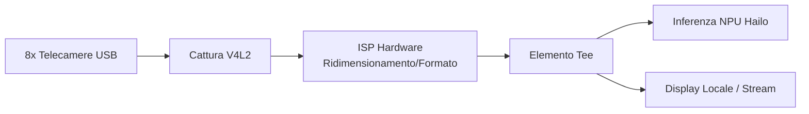

<p align="center">
  
</p>

# 📹 HYDRA-UMC-VISION-STREAMER

<p align="center"><a href="README.md">🇺🇸 English</a> | <a href="README_spa.md">🇪🇸 Español</a> | <a href="README_fra.md">🇫🇷 Français</a> | 🇮🇹 <b>Italiano</b> | <a href="README_deu.md">🇩🇪 Deutsch</a> | <a href="README_zho.md">🇨🇳 简体中文</a> | <a href="README_jpn.md">🇯🇵 日本語</a></p>

### 🚀 Pipeline GStreamer Ottimizzata per IA Edge Multi-Camera

<p align="left">
  
  
  
  
  
</p>

---

## 1. 🛠️ PANORAMICA TECNICA

**HYDRA-UMC-VISION-STREAMER** è pensato per essere lo strato di ingestione media ad alte prestazioni della famiglia Vision AI Node. Il suo compito è la cattura a basso livello, il pre-processamento e la distribuzione fino a 8 flussi camera USB 3.0 concorrenti, usando l'ISP accelerato via hardware del Broadcom BCM2712 (CM5) per conversione dello spazio colore, ridimensionamento e normalizzazione prima che i fotogrammi raggiungano la NPU Hailo-8.

Questo è uno dei 4 figli di **[HYDRA-UMC-VISION-NODE](https://github.com/JuanenRac/HYDRA-UMC-VISION-NODE)**, il genitore di integrazione della famiglia: questo progetto possiede solo cattura/pre-processamento, e non esegue la propria inferenza Hailo-8, API gRPC o logica di sicurezza - questo è deliberatamente suddiviso tra i suoi 3 fratelli.

### Punti Chiave

* ✅ **Reale v0 - generazione di config, pipeline e relay:** `config.py` valida una config JSON per camera (dispositivo, risoluzione, fps, formato); `pipeline.py` genera la descrizione reale della pipeline GStreamer per una camera; `mediamtx_config.py` genera il `paths.yml` MediaMTX corrispondente. Esposto tramite `config validate`/`config gst`/`config mediamtx` più sotto - non serve runtime GStreamer, V4L2 o telecamera fisica per eseguirlo o testarlo.
* 🔁 **Reale v0 - buffer limitato e riconnessione:** `FrameBuffer` di `buffer.py` è una coda a capacità fissa che scarta l'elemento PIÙ VECCHIO (mai il più recente) una volta piena - la vera politica di contropressione di cui un relay live ha bisogno affinché un consumer lento non possa mai far crescere senza limiti la memoria di questo processo. `ConnectionTracker` di `reconnect.py` è una vera politica deterministica di riconnessione con backoff esponenziale per un collegamento camera/relay caduto. Esposto tramite `stream simulate` più sotto - completamente testabile senza GStreamer o telecamera fisica.
* 📡 **Supporto RTSP/WebRTC (parzialmente previsto):** il percorso di relay RTSP (`rtspclientsink` → MediaMTX) è progettato e la sua config viene generata davvero sopra; eseguirlo davvero richiede il runtime GStreamer che questo ambiente non ha. L'output WebRTC resta interamente previsto.
* 🔌 **Limite di integrazione HailoRT, preparato in anticipo sul modulo:** `hailo_runtime.py` è scritto contro l'API reale e confermata `hailo_platform` (`VDevice`, `HEF`, `ConfigureParams`) - importata in modo lazy così che questo repository si installi/testi in modo pulito senza il pacchetto `hailort` né un modulo Hailo-8 presente - più una vera validazione di pre-volo che la risoluzione configurata di una fotocamera corrisponda davvero alla forma del tensore di input di un modello caricato, prima che un singolo fotogramma venga inviato al dispositivo. *(implementato, solo limite di integrazione - eseguire davvero l'inferenza e analizzare il vero output NMS di un modello resta lavoro futuro.)*
* ⚡ **Pipeline Zero-Copy (previsto):** trasferimento di buffer tra V4L2 e HailoRT progettato per evitare copie di fotogrammi non necessarie. *(lavoro futuro - richiede il vero runtime V4L2/HailoRT che questo ambiente non ha.)*
* 🌈 **Pre-elaborazione Hardware (previsto):** ridimensionamento e conversione del formato pixel in tempo reale usando l'ISP della Pi, scaricando lavoro che la CPU dovrebbe altrimenti fare per fotogramma. *(lavoro futuro, stesso motivo.)*
* 🛠️ **Configurazione Dinamica:** risoluzione, framerate e formato pixel per camera sono reali e validati oggi (`config.py`); il controllo di esposizione/guadagno richiede il vero dispositivo V4L2 ed è lavoro futuro.
* 🧩 **Perché esiste come progetto separato:** la messa a punto di cattura/ISP è un'abilità diversa e un dominio di guasto diverso rispetto all'inferenza dei modelli o alla logica di sicurezza - mantenerlo nel proprio processo significa che un bug di cattura non può far cadere [HYDRA-UMC-SAFETY-ZONES](https://github.com/JuanenRac/HYDRA-UMC-SAFETY-ZONES), e i due possono essere sviluppati/testati indipendentemente.

**Verifica di onestà - cosa funziona davvero oggi:** la validazione della config, la generazione della descrizione della pipeline GStreamer, la generazione della config di relay MediaMTX, e la vera politica di buffer/riconnessione, e il vero confine di integrazione HailoRT (`config.py`, `pipeline.py`, `mediamtx_config.py`, `buffer.py`, `reconnect.py`, `hailo_runtime.py`) sono reali e testate (65 test). Nulla di tutto ciò apre un dispositivo V4L2, importa GStreamer, o parla con una telecamera fisica - eseguire davvero la pipeline generata richiede quel vero runtime e hardware, che questo ambiente non ha. Vedi [`CHANGELOG.md`](CHANGELOG.md) per ciò che è stato consegnato esattamente finora, e "Stato Attuale e Prossimi Passi" più sotto per ciò che resta aperto.

---

## 2. 🔄 ARCHITETTURA DI PIPELINE PREVISTA

Il diagramma sotto è il flusso dati obiettivo verso cui viene costruito questo progetto - la sua *forma* (quale elemento alimenta quale, la diramazione `Tee`) è fissata da `pipeline.py` e generata come sintassi reale `gst-launch-1.0` oggi, ma nulla di questo diagramma viene ancora eseguito: serve il vero runtime V4L2/GStreamer/Hailo-8 e vere telecamere USB fisiche.



---

## 3. 🧠 INFORMAZIONI TECNICHE AVANZATE

### Perché non ci sono `hardware/`, `firmware/`, `os/` né `models/` qui

CM5 + Hailo-8 è hardware già esistente senza una scheda propria da progettare, a differenza delle schede STM32H745/STM32G474 su misura dentro [HYDRA-UMC](https://github.com/JuanenRac/HYDRA-UMC) - quindi nessuna cartella `hardware/`/`firmware/` esiste in nessuno dei 5 progetti Vision AI Node. `os/` (l'immagine HydraOS condivisa) e `models/` (i `.hef` compilati realmente serviti alla NPU) vivono solo nel genitore di integrazione, [HYDRA-UMC-VISION-NODE](https://github.com/JuanenRac/HYDRA-UMC-VISION-NODE), perché è il processo proprietario dell'immagine dell'host CM5 e dell'handle del dispositivo Hailo-8 - portare copie separate qui sarebbe solo stato extra da sincronizzare senza alcun beneficio.

### Forma di pipeline prevista

L'elemento `Tee` nel diagramma sopra è la decisione di design chiave già presa prima dell'implementazione: i fotogrammi catturati/pre-elaborati sono pensati per diramarsi verso due consumatori contemporaneamente - il percorso di inferenza Hailo-8 (alimentando [HYDRA-UMC-VISION-NODE](https://github.com/JuanenRac/HYDRA-UMC-VISION-NODE)) e uno stream locale/RTSP-WebRTC opzionale per il monitoraggio umano - senza che il percorso di monitoraggio aggiunga latenza al percorso di inferenza.

### Decisioni di design già prese

* **La versione viene letta dai metadati del pacchetto installato, non è hardcoded** - `main.py` chiama `importlib.metadata.version("hydra-umc-vision-streamer")` invece di una seconda stringa `__version__`, così `bump_version.py` ha un solo posto da modificare e i due non possono mai disallinearsi.
* **L'incremento "contachilometri" tocca automaticamente solo `PATCH`/`MINOR`** - `bump_version.py` riporta `PATCH` a `MINOR` oltre il 9 e da `MINOR` a `MAJOR` oltre il 9, ma non incrementa mai `MAJOR` da solo; è una decisione umana deliberata, stessa convenzione di `HYDRA-UMC-EDITOR-URDF/bump_version.py` e `HYDRA-UMC-SUITE/bump_version.py`.
* **Lo YAML di MediaMTX è scritto a mano, non basato su PyYAML** - la forma di output di `mediamtx_config.py` (una mappa piatta `paths:`, una voce `source: publisher` per camera) è abbastanza semplice e fissa da non giustificare ancora una vera dipendenza. Da rivedere se la config per camera crescerà con campi annidati o di tipo lista.
* **La pipeline e la config MediaMTX devono concordare su un unico percorso RTSP per camera** - `rtsp_url_for()` è l'unico punto che lo deriva (dal nome della camera), così `config gst` e `config mediamtx` non possono mai essere in disaccordo su dove vive lo stream di una camera.
* **`FrameBuffer` scarta l'elemento più vecchio, non il più recente, una volta pieno.** Il video live non ha alcun uso per un arretrato crescente di frame obsoleti - il frame più fresco è sempre quello utile. Una coda che bloccasse i produttori rischierebbe il vero thread di cattura stesso, e una coda che continuasse semplicemente a crescere rischierebbe esattamente il fallimento di memoria senza limiti che questa verifica esiste per prevenire.
* **`reconnect.py` non dorme mai né tocca mai un vero socket da solo.** `ConnectionTracker` traccia solo lo stato e restituisce quanto deve attendere chi lo chiama - questa separazione è ciò che rende l'intero calendario di backoff (incluso l'arrendersi onestamente dopo `max_attempts`) esattamente riproducibile in un test, senza orologio reale né vero collegamento camera coinvolto.

---

## 📂 STRUTTURA DELLE DIRECTORY

```text
HYDRA-UMC-VISION-STREAMER/
├── src/                 # Codice sorgente (pacchetto hydra_umc_vision_streamer)
│   └── hydra_umc_vision_streamer/
│       ├── config.py           # Parsing/validazione della config per camera
│       ├── pipeline.py         # Generazione della descrizione della pipeline GStreamer
│       ├── buffer.py           # Vero buffer limitato (contropressione drop-oldest)
│       ├── reconnect.py        # Vera politica deterministica di riconnessione/backoff
│       ├── mediamtx_config.py  # Generazione del paths.yml MediaMTX
│       ├── hailo_runtime.py    # Vero limite di integrazione HailoRT (hailo_platform), importato in modo lazy
│       ├── mjpeg_server.py     # Vero server MJPEG - serve realmente l'immagine di una webcam USB via HTTP
│       └── main.py             # Entry point CLI (invocazione nuda + `config`/`stream`)
├── tests/               # Suite pytest reale (config, pipeline, mediamtx, buffer, reconnect, hailo_runtime, mjpeg_server, CLI)
├── docs/                # Documentazione e guide di tuning
├── build/               # Output di build (qui vive anche il .venv locale)
├── images/              # Media e diagrammi
├── systemd/
│   ├── hydra-umc-vision-streamer@.service  # Unità systemd istanziata per telecamera
│   └── cameras.env.example                 # File di ambiente di esempio per istanza
├── tools/
│   ├── build_test.py    # Controllo build senza versionamento
│   └── ci_validate.py   # Validazione manifest/CHANGELOG/docs usata dalla CI
├── pyproject.toml       # Metadati pacchetto, dipendenze, versione contachilometri
├── bump_manifest_version.py # Sincronizza la versione di hydra-umc.project.json con quella nativa (--sync)
├── bump_version.py      # Incremento versione tipo contachilometri (build.sh/.bat)
├── build.sh / build.bat # venv + installazione editabile + compile-check + test
├── run.sh / run.bat     # Esegue l'entry point dal venv locale
└── CHANGELOG.md         # Storico versione per versione (schema contachilometri, senza date)
```

Nessuna cartella `hardware/`, `firmware/`, `os/` o `models/` - vedi "Informazioni Tecniche Avanzate" sopra per il perché. `os/` e `models/` vivono solo nel genitore di integrazione, [HYDRA-UMC-VISION-NODE](https://github.com/JuanenRac/HYDRA-UMC-VISION-NODE).

---

## 🏗️ BUILD ED ESECUZIONE

### Prerequisiti

* **Python 3.10 o superiore** nel `PATH` (gli script provano `python3` poi ripiegano su `python`).
* Non serve ancora GStreamer, strumenti V4L2 o altra dipendenza nativa - **zero dipendenze di terze parti a runtime** in questa fase (`dependencies = []` in `pyproject.toml`).
* Poche decine di MB di spazio su disco per un ambiente virtuale locale sotto `.venv/`.

### Passo dopo passo

```bash
# Linux / macOS
./build.sh
```

1. **Incremento versione contachilometri** - esegue `bump_version.py`, incrementando `PATCH` in `pyproject.toml` a ogni build (con riporto a `MINOR`/`MAJOR` secondo la regola sopra).
2. **Ambiente virtuale** - crea `.venv/` se manca; lo riutilizza altrimenti.
3. **Installazione editabile** - `pip install -e ".[dev]"` così le modifiche sotto `src/` hanno effetto immediato, installa `pytest`, e registra l'entry point da console `hydra-umc-vision-streamer`.
4. **Compile-check** - `python -m compileall -q src` compila in bytecode ogni file sotto `src/`, individuando errori di sintassi in tutto il pacchetto.
5. **Suite di test reale** - `python -m pytest tests/ -q` (65 test che coprono config, pipeline, generazione MediaMTX, la politica di buffer/riconnessione, il confine di integrazione HailoRT, e il CLI).

`set -euo pipefail` ferma lo script al primo passo che fallisce; il build segnala successo solo se tutti e 5 i passi hanno successo.

```bash
./run.sh
```

Individua l'interprete dentro `.venv` (gestisce entrambi i layout, POSIX e Windows) ed esegue `python -m hydra_umc_vision_streamer.main`, inoltrando qualsiasi argomento - l'invocazione nuda stampa nome + versione + ruolo.

Esempio reale - validare una config di telecamere, generare la sua pipeline GStreamer, e generare la config di relay MediaMTX corrispondente:

```bash
./run.sh config validate --config cameras.json
# 2 camera(s) in cameras.json
#   cam0: /dev/video0 1920x1080@30 MJPG
#   cam1: /dev/video1 640x480@15 YUYV
# config OK

./run.sh config gst --config cameras.json --camera cam0
# v4l2src device=/dev/video0 ! image/jpeg,width=1920,height=1080,framerate=30/1 ! jpegdec ! videoconvert ! tee name=t t. ! queue ! appsink name=cam0_hailo_sink t. ! queue ! rtspclientsink location=rtsp://localhost:8554/cam0

./run.sh config mediamtx --config cameras.json
# paths:
#   cam0:
#     source: publisher
#   cam1:
#     source: publisher
```

Esempio reale - simula un consumer lento contro un buffer limitato, e una connessione caduta gestita dalla vera politica di riconnessione:

```bash
./run.sh stream simulate --buffer-size 8 --frames 1000 --consumer-rate 1000
# Pushed 1000 frame(s) through a buffer capped at 8
# Max buffer size observed: 8 (must never exceed 8)
# Frames dropped by backpressure: 972
#
# Simulated disconnect at frame 500
# Reconnect backoff schedule (s): [0.5, 1.0, 2.0, 4.0]
# Final connection state: given_up
```

```bat
:: Windows - stessi passi, sintassi batch
build.bat
run.bat
```

### Risoluzione dei problemi

* **`python`/`python3` non trovato** - installa Python 3.10+ e assicurati che sia nel `PATH`.
* **`compileall` fallisce** - è stato introdotto un vero errore di sintassi sotto `src/`; il build si ferma senza toccare l'installazione, di proposito.
* **"No `.venv` found" da `run.sh`/`run.bat`** - esegui `build.sh`/`build.bat` almeno una volta prima; `run` non crea mai l'ambiente da solo.
* **Installazione editabile obsoleta** - elimina `.venv/` e ricostruisci; raramente necessario.

---

## 🚀 Stato Attuale e Prossimi Passi

**Cosa funziona oggi:** la validazione della config per camera, la generazione della descrizione della pipeline GStreamer, e la generazione della config di relay MediaMTX (`config.py`, `pipeline.py`, `mediamtx_config.py`), un vero buffer dimostrabilmente limitato e una vera politica deterministica di riconnessione (`buffer.py`, `reconnect.py`, `stream simulate`), un vero confine di integrazione HailoRT (`hailo_runtime.py`) pronto per un vero modulo Hailo-8 non appena collegato, e un vero percorso v0 di cattura+servizio (`mjpeg_server.py`, `stream serve`) che apre un vero dispositivo V4L2 via OpenCV e serve vero MJPEG via HTTP - installabile su una CM5 tramite `provisioning/install_vision_streamer.sh` di `HYDRA-UMC-OS` (un'istanza systemd per ogni slot camera assegnato dall'amministratore, `systemd/hydra-umc-vision-streamer@.service`) e già consumato dal vivo dal proxy `GET /api/camera/:id/stream` di `HYDRA-UMC-SERVER` e dalle viste camera di `HYDRA-UMC-STUDIO` - 65 test in totale, più un vero pacchetto Python installabile con un entry point verificato e un incremento di versione contachilometri integrato nel build. Vedi [`CHANGELOG.md`](CHANGELOG.md) per l'output di build/run catturato.

**Cosa resta aperto, senza ordine particolare, senza calendario impegnato, e bloccato da vero hardware:**

* Eseguire davvero la *pipeline generata* - il tee GStreamer/PyGObject completo verso un ramo di inferenza Hailo-8, non il più semplice v0 OpenCV sopra (`stream serve`) - tramite un vero runtime.
* Ridimensionamento/conversione formato via ISP hardware (richiede il vero ISP del CM5).
* Eseguire davvero l'inferenza tramite `hailo_runtime.py` (richiede un vero modulo Hailo-8 e un `.hef` compilato reale), e parsare il vero formato di output NMS di quel modello - deliberatamente non indovinato senza il dispositivo per verificarlo.
* L'output WebRTC, e il controllo di esposizione/guadagno per camera (richiede il vero dispositivo V4L2).
* `stream serve` non è ancora stato verificato contro una vera camera USB fisicamente connessa - solo contro un `cv2.VideoCapture` mockato al confine del modulo (vedi `tests/test_mjpeg_server.py`).

---

## 🔗 Progetti Correlati

Questo progetto fa parte dell'ecosistema robotico HYDRA-UMC dello stesso autore (JuanenRac / Electro Hobby 3D). Vale la pena conoscerlo, poiché una richiesta potrebbe in realtà riguardare uno di questi invece di questo repository.

**Progetto Padre**
- **[HYDRA-UMC-VISION-NODE](https://github.com/JuanenRac/HYDRA-UMC-VISION-NODE)** — hub di integrazione per la pipeline di visione Hailo-8, con un vero controllo di prontezza hardware per fase; il genitore di cui questo repository è una fase o un consumatore specifico, all'interno della propria pipeline di percezione.

**Progetti Fratelli** — le altre fasi/consumatori della pipeline di percezione Hailo-8 propria di HYDRA-UMC-VISION-NODE
- **[HYDRA-UMC-DETECTION-HEF](https://github.com/JuanenRac/HYDRA-UMC-DETECTION-HEF)** — registro reale di modelli compilati con verifica di caricamento sicuro per architettura Hailo/checksum.
- **[HYDRA-UMC-SAFETY-ZONES](https://github.com/JuanenRac/HYDRA-UMC-SAFETY-ZONES)** — vero controllo di violazione zona e richiesta E-STOP, con imposizione della freschezza di calibrazione.
- **[HYDRA-UMC-VISUAL-SERVOING-API](https://github.com/JuanenRac/HYDRA-UMC-VISUAL-SERVOING-API)** — vera legge di correzione Position-Based Visual Servoing, con cancello di sicurezza sullo stato di zona a monte.

**Fa Anche Parte dell'Ecosistema**

*Hardware e Piattaforma di Base*
- **[HYDRA-UMC](https://github.com/JuanenRac/HYDRA-UMC)** — la scheda madre fisica del braccio robotico: host CM5 + coprocessore STM32H745 dual-core, che coordina fino a 8 bracci utensile via CAN-OTA/SPI-OTA.
- **[HYDRA-UMC-OS](https://github.com/JuanenRac/HYDRA-UMC-OS)** — livello prodotto riproducibile su Raspberry Pi OS per il CM5: agente in sola lettura, config/profili validati, provisioning WiFi al primo contatto.
- **[HYDRA-UMC-SDK](https://github.com/JuanenRac/HYDRA-UMC-SDK)** — il contratto JSON-Schema condiviso e la barriera di sicurezza contro cui ogni bridge valida i propri comandi.

*Backend Centrale e Client*
- **[HYDRA-UMC-SERVER](https://github.com/JuanenRac/HYDRA-UMC-SERVER)** — il vero backend headless (REST/WebSocket) con cui parla davvero ogni client di controllo.
- **[HYDRA-UMC-STUDIO](https://github.com/JuanenRac/HYDRA-UMC-STUDIO)** — dashboard di controllo web con visualizzazione 3D multi-robot in tempo reale.
- **[HYDRA-UMC-SUITE](https://github.com/JuanenRac/HYDRA-UMC-SUITE)** — centro di comando sciame desktop (PySide6) per più server contemporaneamente, pacchettizzato come eseguibile standalone.
- **[HYDRA-UMC-ANDROID-CONTROL](https://github.com/JuanenRac/HYDRA-UMC-ANDROID-CONTROL)** — app di controllo nativa per Android con login biometrico e un companion Wear OS abbinato.
- **[HYDRA-UMC-IOS-CONTROL](https://github.com/JuanenRac/HYDRA-UMC-IOS-CONTROL)** — app di controllo per iOS/iPadOS (Flutter) con sincronizzazione WebSocket in tempo reale.
- **[HYDRA-UMC-DSI](https://github.com/JuanenRac/HYDRA-UMC-DSI)** — interfaccia touch nativa per il touchscreen DSI da 7" a bordo, incorporata direttamente nel CM5.
- **[HYDRA-UMC-EDITOR-URDF](https://github.com/JuanenRac/HYDRA-UMC-EDITOR-URDF)** — creatore/editor grafico desktop di URDF che invia i modelli finiti al catalogo di STUDIO.
- **[HYDRA-UMC-BRIDGE-AMR](https://github.com/JuanenRac/HYDRA-UMC-BRIDGE-AMR)** — barriera di coordinamento per flotte AGV/AMR tramite un publisher MQTT VDA 5050 reale.
- **[HYDRA-UMC-BRIDGE-CNC](https://github.com/JuanenRac/HYDRA-UMC-BRIDGE-CNC)** — coordinatore ad alto livello per celle CNC con accesso reale a stato/byte di controllo GRBL.
- **[HYDRA-UMC-BRIDGE-DROIDS](https://github.com/JuanenRac/HYDRA-UMC-BRIDGE-DROIDS)** — barriera di coordinamento per droidi con zampe/umanoidi, con un vero mittente di comandi per Boston Dynamics Spot.
- **[HYDRA-UMC-BRIDGE-LASER](https://github.com/JuanenRac/HYDRA-UMC-BRIDGE-LASER)** — coordinatore di sicurezza per celle laser che legge 3 salvaguardie GPIO reali di chiave/involucro/interblocco.
- **[HYDRA-UMC-BRIDGE-OPENPNP](https://github.com/JuanenRac/HYDRA-UMC-BRIDGE-OPENPNP)** — coordinatore ad alto livello sicuro per il flusso schede del pick-and-place OpenPnP.
- **[HYDRA-UMC-BRIDGE-PRINTER3D](https://github.com/JuanenRac/HYDRA-UMC-BRIDGE-PRINTER3D)** — barriera di coordinamento sicura per stampanti 3D Moonraker/Klipper, con comandi di lavoro reali e controllati.
- **[HYDRA-UMC-BRIDGE-ROS2](https://github.com/JuanenRac/HYDRA-UMC-BRIDGE-ROS2)** — coordinatore di sicurezza con un vero trasporto ROS 2 rclpy, importato in modo lazy.
- **[HYDRA-UMC-BRIDGE-UAV](https://github.com/JuanenRac/HYDRA-UMC-BRIDGE-UAV)** — barriera di coordinamento per UAV dotati di fotocamera, con un vero mittente di comandi MAVLink.

*Piattaforma Strumenti URTC*
- **[URTC](https://github.com/JuanenRac/URTC)** — firmware per la scheda fisica dell'Universal Robot Tool Controller, oltre 25 profili utensile su bus CAN.
- **[URTC-FLASHER](https://github.com/JuanenRac/URTC-FLASHER)** — strumento desktop con GUI per il flashing delle schede URTC, CAN-OTA più SWD/JTAG a chip intero.
- **[URTC-TESTER](https://github.com/JuanenRac/URTC-TESTER)** — strumento desktop di diagnostica CAN-bus dal vivo per schede URTC, un pannello per profilo utensile.
- **[URTC-WEB-STUDIO](https://github.com/JuanenRac/URTC-WEB-STUDIO)** — alternativa basata su browser a URTC-TESTER tramite la Web Serial API, senza installazione locale.

*Nodo IA Cognitivo (Hailo-10)*
- **[HYDRA-UMC-COGNITIVE-NODE](https://github.com/JuanenRac/HYDRA-UMC-COGNITIVE-NODE)** — hub di integrazione per la pipeline cognitiva Hailo-10 (orchestrazione LLM/VLA/voce).
- **[HYDRA-UMC-VLA-ENGINE](https://github.com/JuanenRac/HYDRA-UMC-VLA-ENGINE)** — vera codifica/decodifica di token d'azione e generazione di traiettoria per un modello Vision-Language-Action.
- **[HYDRA-UMC-VOICE-UI](https://github.com/JuanenRac/HYDRA-UMC-VOICE-UI)** — vero front-end vocale (VAD + parser di intenti) con un relay verso Watch limitato e soggetto a conferma.
- **[HYDRA-UMC-SEMANTIC-PLANNER](https://github.com/JuanenRac/HYDRA-UMC-SEMANTIC-PLANNER)** — vera scomposizione dei task basata su regole e recupero semantico degli errori sui codici errore MCU.
- **[HYDRA-UMC-DOCS-QA](https://github.com/JuanenRac/HYDRA-UMC-DOCS-QA)** — vera ricerca documentale TF-IDF (solo libreria standard) sui documenti Markdown di questo ecosistema.

*Orchestrazione e Sciame*
- **[HYDRA-UMC-ORCHESTRATOR](https://github.com/JuanenRac/HYDRA-UMC-ORCHESTRATOR)** — hub di integrazione con un vero contratto di health-report gRPC/Protobuf e una macchina a stati di missione.
- **[HYDRA-UMC-JOB-DISPATCHER](https://github.com/JuanenRac/HYDRA-UMC-JOB-DISPATCHER)** — vera coda di lavori basata su priorità con deduplicazione, su una vera API HTTP.
- **[HYDRA-UMC-NODE-HEALING](https://github.com/JuanenRac/HYDRA-UMC-NODE-HEALING)** — vero watchdog di salute della flotta basato su gRPC, con retry/backoff e rilevamento di discrepanza d'identità.
- **[HYDRA-UMC-PATH-PLANNER-3D](https://github.com/JuanenRac/HYDRA-UMC-PATH-PLANNER-3D)** — vero pianificatore di percorsi 3D basato su RRT, con vera validazione delle collisioni ostacolo/spazio di lavoro.
- **[HYDRA-UMC-SWARM-SYNC](https://github.com/JuanenRac/HYDRA-UMC-SWARM-SYNC)** — vera sincronizzazione di stato CRDT LWW-Element-Map, con property test per la convergenza multi-cella.

*Gemello Digitale e Simulazione*
- **[HYDRA-UMC-TWIN](https://github.com/JuanenRac/HYDRA-UMC-TWIN)** — hub di integrazione per il motore di gemello digitale, con un vero contratto di sincronizzazione per compatibilità di versione.
- **[HYDRA-UMC-HIL-BRIDGE](https://github.com/JuanenRac/HYDRA-UMC-HIL-BRIDGE)** — vero interblocco di sicurezza hardware-in-the-loop che instrada i comandi tra simulazione e hardware reale.
- **[HYDRA-UMC-PHYSICS-REPLICA](https://github.com/JuanenRac/HYDRA-UMC-PHYSICS-REPLICA)** — vera cinematica diretta e validazione dei limiti articolari su un vero sottoinsieme URDF.
- **[HYDRA-UMC-SYNTHETIC-DATA-GEN](https://github.com/JuanenRac/HYDRA-UMC-SYNTHETIC-DATA-GEN)** — vero generatore procedurale di scene 2D con esportazione di annotazioni YOLO/COCO.

*Dati e Analisi*
- **[HYDRA-UMC-DATALAKE](https://github.com/JuanenRac/HYDRA-UMC-DATALAKE)** — vero archivio di serie temporali basato su sqlite3, con una vera API HTTP di ingestione/query.
- **[HYDRA-UMC-ANOMALY-DETECTOR](https://github.com/JuanenRac/HYDRA-UMC-ANOMALY-DETECTOR)** — vero rilevatore di anomalie FFT + baseline statistica, con monitoraggio della deriva.
- **[HYDRA-UMC-PRODUCTION-REPORTS](https://github.com/JuanenRac/HYDRA-UMC-PRODUCTION-REPORTS)** — vero calcolo OEE/disponibilità sullo storico di DATALAKE, con esportazione CSV riproducibile.
- **[HYDRA-UMC-TELEMETRY-COLLECTOR](https://github.com/JuanenRac/HYDRA-UMC-TELEMETRY-COLLECTOR)** — vera pipeline di ingestione CAN/WebSocket verso DATALAKE, con deduplicazione per sequenza.

*Gateway Industriale*
- **[HYDRA-UMC-GATEWAY-INDUSTRIAL](https://github.com/JuanenRac/HYDRA-UMC-GATEWAY-INDUSTRIAL)** — hub di integrazione che inoltra ai protocolli industriali, con un vero livello di allowlist dei comandi/backpressure.
- **[HYDRA-UMC-OPCUA-SERVER](https://github.com/JuanenRac/HYDRA-UMC-OPCUA-SERVER)** — vero spazio di indirizzi OPC-UA, verificato con una vera sessione client del protocollo binario.
- **[HYDRA-UMC-MQTT-BROKER](https://github.com/JuanenRac/HYDRA-UMC-MQTT-BROKER)** — vero broker MQTT con autenticazione opzionale per client e ACL sui topic.
- **[HYDRA-UMC-MTCONNECT-ADAPTER](https://github.com/JuanenRac/HYDRA-UMC-MTCONNECT-ADAPTER)** — veri endpoint XML `/probe` e `/current` di MTConnect, con output in modalità degradata.

*Strumenti Complementari e Operazioni dell'Ecosistema*
- **[HYDRA-UMC-DASHBOARD-AI](https://github.com/JuanenRac/HYDRA-UMC-DASHBOARD-AI)** — pannelli Smart Summaries e Anomaly Highlighting su DATALAKE/ANOMALY-DETECTOR, con un fallback statistico onesto.
- **[HYDRA-UMC-TOOL-CLI](https://github.com/JuanenRac/HYDRA-UMC-TOOL-CLI)** — CLI di flotta con un vero e stabile contratto di exit-code, un client live reale della stessa API di HYDRA-UMC-SERVER.
- **[HYDRA-UMC-WATCH](https://github.com/JuanenRac/HYDRA-UMC-WATCH)** — app companion WearOS con avvisi aptici reali e un relay vocale verso il telefono abbinato.
- **[URTC-SMART-RACK](https://github.com/JuanenRac/URTC-SMART-RACK)** — firmware per un rack di montaggio schede con decodifica reale dell'ID utensile e logica di preriscaldamento Smart Idle.
- **[URTC-VISION-TOOL](https://github.com/JuanenRac/URTC-VISION-TOOL)** — firmware più un vero companion di visione Python per una testa utensile di ispezione termica/RGB.
- **[HYDRA-UMC-UPDATER](https://github.com/JuanenRac/HYDRA-UMC-UPDATER)** — strumento amministrativo desktop che scopre, clona e aggiorna ogni repository di questo ecosistema.

---

## 📚 Documentazione e Comunità

- **[CONTRIBUTING.md](CONTRIBUTING.md)** — stack tecnologico e linee guida di codifica per una pull request.
- **[CODE_OF_CONDUCT.md](CODE_OF_CONDUCT.md)** — gli standard di comportamento attesi in questa comunità.
- **[SECURITY.md](SECURITY.md)** — come segnalare una vulnerabilità, e le reali aree di attenzione sulla sicurezza di questo progetto.
- **[SUPPORT.md](SUPPORT.md)** — dove porre domande e segnalare bug.
- **[LICENSE.md](LICENSE.md)** — la licenza propria di questo progetto.

## 👤 AUTORE
**JuanenRac** (Electro Hobby 3D)
📧 electrohobby3d@gmail.com
📺 [youtube.com/@electrohobby3d](https://youtube.com/@electrohobby3d)

## 📜 LICENZA
GPL-3.0 - Vedi il file LICENSE per i dettagli.
