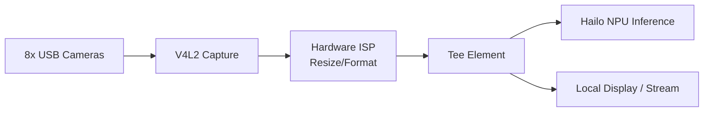

<p align="center">
  
</p>

# 📹 HYDRA-UMC-VISION-STREAMER

<p align="center"><a href="README.md">🇺🇸 English</a> | <a href="README_spa.md">🇪🇸 Español</a> | <a href="README_fra.md">🇫🇷 Français</a> | <a href="README_ita.md">🇮🇹 Italiano</a> | <a href="README_deu.md">🇩🇪 Deutsch</a> | <a href="README_zho.md">🇨🇳 简体中文</a> | 🇯🇵 <b>日本語</b></p>

### 🚀 マルチカメラエッジ AI 向けに最適化された GStreamer パイプライン

<p align="left">
  
  
  
  
  
</p>

---

## 1. 🛠️ 技術概要

**HYDRA-UMC-VISION-STREAMER** は、Vision AI Node ファミリーの高性能な
メディア取り込み層となることを目指しています。その役割は、最大 8 台の
USB 3.0 カメラストリームを同時に低レベルでキャプチャ、前処理、配信する
ことであり、Broadcom BCM2712（CM5）のハードウェアアクセラレーション ISP
を利用して、フレームが Hailo-8 NPU に到達する前に色空間変換、リサイズ、
正規化を行います。

これは、ファミリーの統合親プロジェクトである
**[HYDRA-UMC-VISION-NODE](https://github.com/JuanenRac/HYDRA-UMC-VISION-NODE)** の 4 つの子プロジェクトの 1 つです：本プロジェクトはキャプチャ/前処理のみを担当し、独自の Hailo-8 推論、gRPC API、安全ロジックは実行しません——これらは意図的に他の 3 つの兄弟プロジェクトに分割されています。

### 要点

* ✅ **実装済み v0 —— 設定・パイプライン・リレー生成：** `config.py` はカメラごとの JSON 設定（デバイス、解像度、fps、フォーマット）を検証し、`pipeline.py` はあるカメラの実際の GStreamer パイプライン記述を生成し、`mediamtx_config.py` は対応する MediaMTX の `paths.yml` を生成します。下記の `config validate`/`config gst`/`config mediamtx` から利用可能で、実行にもテストにも GStreamer ランタイム、V4L2、物理カメラは不要です。
* 🔁 **実装済み v0 —— 有界バッファリングと再接続：** `buffer.py` の `FrameBuffer` は満杯になると最も古い項目(最新のものではない)を破棄する固定容量のキューです——遅い消費者がこのプロセス自体のメモリを無制限に増加させることを決して許さない、ライブリレーが必要とする実際のバックプレッシャーポリシーです。`reconnect.py` の `ConnectionTracker` は、切断されたカメラ/リレーリンクのための実際の、決定論的な指数バックオフ再接続ポリシーです。下記の `stream simulate` から利用可能で、GStreamer や物理カメラなしで完全にテスト可能です。
* 📡 **RTSP/WebRTC サポート（一部計画中）：** RTSP リレーパス（`rtspclientsink` → MediaMTX）は設計済みで、その設定は上記で実際に生成されています。実際に実行するにはこの環境にない GStreamer ランタイムが必要です。WebRTC 出力は引き続き完全に計画段階です。
* ⚡ **ゼロコピーパイプライン（計画中）：** 不要なフレームコピーを避けるよう設計された、V4L2 と HailoRT の間のバッファ受け渡し。*（将来の作業——この環境にはまだない実際の V4L2/HailoRT ランタイムが必要です。）*
* 🌈 **ハードウェア前処理（計画中）：** Pi の ISP を使用したリアルタイムのリサイズとピクセルフォーマット変換により、本来フレームごとに CPU が担うはずの作業をオフロードします。*（同じ理由で将来の作業です。）*
* 🛠️ **動的設定：** カメラごとの解像度、フレームレート、ピクセルフォーマットは今日すでに実装され検証されています（`config.py`）。露出/ゲイン制御は実際の V4L2 デバイスが必要で、将来の作業です。
* 🧩 **独立したプロジェクトとして存在する理由：** キャプチャ/ISP チューニングは、モデル推論や安全ロジックとは異なるスキルと異なる障害領域を持ちます——独自のプロセスとして保つことで、キャプチャ側のバグが [HYDRA-UMC-SAFETY-ZONES](https://github.com/JuanenRac/HYDRA-UMC-SAFETY-ZONES) を巻き込むことがなくなり、両者を独立して開発・テストできます。

**正直な現状確認 —— 今日実際に動くもの：** 設定の検証、GStreamer パイプライン記述の生成、MediaMTX リレー設定の生成、そして実際のバッファ/再接続ポリシー（`config.py`、`pipeline.py`、`mediamtx_config.py`、`buffer.py`、`reconnect.py`）は実装され、テストされています（45 個のテスト）。これらのいずれも V4L2 デバイスを開いたり、GStreamer をインポートしたり、物理カメラと通信したりはしません——生成されたパイプラインを実際に実行するには、この環境にない実際のランタイムとハードウェアが必要です。実際に出荷済みの内容は [`CHANGELOG.md`](CHANGELOG.md)
を、まだ残っている作業は下記の「現在の状況と次のステップ」セクションを
参照してください。

---

## 2. 🔄 目標パイプラインアーキテクチャ

下図は、本プロジェクトが構築を目指している目標データフローです——その*形態*（どの要素がどれに供給するか、`Tee` の分岐）は `pipeline.py` によって固定され、今日すでに実際の `gst-launch-1.0` 構文として生成されますが、この図の内容はまだ何も実行されていません：それには実際の V4L2/GStreamer/Hailo-8 ランタイムと物理 USB カメラが必要です。



---

## 3. 🧠 高度な技術情報

### なぜ `hardware/`、`firmware/`、`os/`、`models/` がここに存在しないのか

[HYDRA-UMC](https://github.com/JuanenRac/HYDRA-UMC) 内部のカスタム
STM32H745/STM32G474 基板とは異なり、CM5 + Hailo-8 は市販のハードウェア
であり、独自に設計する基板はありません——そのため、5 つの Vision AI Node
プロジェクトのいずれにも `hardware/`/`firmware/` フォルダは存在しません。
`os/`（共有 HydraOS イメージ）と `models/`（実際に NPU に配信される、
コンパイル済みの `.hef` ファイル）は、CM5 ホストイメージと Hailo-8
デバイスハンドルを保持するプロセスである統合親プロジェクト
[HYDRA-UMC-VISION-NODE](https://github.com/JuanenRac/HYDRA-UMC-VISION-NODE) にのみ存在します——ここに別のコピーを持つことは、同期を保つための余分な状態が増えるだけで、何の利益にもなりません。

### 計画中のパイプライン形態

上図の `Tee` 要素は、実装に先立って既に決定されている重要な設計上の
決定です：キャプチャ/前処理されたフレームは、2 つの消費者に同時に分岐
することを意図しています——Hailo-8 推論パス（[HYDRA-UMC-VISION-NODE](https://github.com/JuanenRac/HYDRA-UMC-VISION-NODE) に供給）と、人間による監視のためのオプションのローカル表示/RTSP-WebRTC ストリームです——監視パスが推論パスに遅延を追加することはありません。

### 既に行われた設計上の決定

* **バージョンはハードコードではなく、インストール済みパッケージのメタデータから読み取られます** —— `main.py` は 2 つ目の `__version__` 文字列の代わりに `importlib.metadata.version("hydra-umc-vision-streamer")` を呼び出すため、`bump_version.py` が編集すべき箇所は常に 1 か所であり、両者が食い違うことは決してありません。
* **オドメーター式のインクリメントは自動的に `PATCH`/`MINOR` にのみ触れます** —— `bump_version.py` は `PATCH` が 9 を超えると `MINOR` に、`MINOR` が 9 を超えると `MAJOR` に繰り上がりますが、`MAJOR` 自体を自動で増加させることは決してありません。これは意図的な人間による決定であり、`HYDRA-UMC-EDITOR-URDF/bump_version.py` および `HYDRA-UMC-SUITE/bump_version.py` と同じ慣例です。
* **MediaMTX の YAML は手書きであり、PyYAML の上には構築されていません** —— `mediamtx_config.py` の出力形態（フラットな `paths:` マップ、カメラごとに 1 つの `source: publisher` エントリ）は十分にシンプルで固定されており、実際の依存関係はまだ正当化されません。カメラごとの設定にネストされたフィールドやリスト値のフィールドが増えた場合は、その時点で見直します。
* **パイプラインと MediaMTX 設定は、カメラごとに 1 つの RTSP パスで一致していなければなりません** —— `rtsp_url_for()` はそれを（カメラ名から）導出する唯一の場所であるため、`config gst` と `config mediamtx` があるカメラのストリームがどこにあるかについて食い違うことは決してありません。
* **`FrameBuffer` は満杯になると最も古い項目を破棄し、最新のものは破棄しません。** ライブ映像には、増え続ける古いフレームの滞留分は何の役にも立ちません——常に有用なのは最も新しいフレームです。代わりにプロデューサーをブロックするキューは実際のキャプチャスレッド自体を危険にさらし、ただ単純に増え続けるキューは、このゲートが防ぐために存在する無制限メモリの失敗をまさに引き起こしてしまいます。
* **`reconnect.py` は決して自分でスリープしたり、実際のソケットに触れたりしません。** `ConnectionTracker` は状態を追跡し、呼び出し側がどれだけ待つべきかを返すだけです——この分離こそが、`max_attempts` に達した後に正直に諦めることを含む、バックオフスケジュール全体をテストの中で正確に再現可能にしているものです。実際の時計も実際のカメラリンクも関与しません。

---

## 📂 リポジトリ構成

```text
HYDRA-UMC-VISION-STREAMER/
├── src/                 # ソースコード（hydra_umc_vision_streamer パッケージ）
│   └── hydra_umc_vision_streamer/
│       ├── config.py           # カメラごとの設定の解析/検証
│       ├── pipeline.py         # GStreamer パイプライン記述の生成
│       ├── buffer.py           # 実際の有界バッファ（drop-oldest バックプレッシャー）
│       ├── reconnect.py        # 実際の決定論的な再接続/バックオフポリシー
│       ├── mediamtx_config.py  # MediaMTX paths.yml の生成
│       └── main.py             # CLI エントリポイント（素の呼び出し + `config`/`stream`）
├── tests/               # 実際の pytest スイート（config、pipeline、mediamtx、バッファ/再接続、CLI）
├── docs/                # ドキュメントとチューニングガイド
├── build/               # ビルド出力（ローカルの .venv もここに存在）
├── images/              # メディアと図表
├── scripts/             # ユーティリティスクリプト
├── pyproject.toml       # パッケージメタデータ、依存関係、オドメーターバージョン
├── bump_version.py      # オドメーター式バージョンインクリメント（build.sh/.bat が実行）
├── build.sh / build.bat # venv + editable インストール + コンパイルチェック + テスト
├── run.sh / run.bat     # ローカル venv からエントリポイントを実行
└── CHANGELOG.md         # バージョンごとの履歴（オドメーター方式、日付なし）
```

`hardware/`、`firmware/`、`os/`、`models/` フォルダは存在しません——理由は
上記「高度な技術情報」を参照してください。`os/` と `models/` は統合親
プロジェクトである [HYDRA-UMC-VISION-NODE](https://github.com/JuanenRac/HYDRA-UMC-VISION-NODE) にのみ存在します。

---

## 🏗️ ビルドと実行

### 前提条件

* `PATH` 上に **Python 3.10 以降**があること（スクリプトは先に `python3` を試し、次に `python` にフォールバックします）。
* GStreamer、V4L2 ツール、その他のネイティブ依存関係は現時点では不要です——この段階では**サードパーティのランタイム依存関係が一切ありません**（`pyproject.toml` の `dependencies = []`）。
* ローカル仮想環境（`.venv/` 下）には数十 MB のディスク容量が必要です。

### ステップバイステップ

```bash
# Linux / macOS
./build.sh
```

1. **オドメーター式バージョンインクリメント** — `bump_version.py` を実行し、ビルドのたびに `pyproject.toml` 内の `PATCH` を増加させます（上記の規則に従って `MINOR`/`MAJOR` に繰り上がります）。
2. **仮想環境** — `.venv/` が存在しない場合は作成し、存在する場合は再利用します。
3. **Editable インストール** — `pip install -e ".[dev]"` により `src/` 下の変更が即座に反映され、`pytest` がインストールされ、`hydra-umc-vision-streamer` コンソールエントリポイントが登録されます。
4. **コンパイルチェック** — `python -m compileall -q src` が `src/` 下の各ファイルをバイトコンパイルし、あるファイルが `main.py` から一度もインポートされない場合でも、エコシステム全体にわたる構文エラーを検出します。
5. **実際のテストスイート** — `python -m pytest tests/ -q`（config、pipeline、MediaMTX 生成、バッファ/再接続ポリシー、CLI をカバーする 45 個のテスト）。

`set -euo pipefail` は最初に失敗したステップでスクリプトを停止させます。
5 つのステップすべてが成功した場合にのみビルドは成功を報告します。

```bash
./run.sh
```

`.venv` 内のインタープリタを特定し（POSIX と Windows 両方の `.venv`
ディレクトリ構造を処理）、`python -m hydra_umc_vision_streamer.main` を
実行してすべての引数を転送します——素の呼び出しは名前・バージョン・役割
を表示します。

実際の例 —— カメラ設定を検証し、その GStreamer パイプラインを生成し、対応する MediaMTX リレー設定を生成する：

```bash
./run.sh config validate --config cameras.json
# 2 camera(s) in cameras.json
#   cam0: /dev/video0 1920x1080@30 MJPG
#   cam1: /dev/video1 640x480@15 YUYV
# config OK

./run.sh config gst --config cameras.json --camera cam0
# v4l2src device=/dev/video0 ! image/jpeg,width=1920,height=1080,framerate=30/1 ! jpegdec ! videoconvert ! tee name=t t. ! queue ! appsink name=cam0_hailo_sink t. ! queue ! rtspclientsink location=rtsp://localhost:8554/cam0

./run.sh config mediamtx --config cameras.json
# paths:
#   cam0:
#     source: publisher
#   cam1:
#     source: publisher
```

実際の例 —— 有界バッファに対する遅い消費者をシミュレートし、実際の
再接続ポリシーを通して切断された接続を処理する：

```bash
./run.sh stream simulate --buffer-size 8 --frames 1000 --consumer-rate 1000
# Pushed 1000 frame(s) through a buffer capped at 8
# Max buffer size observed: 8 (must never exceed 8)
# Frames dropped by backpressure: 972
#
# Simulated disconnect at frame 500
# Reconnect backoff schedule (s): [0.5, 1.0, 2.0, 4.0]
# Final connection state: given_up
```

```bat
:: Windows - 手順は同じ、バッチ構文
build.bat
run.bat
```

### トラブルシューティング

* **`python`/`python3` が見つからない** —— Python 3.10+ をインストールし `PATH` に含まれていることを確認してください。
* **`compileall` が失敗する** —— `src/` 下に実際の構文エラーが導入されたことを意味します。ビルドは意図的にインストールに触れることなく停止します。
* **`run.sh`/`run.bat` が「`.venv` が見つかりません」と表示する** —— 先に少なくとも 1 回 `build.sh`/`build.bat` を実行してください。`run` 自体が環境を作成することはありません。
* **editable インストールが古いままになる** —— `.venv/` を削除して再構築してください。`pip install -e .` は通常、ソースの変更をリアルタイムで認識するため、これが必要になることはまれです。

---

## 🚀 現在の状況と次のステップ

**今日実現していること：** 設定の検証、GStreamer パイプライン記述の生成、そして MediaMTX リレー設定の生成（`config.py`、`pipeline.py`、`mediamtx_config.py`）に加え、実際の、証明可能な有界バッファと実際の決定論的な再接続ポリシー（`buffer.py`、`reconnect.py`、`stream simulate`）、合計 45 個のテスト、さらに検証済みのエントリポイントを持つ実際のインストール
可能な Python パッケージ、そしてビルドに組み込まれた
オドメーター式バージョンインクリメント。実際に取得されたビルド/実行出力については
[`CHANGELOG.md`](CHANGELOG.md) を参照してください。

**まだ残っている作業（順不同、確定した期限なし、実際のハードウェアに阻まれている）：**

* 実際の GStreamer/PyGObject ランタイムと物理 V4L2 デバイスを通じて、生成されたパイプラインを実際に実行すること。
* ハードウェア ISP によるリサイズ/フォーマット変換（実際の CM5 ISP が必要）。
* [HYDRA-UMC-VISION-NODE](https://github.com/JuanenRac/HYDRA-UMC-VISION-NODE) が保持する Hailo-8 ランタイムへのゼロコピー受け渡し。
* WebRTC 出力、およびカメラごとの露出/ゲイン制御（実際の V4L2 デバイスが必要）。

---

## 🔗 関連プロジェクト

本プロジェクトは、同一著者（JuanenRac / Electro Hobby 3D）による、
ファームウェア、制御ソフトウェア、AI ノード、フリート管理ツールにまたがる、
より大きなロボティクスエコシステムの一部です。ご要望が実際にはこれらの
プロジェクトのいずれかに関するものであり、本リポジトリのものではない
可能性もあるため、知っておく価値があります。

### プロジェクトファミリー

**親プロジェクト：** **[HYDRA-UMC-VISION-NODE](https://github.com/JuanenRac/HYDRA-UMC-VISION-NODE)** —— 本パイプラインが供給する統合親プロジェクト。

**兄弟プロジェクト：**
- **[HYDRA-UMC-DETECTION-HEF](https://github.com/JuanenRac/HYDRA-UMC-DETECTION-HEF)** — 親プロジェクトがその Hailo-8 NPU にロードする `.hef` モデルをコンパイルします。
- **[HYDRA-UMC-SAFETY-ZONES](https://github.com/JuanenRac/HYDRA-UMC-SAFETY-ZONES)** — 親プロジェクトの知覚結果を侵入検知と E-STOP トリガーに変換します。
- **[HYDRA-UMC-VISUAL-SERVOING-API](https://github.com/JuanenRac/HYDRA-UMC-VISUAL-SERVOING-API)** — 親プロジェクトの知覚結果を運動学的な姿勢補正に変換します。

本プロジェクトは、Vision AI Node ファミリー外に直接関連するプロジェクトを
持ちません（エコシステム自身の関係図に基づく）——その他すべては下記の
「エコシステムのその他のプロジェクト」を参照してください。

### エコシステムのその他のプロジェクト

**HYDRA-UMC プラットフォーム** — マルチロボット・マイクロファクトリーセル
- **[HYDRA-UMC](https://github.com/JuanenRac/HYDRA-UMC)** — 最大 8 台のロボットアームを統括する CM5 + STM32H745 マザーボード。
- **[HYDRA-UMC-SERVER](https://github.com/JuanenRac/HYDRA-UMC-SERVER)** — すべての制御クライアントが接続する Express/WebSocket バックエンド。
- **[HYDRA-UMC-STUDIO](https://github.com/JuanenRac/HYDRA-UMC-STUDIO)** — Web ベースの制御ダッシュボード、マルチロボット 3D 可視化。
- **[HYDRA-UMC-ANDROID-CONTROL](https://github.com/JuanenRac/HYDRA-UMC-ANDROID-CONTROL)** — Wi-Fi/Bluetooth 経由の Android 制御アプリ。
- **[HYDRA-UMC-IOS-CONTROL](https://github.com/JuanenRac/HYDRA-UMC-IOS-CONTROL)** — Flutter で構築された iOS/iPadOS 制御アプリ。
- **[HYDRA-UMC-SUITE](https://github.com/JuanenRac/HYDRA-UMC-SUITE)** — デスクトップ版群制御コマンドセンター（Python/PySide6）。
- **[HYDRA-UMC-EDITOR-URDF](https://github.com/JuanenRac/HYDRA-UMC-EDITOR-URDF)** — ロボットカタログ向けのデスクトップ版 URDF モデルエディター。
- **[HYDRA-UMC-DSI](https://github.com/JuanenRac/HYDRA-UMC-DSI)** — 機載 DSI タッチスクリーン用のネイティブタッチ UI。

**URTC プラットフォーム** — すべての HYDRA-UMC ロボットアームが搭載するツールヘッドコントローラー
- **[URTC](https://github.com/JuanenRac/URTC)** — CAN バスツールヘッドコントローラー、25 種類のツールプロファイル。
- **[URTC-FLASHER](https://github.com/JuanenRac/URTC-FLASHER)** — デスクトップ版 CAN-OTA + SWD/JTAG フラッシュツール。
- **[URTC-TESTER](https://github.com/JuanenRac/URTC-TESTER)** — デスクトップ版ライブ CAN バス診断ツール。
- **[URTC-WEB-STUDIO](https://github.com/JuanenRac/URTC-WEB-STUDIO)** — Web Serial API によるブラウザベースの代替版。

**🧠 認知 AI ノード（Hailo-10）**
- [HYDRA-UMC-COGNITIVE-NODE](https://github.com/JuanenRac/HYDRA-UMC-COGNITIVE-NODE)
- [HYDRA-UMC-VLA-ENGINE](https://github.com/JuanenRac/HYDRA-UMC-VLA-ENGINE)
- [HYDRA-UMC-VOICE-UI](https://github.com/JuanenRac/HYDRA-UMC-VOICE-UI)
- [HYDRA-UMC-SEMANTIC-PLANNER](https://github.com/JuanenRac/HYDRA-UMC-SEMANTIC-PLANNER)
- [HYDRA-UMC-DOCS-QA](https://github.com/JuanenRac/HYDRA-UMC-DOCS-QA)

**🐝 オーケストレーションと群制御**
- [HYDRA-UMC-ORCHESTRATOR](https://github.com/JuanenRac/HYDRA-UMC-ORCHESTRATOR)
- [HYDRA-UMC-SWARM-SYNC](https://github.com/JuanenRac/HYDRA-UMC-SWARM-SYNC)
- [HYDRA-UMC-PATH-PLANNER-3D](https://github.com/JuanenRac/HYDRA-UMC-PATH-PLANNER-3D)
- [HYDRA-UMC-JOB-DISPATCHER](https://github.com/JuanenRac/HYDRA-UMC-JOB-DISPATCHER)
- [HYDRA-UMC-NODE-HEALING](https://github.com/JuanenRac/HYDRA-UMC-NODE-HEALING)

**🎮 デジタルツインとシミュレーション**
- [HYDRA-UMC-TWIN](https://github.com/JuanenRac/HYDRA-UMC-TWIN)
- [HYDRA-UMC-PHYSICS-REPLICA](https://github.com/JuanenRac/HYDRA-UMC-PHYSICS-REPLICA)
- [HYDRA-UMC-HIL-BRIDGE](https://github.com/JuanenRac/HYDRA-UMC-HIL-BRIDGE)
- [HYDRA-UMC-SYNTHETIC-DATA-GEN](https://github.com/JuanenRac/HYDRA-UMC-SYNTHETIC-DATA-GEN)

**📊 データと分析**
- [HYDRA-UMC-DATALAKE](https://github.com/JuanenRac/HYDRA-UMC-DATALAKE)
- [HYDRA-UMC-TELEMETRY-COLLECTOR](https://github.com/JuanenRac/HYDRA-UMC-TELEMETRY-COLLECTOR)
- [HYDRA-UMC-ANOMALY-DETECTOR](https://github.com/JuanenRac/HYDRA-UMC-ANOMALY-DETECTOR)
- [HYDRA-UMC-PRODUCTION-REPORTS](https://github.com/JuanenRac/HYDRA-UMC-PRODUCTION-REPORTS)

**🏭 産業用ゲートウェイ**
- [HYDRA-UMC-GATEWAY-INDUSTRIAL](https://github.com/JuanenRac/HYDRA-UMC-GATEWAY-INDUSTRIAL)
- [HYDRA-UMC-OPCUA-SERVER](https://github.com/JuanenRac/HYDRA-UMC-OPCUA-SERVER)
- [HYDRA-UMC-MQTT-BROKER](https://github.com/JuanenRac/HYDRA-UMC-MQTT-BROKER)
- [HYDRA-UMC-MTCONNECT-ADAPTER](https://github.com/JuanenRac/HYDRA-UMC-MTCONNECT-ADAPTER)

**🛠️ 補完ツール**
- [URTC-SMART-RACK](https://github.com/JuanenRac/URTC-SMART-RACK)
- [URTC-VISION-TOOL](https://github.com/JuanenRac/URTC-VISION-TOOL)
- [HYDRA-UMC-WATCH](https://github.com/JuanenRac/HYDRA-UMC-WATCH)
- [HYDRA-UMC-TOOL-CLI](https://github.com/JuanenRac/HYDRA-UMC-TOOL-CLI)
- [HYDRA-UMC-DASHBOARD-AI](https://github.com/JuanenRac/HYDRA-UMC-DASHBOARD-AI)

---

## 👤 作者
**JuanenRac**（Electro Hobby 3D）
📧 electrohobby3d@gmail.com

## 📜 ライセンス
GPL-3.0 —— 詳細は LICENSE を参照してください。

## 🛠️ BUILD & RUN

リリースビルドの前に、バージョンを変更しないビルドチェックを使用してください。

| 操作 | Windows | Linux / macOS |
|---|---|---|
| ビルドチェック（バージョンと CHANGELOG を変更しない） | `build-test.bat` | `./build-test.sh` |
| 実行 / 開発（提供されている場合） | `run*.bat` または `dev*.bat` | `./run*.sh` または `./dev*.sh` |

`build-test.bat` と `build-test.sh` は、`hydra-umc.project.json` をインクリメントせず、`CHANGELOG.md` も変更せずにプロジェクトのスタックをコンパイルまたは検証します。通常のコンパイラ出力だけが作成される場合があります。既存の `build*.bat`、`build*.sh`、`run*`、`dev*` は、各プロジェクト固有のバージョン化または実行時の動作を維持します。その動作が必要な場合はそれらを使用してください。