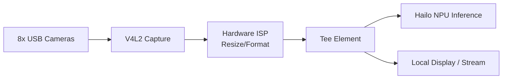

<p align="center">
  
</p>

# 📹 HYDRA-UMC-VISION-STREAMER

<p align="center"><a href="README.md">🇺🇸 English</a> | <a href="README_spa.md">🇪🇸 Español</a> | <a href="README_fra.md">🇫🇷 Français</a> | <a href="README_ita.md">🇮🇹 Italiano</a> | <a href="README_deu.md">🇩🇪 Deutsch</a> | <a href="README_zho.md">🇨🇳 简体中文</a> | 🇯🇵 <b>日本語</b></p>

### 🚀 マルチカメラエッジ AI 向けに最適化された GStreamer パイプライン

<p align="left">
  
  
  
  
  
</p>

---

## 1. 🛠️ 技術概要

**HYDRA-UMC-VISION-STREAMER** は、Vision AI Node ファミリーの高性能な
メディア取り込み層となることを目指しています。その役割は、最大 8 台の
USB 3.0 カメラストリームを同時に低レベルでキャプチャ、前処理、配信する
ことであり、Broadcom BCM2712（CM5）のハードウェアアクセラレーション ISP
を利用して、フレームが Hailo-8 NPU に到達する前に色空間変換、リサイズ、
正規化を行います。

これは、ファミリーの統合親プロジェクトである
**[HYDRA-UMC-VISION-NODE](https://github.com/JuanenRac/HYDRA-UMC-VISION-NODE)** の 4 つの子プロジェクトの 1 つです：本プロジェクトはキャプチャ/前処理のみを担当し、独自の Hailo-8 推論、gRPC API、安全ロジックは実行しません——これらは意図的に他の 3 つの兄弟プロジェクトに分割されています。

### 要点

* ✅ **実装済み v0 —— 設定・パイプライン・リレー生成：** `config.py` はカメラごとの JSON 設定（デバイス、解像度、fps、フォーマット）を検証し、`pipeline.py` はあるカメラの実際の GStreamer パイプライン記述を生成し、`mediamtx_config.py` は対応する MediaMTX の `paths.yml` を生成します。下記の `config validate`/`config gst`/`config mediamtx` から利用可能で、実行にもテストにも GStreamer ランタイム、V4L2、物理カメラは不要です。
* 🔁 **実装済み v0 —— 有界バッファリングと再接続：** `buffer.py` の `FrameBuffer` は満杯になると最も古い項目(最新のものではない)を破棄する固定容量のキューです——遅い消費者がこのプロセス自体のメモリを無制限に増加させることを決して許さない、ライブリレーが必要とする実際のバックプレッシャーポリシーです。`reconnect.py` の `ConnectionTracker` は、切断されたカメラ/リレーリンクのための実際の、決定論的な指数バックオフ再接続ポリシーです。下記の `stream simulate` から利用可能で、GStreamer や物理カメラなしで完全にテスト可能です。
* 📡 **RTSP/WebRTC サポート（一部計画中）：** RTSP リレーパス（`rtspclientsink` → MediaMTX）は設計済みで、その設定は上記で実際に生成されています。実際に実行するにはこの環境にない GStreamer ランタイムが必要です。WebRTC 出力は引き続き完全に計画段階です。
* 🔌 **モジュールに先立って準備されたHailoRT統合境界：** `hailo_runtime.py` は、実際の確認済み `hailo_platform` API(`VDevice`、`HEF`、`ConfigureParams`)に対して書かれています —— `hailort` パッケージやHailo-8モジュールが存在しなくてもこのリポジトリがクリーンにインストール/テストできるよう遅延インポートされており、さらに、デバイスに1フレームでも送信される前に、カメラの設定済み解像度が実際にロード済みモデルの入力テンソル形状と一致することを検証する実際の事前チェックを備えています。*(実装済み、統合境界のみ —— 実際に推論を実行し、実際のモデルのNMS出力を解析することは依然として将来の作業です。)*
* ⚡ **ゼロコピーパイプライン（計画中）：** 不要なフレームコピーを避けるよう設計された、V4L2 と HailoRT の間のバッファ受け渡し。*（将来の作業——この環境にはまだない実際の V4L2/HailoRT ランタイムが必要です。）*
* 🌈 **ハードウェア前処理（計画中）：** Pi の ISP を使用したリアルタイムのリサイズとピクセルフォーマット変換により、本来フレームごとに CPU が担うはずの作業をオフロードします。*（同じ理由で将来の作業です。）*
* 🛠️ **動的設定：** カメラごとの解像度、フレームレート、ピクセルフォーマットは今日すでに実装され検証されています（`config.py`）。露出/ゲイン制御は実際の V4L2 デバイスが必要で、将来の作業です。
* 🧩 **独立したプロジェクトとして存在する理由：** キャプチャ/ISP チューニングは、モデル推論や安全ロジックとは異なるスキルと異なる障害領域を持ちます——独自のプロセスとして保つことで、キャプチャ側のバグが [HYDRA-UMC-SAFETY-ZONES](https://github.com/JuanenRac/HYDRA-UMC-SAFETY-ZONES) を巻き込むことがなくなり、両者を独立して開発・テストできます。

**正直な現状確認 —— 今日実際に動くもの：** 設定の検証、GStreamer パイプライン記述の生成、MediaMTX リレー設定の生成、そして実際のバッファ/再接続ポリシー、そして実際の HailoRT 統合境界(`config.py`、`pipeline.py`、`mediamtx_config.py`、`buffer.py`、`reconnect.py`、`hailo_runtime.py`)は実装され、テストされています（65 個のテスト）。これらのいずれも V4L2 デバイスを開いたり、GStreamer をインポートしたり、物理カメラと通信したりはしません——生成されたパイプラインを実際に実行するには、この環境にない実際のランタイムとハードウェアが必要です。実際に出荷済みの内容は [`CHANGELOG.md`](CHANGELOG.md)
を、まだ残っている作業は下記の「現在の状況と次のステップ」セクションを
参照してください。

---

## 2. 🔄 目標パイプラインアーキテクチャ

下図は、本プロジェクトが構築を目指している目標データフローです——その*形態*（どの要素がどれに供給するか、`Tee` の分岐）は `pipeline.py` によって固定され、今日すでに実際の `gst-launch-1.0` 構文として生成されますが、この図の内容はまだ何も実行されていません：それには実際の V4L2/GStreamer/Hailo-8 ランタイムと物理 USB カメラが必要です。



---

## 3. 🧠 高度な技術情報

### なぜ `hardware/`、`firmware/`、`os/`、`models/` がここに存在しないのか

[HYDRA-UMC](https://github.com/JuanenRac/HYDRA-UMC) 内部のカスタム
STM32H745/STM32G474 基板とは異なり、CM5 + Hailo-8 は市販のハードウェア
であり、独自に設計する基板はありません——そのため、5 つの Vision AI Node
プロジェクトのいずれにも `hardware/`/`firmware/` フォルダは存在しません。
`os/`（共有 HydraOS イメージ）と `models/`（実際に NPU に配信される、
コンパイル済みの `.hef` ファイル）は、CM5 ホストイメージと Hailo-8
デバイスハンドルを保持するプロセスである統合親プロジェクト
[HYDRA-UMC-VISION-NODE](https://github.com/JuanenRac/HYDRA-UMC-VISION-NODE) にのみ存在します——ここに別のコピーを持つことは、同期を保つための余分な状態が増えるだけで、何の利益にもなりません。

### 計画中のパイプライン形態

上図の `Tee` 要素は、実装に先立って既に決定されている重要な設計上の
決定です：キャプチャ/前処理されたフレームは、2 つの消費者に同時に分岐
することを意図しています——Hailo-8 推論パス（[HYDRA-UMC-VISION-NODE](https://github.com/JuanenRac/HYDRA-UMC-VISION-NODE) に供給）と、人間による監視のためのオプションのローカル表示/RTSP-WebRTC ストリームです——監視パスが推論パスに遅延を追加することはありません。

### 既に行われた設計上の決定

* **バージョンはハードコードではなく、インストール済みパッケージのメタデータから読み取られます** —— `main.py` は 2 つ目の `__version__` 文字列の代わりに `importlib.metadata.version("hydra-umc-vision-streamer")` を呼び出すため、`bump_version.py` が編集すべき箇所は常に 1 か所であり、両者が食い違うことは決してありません。
* **オドメーター式のインクリメントは自動的に `PATCH`/`MINOR` にのみ触れます** —— `bump_version.py` は `PATCH` が 9 を超えると `MINOR` に、`MINOR` が 9 を超えると `MAJOR` に繰り上がりますが、`MAJOR` 自体を自動で増加させることは決してありません。これは意図的な人間による決定であり、`HYDRA-UMC-EDITOR-URDF/bump_version.py` および `HYDRA-UMC-SUITE/bump_version.py` と同じ慣例です。
* **MediaMTX の YAML は手書きであり、PyYAML の上には構築されていません** —— `mediamtx_config.py` の出力形態（フラットな `paths:` マップ、カメラごとに 1 つの `source: publisher` エントリ）は十分にシンプルで固定されており、実際の依存関係はまだ正当化されません。カメラごとの設定にネストされたフィールドやリスト値のフィールドが増えた場合は、その時点で見直します。
* **パイプラインと MediaMTX 設定は、カメラごとに 1 つの RTSP パスで一致していなければなりません** —— `rtsp_url_for()` はそれを（カメラ名から）導出する唯一の場所であるため、`config gst` と `config mediamtx` があるカメラのストリームがどこにあるかについて食い違うことは決してありません。
* **`FrameBuffer` は満杯になると最も古い項目を破棄し、最新のものは破棄しません。** ライブ映像には、増え続ける古いフレームの滞留分は何の役にも立ちません——常に有用なのは最も新しいフレームです。代わりにプロデューサーをブロックするキューは実際のキャプチャスレッド自体を危険にさらし、ただ単純に増え続けるキューは、このゲートが防ぐために存在する無制限メモリの失敗をまさに引き起こしてしまいます。
* **`reconnect.py` は決して自分でスリープしたり、実際のソケットに触れたりしません。** `ConnectionTracker` は状態を追跡し、呼び出し側がどれだけ待つべきかを返すだけです——この分離こそが、`max_attempts` に達した後に正直に諦めることを含む、バックオフスケジュール全体をテストの中で正確に再現可能にしているものです。実際の時計も実際のカメラリンクも関与しません。

---

## 📂 リポジトリ構成

```text
HYDRA-UMC-VISION-STREAMER/
├── src/                 # ソースコード（hydra_umc_vision_streamer パッケージ）
│   └── hydra_umc_vision_streamer/
│       ├── config.py           # カメラごとの設定の解析/検証
│       ├── pipeline.py         # GStreamer パイプライン記述の生成
│       ├── buffer.py           # 実際の有界バッファ（drop-oldest バックプレッシャー）
│       ├── reconnect.py        # 実際の決定論的な再接続/バックオフポリシー
│       ├── mediamtx_config.py  # MediaMTX paths.yml の生成
│       ├── hailo_runtime.py    # 実際のHailoRT(hailo_platform)統合境界、遅延インポート
│       ├── mjpeg_server.py     # 実際のMJPEGサーバー - USBウェブカメラの映像を実際にHTTP経由で配信
│       └── main.py             # CLI エントリポイント（素の呼び出し + `config`/`stream`）
├── tests/               # 実際の pytest スイート（config、pipeline、mediamtx、buffer、reconnect、hailo_runtime、mjpeg_server、CLI）
├── docs/                # ドキュメントとチューニングガイド
├── build/               # ビルド出力（ローカルの .venv もここに存在）
├── images/              # メディアと図表
├── systemd/
│   ├── hydra-umc-vision-streamer@.service  # カメラごとにインスタンス化されるsystemdユニット
│   └── cameras.env.example                 # インスタンスごとの環境ファイルの例
├── tools/
│   ├── build_test.py    # バージョンを増やさないビルドチェック
│   └── ci_validate.py   # CI が使用するマニフェスト/CHANGELOG/ドキュメント検証
├── pyproject.toml       # パッケージメタデータ、依存関係、オドメーターバージョン
├── bump_manifest_version.py # hydra-umc.project.json のバージョンをネイティブ版と同期(--sync)
├── bump_version.py      # オドメーター式バージョンインクリメント（build.sh/.bat が実行）
├── build.sh / build.bat # venv + editable インストール + コンパイルチェック + テスト
├── run.sh / run.bat     # ローカル venv からエントリポイントを実行
└── CHANGELOG.md         # バージョンごとの履歴（オドメーター方式、日付なし）
```

`hardware/`、`firmware/`、`os/`、`models/` フォルダは存在しません——理由は
上記「高度な技術情報」を参照してください。`os/` と `models/` は統合親
プロジェクトである [HYDRA-UMC-VISION-NODE](https://github.com/JuanenRac/HYDRA-UMC-VISION-NODE) にのみ存在します。

---

## 🏗️ ビルドと実行

### 前提条件

* `PATH` 上に **Python 3.10 以降**があること（スクリプトは先に `python3` を試し、次に `python` にフォールバックします）。
* GStreamer、V4L2 ツール、その他のネイティブ依存関係は現時点では不要です——この段階では**サードパーティのランタイム依存関係が一切ありません**（`pyproject.toml` の `dependencies = []`）。
* ローカル仮想環境（`.venv/` 下）には数十 MB のディスク容量が必要です。

### ステップバイステップ

```bash
# Linux / macOS
./build.sh
```

1. **オドメーター式バージョンインクリメント** — `bump_version.py` を実行し、ビルドのたびに `pyproject.toml` 内の `PATCH` を増加させます（上記の規則に従って `MINOR`/`MAJOR` に繰り上がります）。
2. **仮想環境** — `.venv/` が存在しない場合は作成し、存在する場合は再利用します。
3. **Editable インストール** — `pip install -e ".[dev]"` により `src/` 下の変更が即座に反映され、`pytest` がインストールされ、`hydra-umc-vision-streamer` コンソールエントリポイントが登録されます。
4. **コンパイルチェック** — `python -m compileall -q src` が `src/` 下の各ファイルをバイトコンパイルし、あるファイルが `main.py` から一度もインポートされない場合でも、エコシステム全体にわたる構文エラーを検出します。
5. **実際のテストスイート** — `python -m pytest tests/ -q`（config、pipeline、MediaMTX 生成、バッファ/再接続ポリシー、HailoRT 統合境界、CLI をカバーする 65 個のテスト）。

`set -euo pipefail` は最初に失敗したステップでスクリプトを停止させます。
5 つのステップすべてが成功した場合にのみビルドは成功を報告します。

```bash
./run.sh
```

`.venv` 内のインタープリタを特定し（POSIX と Windows 両方の `.venv`
ディレクトリ構造を処理）、`python -m hydra_umc_vision_streamer.main` を
実行してすべての引数を転送します——素の呼び出しは名前・バージョン・役割
を表示します。

実際の例 —— カメラ設定を検証し、その GStreamer パイプラインを生成し、対応する MediaMTX リレー設定を生成する：

```bash
./run.sh config validate --config cameras.json
# 2 camera(s) in cameras.json
#   cam0: /dev/video0 1920x1080@30 MJPG
#   cam1: /dev/video1 640x480@15 YUYV
# config OK

./run.sh config gst --config cameras.json --camera cam0
# v4l2src device=/dev/video0 ! image/jpeg,width=1920,height=1080,framerate=30/1 ! jpegdec ! videoconvert ! tee name=t t. ! queue ! appsink name=cam0_hailo_sink t. ! queue ! rtspclientsink location=rtsp://localhost:8554/cam0

./run.sh config mediamtx --config cameras.json
# paths:
#   cam0:
#     source: publisher
#   cam1:
#     source: publisher
```

実際の例 —— 有界バッファに対する遅い消費者をシミュレートし、実際の
再接続ポリシーを通して切断された接続を処理する：

```bash
./run.sh stream simulate --buffer-size 8 --frames 1000 --consumer-rate 1000
# Pushed 1000 frame(s) through a buffer capped at 8
# Max buffer size observed: 8 (must never exceed 8)
# Frames dropped by backpressure: 972
#
# Simulated disconnect at frame 500
# Reconnect backoff schedule (s): [0.5, 1.0, 2.0, 4.0]
# Final connection state: given_up
```

```bat
:: Windows - 手順は同じ、バッチ構文
build.bat
run.bat
```

### トラブルシューティング

* **`python`/`python3` が見つからない** —— Python 3.10+ をインストールし `PATH` に含まれていることを確認してください。
* **`compileall` が失敗する** —— `src/` 下に実際の構文エラーが導入されたことを意味します。ビルドは意図的にインストールに触れることなく停止します。
* **`run.sh`/`run.bat` が「`.venv` が見つかりません」と表示する** —— 先に少なくとも 1 回 `build.sh`/`build.bat` を実行してください。`run` 自体が環境を作成することはありません。
* **editable インストールが古いままになる** —— `.venv/` を削除して再構築してください。`pip install -e .` は通常、ソースの変更をリアルタイムで認識するため、これが必要になることはまれです。

---

## 🚀 現在の状況と次のステップ

**今日実現していること：** 設定の検証、GStreamer パイプライン記述の生成、そして MediaMTX リレー設定の生成（`config.py`、`pipeline.py`、`mediamtx_config.py`）、実際の、証明可能な有界バッファと実際の決定論的な再接続ポリシー（`buffer.py`、`reconnect.py`、`stream simulate`）、実際の Hailo-8 モジュールが接続され次第すぐに使える実際の HailoRT 統合境界（`hailo_runtime.py`）、そして OpenCV 経由で実際の V4L2 デバイスを開き、実際の MJPEG を HTTP 経由で配信する実際の v0 キャプチャ＋配信パス（`mjpeg_server.py`、`stream serve`） - `HYDRA-UMC-OS` 自身の `provisioning/install_vision_streamer.sh` により CM5 にインストール可能（管理者が割り当てたカメラスロットごとに 1 つの systemd インスタンス、`systemd/hydra-umc-vision-streamer@.service`）で、すでに `HYDRA-UMC-SERVER` の `GET /api/camera/:id/stream` プロキシと `HYDRA-UMC-STUDIO` のカメラビューによってライブで利用されている - 合計 65 個のテスト、さらに検証済みのエントリポイントを持つ実際のインストール
可能な Python パッケージ、そしてビルドに組み込まれた
オドメーター式バージョンインクリメント。実際に取得されたビルド/実行出力については
[`CHANGELOG.md`](CHANGELOG.md) を参照してください。

**まだ残っている作業（順不同、確定した期限なし、実際のハードウェアに阻まれている）：**

* *生成されたパイプライン* を実際に実行すること - 上記のよりシンプルな OpenCV v0（`stream serve`）ではなく、Hailo-8 推論ブランチへの完全な GStreamer/PyGObject tee - を実際のランタイムで実行すること。
* ハードウェア ISP によるリサイズ/フォーマット変換（実際の CM5 ISP が必要）。
* `hailo_runtime.py` を通じて実際に推論を実行すること（実際の Hailo-8 モジュールと実際にコンパイルされた `.hef` が必要）、そしてその実際のモデルの NMS 出力形式をパースすること - デバイスなしでは検証できないため、意図的に推測していない。
* WebRTC 出力、およびカメラごとの露出/ゲイン制御（実際の V4L2 デバイスが必要）。
* `stream serve` はまだ実際に物理接続された USB カメラに対して検証されていない - モジュール境界でモック化された `cv2.VideoCapture` に対してのみ検証済み（`tests/test_mjpeg_server.py` を参照）。

---

## 🔗 関連プロジェクト

本プロジェクトは、同じ作者(JuanenRac / Electro Hobby 3D)による HYDRA-UMC ロボティクスエコシステムの一部です。リクエストが実はこの中のどれかについてのものである可能性があるため、知っておく価値があります。

**親プロジェクト**
- **[HYDRA-UMC-VISION-NODE](https://github.com/JuanenRac/HYDRA-UMC-VISION-NODE)** — Hailo-8 ビジョンパイプラインの統合ハブ、段階ごとの実際のハードウェア準備状況チェック付き。本リポジトリは、その自身の知覚パイプライン内における特定の段階・消費者として、この親の一部を成す。

**兄弟プロジェクト** —— HYDRA-UMC-VISION-NODE 自身の Hailo-8 知覚パイプラインにおける他の段階・消費者
- **[HYDRA-UMC-DETECTION-HEF](https://github.com/JuanenRac/HYDRA-UMC-DETECTION-HEF)** — Hailo アーキテクチャ/チェックサムによる安全読み込み検証を備えた、実際のコンパイル済みモデルレジストリ。
- **[HYDRA-UMC-SAFETY-ZONES](https://github.com/JuanenRac/HYDRA-UMC-SAFETY-ZONES)** — キャリブレーションの鮮度を強制する、実際のゾーン侵入チェックと E-STOP 要求。
- **[HYDRA-UMC-VISUAL-SERVOING-API](https://github.com/JuanenRac/HYDRA-UMC-VISUAL-SERVOING-API)** — 上流のゾーン状態に応じて安全ゲート制御される、実際の Position-Based Visual Servoing 補正則。

**エコシステムの他のプロジェクト**

*コアハードウェア&プラットフォーム*
- **[HYDRA-UMC](https://github.com/JuanenRac/HYDRA-UMC)** — 実際のロボットアームのマザーボード——CM5 ホスト + デュアルコア STM32H745、CAN-OTA/SPI-OTA 経由で最大 8 本のツールアームを統括。
- **[HYDRA-UMC-OS](https://github.com/JuanenRac/HYDRA-UMC-OS)** — CM5 向けの再現可能な Raspberry Pi OS プロダクト層——読み取り専用エージェント、検証済み設定/プロファイル、WiFi 初回接続プロビジョニング。
- **[HYDRA-UMC-SDK](https://github.com/JuanenRac/HYDRA-UMC-SDK)** — すべてのブリッジが自身のコマンドを検証する共有 JSON-Schema 契約と安全ゲートの境界。

*コアバックエンド&クライアント*
- **[HYDRA-UMC-SERVER](https://github.com/JuanenRac/HYDRA-UMC-SERVER)** — すべての制御クライアントが実際に通信する、本物のヘッドレスバックエンド(REST/WebSocket)。
- **[HYDRA-UMC-STUDIO](https://github.com/JuanenRac/HYDRA-UMC-STUDIO)** — リアルタイムのマルチロボット 3D 可視化を備えたウェブ制御ダッシュボード。
- **[HYDRA-UMC-SUITE](https://github.com/JuanenRac/HYDRA-UMC-SUITE)** — 複数のサーバーを同時に扱えるデスクトップ(PySide6)スウォームコマンドセンター、スタンドアロン実行ファイルとしてパッケージ化。
- **[HYDRA-UMC-ANDROID-CONTROL](https://github.com/JuanenRac/HYDRA-UMC-ANDROID-CONTROL)** — 生体認証ログインとペアリングされた Wear OS コンパニオンを備えたネイティブ Android 制御アプリ。
- **[HYDRA-UMC-IOS-CONTROL](https://github.com/JuanenRac/HYDRA-UMC-IOS-CONTROL)** — リアルタイム WebSocket 同期を備えた iOS/iPadOS 制御アプリ(Flutter)。
- **[HYDRA-UMC-DSI](https://github.com/JuanenRac/HYDRA-UMC-DSI)** — 本体搭載の 7 インチ DSI タッチスクリーン向けネイティブタッチ UI、CM5 自体に組み込み。
- **[HYDRA-UMC-EDITOR-URDF](https://github.com/JuanenRac/HYDRA-UMC-EDITOR-URDF)** — 完成したモデルを STUDIO 自身のカタログへ送信するデスクトップ用グラフィカル URDF 作成/編集ツール。
- **[HYDRA-UMC-BRIDGE-AMR](https://github.com/JuanenRac/HYDRA-UMC-BRIDGE-AMR)** — 実際の VDA 5050 MQTT パブリッシャーによる AGV/AMR フリートの調整境界。
- **[HYDRA-UMC-BRIDGE-CNC](https://github.com/JuanenRac/HYDRA-UMC-BRIDGE-CNC)** — 実際の GRBL ステータス/制御バイトへのアクセスを持つ、CNC セルの高レベルコーディネーター。
- **[HYDRA-UMC-BRIDGE-DROIDS](https://github.com/JuanenRac/HYDRA-UMC-BRIDGE-DROIDS)** — 実際の Boston Dynamics Spot コマンド送信機能を持つ、脚型/ヒューマノイドドロイドの調整境界。
- **[HYDRA-UMC-BRIDGE-LASER](https://github.com/JuanenRac/HYDRA-UMC-BRIDGE-LASER)** — 実際のキー/筐体/インターロック GPIO セーフガード 3 系統を読み取る、レーザーセルの安全コーディネーター。
- **[HYDRA-UMC-BRIDGE-OPENPNP](https://github.com/JuanenRac/HYDRA-UMC-BRIDGE-OPENPNP)** — OpenPnP ピックアンドプレースの基板フローを安全に統括する高レベルコーディネーター。
- **[HYDRA-UMC-BRIDGE-PRINTER3D](https://github.com/JuanenRac/HYDRA-UMC-BRIDGE-PRINTER3D)** — 実際にゲート制御されたジョブコマンドを持つ、Moonraker/Klipper 3D プリンター向けの安全な調整境界。
- **[HYDRA-UMC-BRIDGE-ROS2](https://github.com/JuanenRac/HYDRA-UMC-BRIDGE-ROS2)** — 実際の遅延インポート rclpy ROS 2 トランスポートを持つ安全コーディネーター。
- **[HYDRA-UMC-BRIDGE-UAV](https://github.com/JuanenRac/HYDRA-UMC-BRIDGE-UAV)** — 実際の MAVLink コマンド送信機能を持つ、カメラ搭載 UAV の調整境界。

*URTC ツールプラットフォーム*
- **[URTC](https://github.com/JuanenRac/URTC)** — 物理的な Universal Robot Tool Controller 基板向けファームウェア、CAN バス経由の 25 以上のツールプロファイル。
- **[URTC-FLASHER](https://github.com/JuanenRac/URTC-FLASHER)** — URTC 基板用のデスクトップ GUI 書き込みツール、CAN-OTA およびフルチップ SWD/JTAG。
- **[URTC-TESTER](https://github.com/JuanenRac/URTC-TESTER)** — URTC 基板向けのデスクトップ CAN バスライブ診断ツール、ツールプロファイルごとに 1 パネル。
- **[URTC-WEB-STUDIO](https://github.com/JuanenRac/URTC-WEB-STUDIO)** — Web Serial API を使ったブラウザベースの URTC-TESTER の代替、ローカルインストール不要。

*コグニティブ AI ノード(Hailo-10)*
- **[HYDRA-UMC-COGNITIVE-NODE](https://github.com/JuanenRac/HYDRA-UMC-COGNITIVE-NODE)** — Hailo-10 コグニティブパイプライン(LLM/VLA/音声オーケストレーション)の統合ハブ。
- **[HYDRA-UMC-VLA-ENGINE](https://github.com/JuanenRac/HYDRA-UMC-VLA-ENGINE)** — Vision-Language-Action モデル向けの、実際のアクショントークンのエンコード/デコードと軌道生成。
- **[HYDRA-UMC-VOICE-UI](https://github.com/JuanenRac/HYDRA-UMC-VOICE-UI)** — 確認ゲート付きの限定的な Watch リレーを備えた、実際の音声フロントエンド(VAD + 意図解析)。
- **[HYDRA-UMC-SEMANTIC-PLANNER](https://github.com/JuanenRac/HYDRA-UMC-SEMANTIC-PLANNER)** — MCU エラーコードに対する、実際のルールベースのタスク分解と意味的エラー復旧。
- **[HYDRA-UMC-DOCS-QA](https://github.com/JuanenRac/HYDRA-UMC-DOCS-QA)** — このエコシステム自身の Markdown ドキュメントに対する、標準ライブラリのみの実際の TF-IDF 文書検索。

*オーケストレーション&スウォーム*
- **[HYDRA-UMC-ORCHESTRATOR](https://github.com/JuanenRac/HYDRA-UMC-ORCHESTRATOR)** — 実際の gRPC/Protobuf ヘルスレポート契約とミッションステートマシンを持つ統合ハブ。
- **[HYDRA-UMC-JOB-DISPATCHER](https://github.com/JuanenRac/HYDRA-UMC-JOB-DISPATCHER)** — 実際の HTTP API 上に構築された、優先度ベースの実際のジョブキュー(重複排除付き)。
- **[HYDRA-UMC-NODE-HEALING](https://github.com/JuanenRac/HYDRA-UMC-NODE-HEALING)** — リトライ/バックオフとアイデンティティ不一致検出を備えた、実際の gRPC ベースのフリートヘルスウォッチドッグ。
- **[HYDRA-UMC-PATH-PLANNER-3D](https://github.com/JuanenRac/HYDRA-UMC-PATH-PLANNER-3D)** — 実際の障害物/ワークスペース衝突検証を備えた、実際の RRT ベースの 3D 経路プランナー。
- **[HYDRA-UMC-SWARM-SYNC](https://github.com/JuanenRac/HYDRA-UMC-SWARM-SYNC)** — 複数セルの収束についてプロパティテストされた、実際の CRDT LWW-Element-Map 状態同期。

*デジタルツイン&シミュレーション*
- **[HYDRA-UMC-TWIN](https://github.com/JuanenRac/HYDRA-UMC-TWIN)** — 実際のバージョン互換性同期契約を持つ、デジタルツインエンジンの統合ハブ。
- **[HYDRA-UMC-HIL-BRIDGE](https://github.com/JuanenRac/HYDRA-UMC-HIL-BRIDGE)** — シミュレーションと実際のハードウェアの間でコマンドをルーティングする、実際のハードウェア・イン・ザ・ループ安全インターロック。
- **[HYDRA-UMC-PHYSICS-REPLICA](https://github.com/JuanenRac/HYDRA-UMC-PHYSICS-REPLICA)** — 実際の URDF サブセットに対する、実際の順運動学と関節限界検証。
- **[HYDRA-UMC-SYNTHETIC-DATA-GEN](https://github.com/JuanenRac/HYDRA-UMC-SYNTHETIC-DATA-GEN)** — YOLO/COCO アノテーションのエクスポート機能を持つ、実際のプロシージャル 2D シーンジェネレーター。

*データ&分析*
- **[HYDRA-UMC-DATALAKE](https://github.com/JuanenRac/HYDRA-UMC-DATALAKE)** — 実際の取り込み/クエリ HTTP API を備えた、実際の sqlite3 ベースの時系列ストア。
- **[HYDRA-UMC-ANOMALY-DETECTOR](https://github.com/JuanenRac/HYDRA-UMC-ANOMALY-DETECTOR)** — ドリフト監視を備えた、実際の FFT + 統計ベースラインによる異常検知器。
- **[HYDRA-UMC-PRODUCTION-REPORTS](https://github.com/JuanenRac/HYDRA-UMC-PRODUCTION-REPORTS)** — DATALAKE の履歴に対する実際の OEE/稼働率計算、再現可能な CSV エクスポート付き。
- **[HYDRA-UMC-TELEMETRY-COLLECTOR](https://github.com/JuanenRac/HYDRA-UMC-TELEMETRY-COLLECTOR)** — シーケンス重複排除機能を備えた、DATALAKE への実際の CAN/WebSocket 取り込みパイプライン。

*産業用ゲートウェイ*
- **[HYDRA-UMC-GATEWAY-INDUSTRIAL](https://github.com/JuanenRac/HYDRA-UMC-GATEWAY-INDUSTRIAL)** — 実際のコマンド許可リスト/バックプレッシャー層を持つ、産業用プロトコルへ中継する統合ハブ。
- **[HYDRA-UMC-OPCUA-SERVER](https://github.com/JuanenRac/HYDRA-UMC-OPCUA-SERVER)** — 実際のバイナリプロトコルクライアントセッションで検証された、実際の OPC-UA アドレス空間。
- **[HYDRA-UMC-MQTT-BROKER](https://github.com/JuanenRac/HYDRA-UMC-MQTT-BROKER)** — クライアント単位のオプション認証とトピック ACL を備えた、実際の MQTT ブローカー。
- **[HYDRA-UMC-MTCONNECT-ADAPTER](https://github.com/JuanenRac/HYDRA-UMC-MTCONNECT-ADAPTER)** — 縮退モード出力を備えた、実際の MTConnect `/probe` および `/current` XML エンドポイント。

*補完ツール&エコシステム運用*
- **[HYDRA-UMC-DASHBOARD-AI](https://github.com/JuanenRac/HYDRA-UMC-DASHBOARD-AI)** — 誠実な統計フォールバックを備えた、DATALAKE/ANOMALY-DETECTOR 上のスマートサマリーと異常ハイライトパネル。
- **[HYDRA-UMC-TOOL-CLI](https://github.com/JuanenRac/HYDRA-UMC-TOOL-CLI)** — 実際の安定した終了コード契約を持つフリート CLI、HYDRA-UMC-SERVER 自身の API の本物のライブクライアント。
- **[HYDRA-UMC-WATCH](https://github.com/JuanenRac/HYDRA-UMC-WATCH)** — 実際の触覚アラートとペアリングされたスマートフォンへの音声リレーを備えた WearOS コンパニオンアプリ。
- **[URTC-SMART-RACK](https://github.com/JuanenRac/URTC-SMART-RACK)** — 実際の工具 ID デコードと Smart Idle 予熱ロジックを備えた、基板搭載ラック用ファームウェア。
- **[URTC-VISION-TOOL](https://github.com/JuanenRac/URTC-VISION-TOOL)** — サーマル/RGB 検査ツールヘッド向けの、ファームウェアと実際の Python ビジョンコンパニオン。
- **[HYDRA-UMC-UPDATER](https://github.com/JuanenRac/HYDRA-UMC-UPDATER)** — このエコシステム内のすべてのリポジトリを検出・クローン・更新する、管理用デスクトップツール。

---

## 📚 ドキュメント & コミュニティ

- **[CONTRIBUTING.md](CONTRIBUTING.md)** —— プルリクエストのための技術スタックとコーディング指針。
- **[CODE_OF_CONDUCT.md](CODE_OF_CONDUCT.md)** —— このコミュニティで期待される行動規範。
- **[SECURITY.md](SECURITY.md)** —— 脆弱性の報告方法と、このプロジェクトの実際のセキュリティ重点領域。
- **[SUPPORT.md](SUPPORT.md)** —— 質問の投稿先とバグの報告先。
- **[LICENSE.md](LICENSE.md)** —— このプロジェクト自身のライセンス。

## 👤 作者
**JuanenRac** (Electro Hobby 3D)
📧 electrohobby3d@gmail.com
📺 [youtube.com/@electrohobby3d](https://youtube.com/@electrohobby3d)

## 📜 ライセンス
GPL-3.0 —— 詳細は LICENSE を参照してください。
