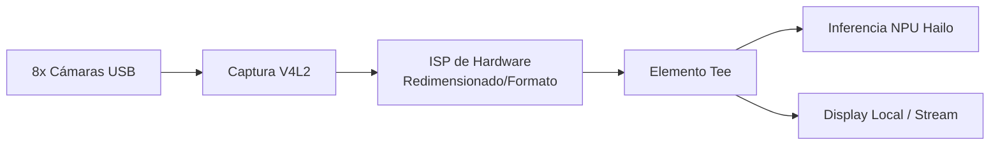

<p align="center">
  
</p>

# 📹 HYDRA-UMC-VISION-STREAMER

<p align="center"><a href="README.md">🇺🇸 English</a> | 🇪🇸 <b>Español</b> | <a href="README_fra.md">🇫🇷 Français</a> | <a href="README_ita.md">🇮🇹 Italiano</a> | <a href="README_deu.md">🇩🇪 Deutsch</a> | <a href="README_zho.md">🇨🇳 简体中文</a> | <a href="README_jpn.md">🇯🇵 日本語</a></p>

### 🚀 Pipeline GStreamer Optimizado para IA de Borde Multi-Cámara

<p align="left">
  
  
  
  
  
</p>

---

## 1. 🛠️ VISIÓN GENERAL TÉCNICA

**HYDRA-UMC-VISION-STREAMER** está pensado para ser la capa de ingesta de medios de alto rendimiento de la familia Vision AI Node. Su trabajo es la captura de bajo nivel, pre-procesado y distribución de hasta 8 flujos de cámara USB 3.0 concurrentes, usando el ISP acelerado por hardware del Broadcom BCM2712 (CM5) para hacer conversión de espacio de color, redimensionado y normalización antes de que los fotogramas lleguen a la NPU Hailo-8.

Este es uno de los 4 hijos de **[HYDRA-UMC-VISION-NODE](https://github.com/JuanenRac/HYDRA-UMC-VISION-NODE)**, el padre de integración de la familia: este proyecto solo posee la captura/pre-procesado, y no ejecuta su propia inferencia Hailo-8, API gRPC ni lógica de seguridad - eso está deliberadamente repartido entre sus 3 hermanos.

### Puntos Clave

* ⚡ **Pipeline Zero-Copy (previsto):** transferencia de buffers entre V4L2 y HailoRT diseñada para evitar copias de fotogramas innecesarias.
* 🌈 **Pre-procesado por Hardware (previsto):** redimensionado y conversión de formato de píxel en tiempo real usando el ISP de la Pi, descargando trabajo que la CPU tendría que hacer por fotograma.
* 📡 **Soporte RTSP/WebRTC (previsto):** streaming opcional de baja latencia hacia fuera, para monitorización remota sin pasar por todo el pipeline de detección.
* 🛠️ **Configuración Dinámica (previsto):** control de exposición, ganancia y resolución por cámara.
* 🧩 **Por qué existe como proyecto separado:** el ajuste de captura/ISP es una habilidad distinta y un dominio de fallos distinto al de la inferencia de modelos o la lógica de seguridad - mantenerlo en su propio proceso significa que un fallo de captura no puede tumbar [HYDRA-UMC-SAFETY-ZONES](https://github.com/JuanenRac/HYDRA-UMC-SAFETY-ZONES), y ambos se pueden desarrollar/probar de forma independiente.

**Comprobación de honestidad - qué funciona hoy de verdad:** este repositorio está en etapa de esqueleto. El entry point real (`src/hydra_umc_vision_streamer/main.py`) imprime el nombre del proyecto, su versión instalada y una descripción de rol de una línea, y sale con código 0. Nada del pipeline GStreamer, la captura V4L2, la integración con el ISP ni la lógica de streaming descrita arriba existe todavía en código. Ver [`CHANGELOG.md`](CHANGELOG.md) para lo entregado exactamente hasta ahora, y "Estado Actual y Próximos Pasos" más abajo para lo que sigue abierto.

---

## 2. 🔄 ARQUITECTURA DE PIPELINE PREVISTA

El diagrama de abajo es el flujo de datos objetivo hacia el que se construye este esqueleto, no un pipeline que funcione hoy.



---

## 3. 🧠 INFORMACIÓN TÉCNICA AVANZADA

### Por qué no hay `hardware/`, `firmware/`, `os/` ni `models/` aquí

CM5 + Hailo-8 es hardware ya existente sin placa propia que diseñar, a diferencia de las placas STM32H745/STM32G474 a medida dentro de [HYDRA-UMC](https://github.com/JuanenRac/HYDRA-UMC) - así que no existe carpeta `hardware/`/`firmware/` en ninguno de los 5 proyectos de Vision AI Node. `os/` (la imagen HydraOS compartida) y `models/` (los `.hef` compilados realmente servidos a la NPU) viven solo en el padre de integración, [HYDRA-UMC-VISION-NODE](https://github.com/JuanenRac/HYDRA-UMC-VISION-NODE), porque es el proceso dueño de la imagen del host CM5 y del handle del dispositivo Hailo-8 - llevar copias separadas aquí sería solo estado extra que sincronizar sin ningún beneficio.

### Forma de pipeline prevista

El elemento `Tee` del diagrama de arriba es la decisión de diseño clave ya tomada antes de la implementación: los fotogramas capturados/pre-procesados están pensados para bifurcarse hacia dos consumidores a la vez - la ruta de inferencia Hailo-8 (alimentando a [HYDRA-UMC-VISION-NODE](https://github.com/JuanenRac/HYDRA-UMC-VISION-NODE)) y un stream opcional local/RTSP-WebRTC para monitorización humana - sin que la ruta de monitorización añada latencia a la ruta de inferencia.

### Decisiones de diseño ya tomadas en este esqueleto

* **La versión se lee de los metadatos del paquete instalado, no está fija en el código** - `main.py` llama a `importlib.metadata.version("hydra-umc-vision-streamer")` en vez de una segunda cadena `__version__`, así `bump_version.py` solo tiene un lugar que editar y nunca pueden desincronizarse.
* **El bump cuentakilómetros solo toca `PATCH`/`MINOR` automáticamente** - `bump_version.py` acarrea `PATCH` a `MINOR` al pasar de 9 y `MINOR` a `MAJOR` al pasar de 9, pero nunca incrementa `MAJOR` por sí mismo; es una decisión humana deliberada, misma convención que `HYDRA-UMC-EDITOR-URDF/bump_version.py` y `HYDRA-UMC-SUITE/bump_version.py`.

---

## 📂 ESTRUCTURA DE DIRECTORIOS

```text
HYDRA-UMC-VISION-STREAMER/
├── src/                 # Código fuente (paquete hydra_umc_vision_streamer)
├── docs/                # Documentación y guías de ajuste
├── build/               # Salida de build (aquí vive también el .venv local)
├── images/              # Medios y diagramas
├── scripts/             # Scripts de utilidad
├── pyproject.toml       # Metadatos del paquete, dependencias, versión cuentakilómetros
├── bump_version.py      # Bump de versión tipo cuentakilómetros (build.sh/.bat)
├── build.sh / build.bat # venv + instalación editable + compile-check
├── run.sh / run.bat     # Ejecuta el entry point desde el venv local
└── CHANGELOG.md         # Historial versión a versión (esquema cuentakilómetros, sin fechas)
```

Sin carpeta `hardware/`, `firmware/`, `os/` ni `models/` - ver "Información Técnica Avanzada" arriba para el porqué. `os/` y `models/` viven solo en el padre de integración, [HYDRA-UMC-VISION-NODE](https://github.com/JuanenRac/HYDRA-UMC-VISION-NODE).

---

## 🏗️ BUILD Y RUN

### Requisitos previos

* **Python 3.10 o superior** en el `PATH` (los scripts prueban `python3` y luego `python`).
* No hace falta GStreamer, herramientas V4L2 ni otra dependencia nativa todavía - **cero dependencias de terceros en tiempo de ejecución** en esta etapa (`dependencies = []` en `pyproject.toml`).
* Unas pocas decenas de MB de espacio en disco para un entorno virtual local en `.venv/`.

### Paso a paso

```bash
# Linux / macOS
./build.sh
```

1. **Bump de versión cuentakilómetros** - ejecuta `bump_version.py`, incrementando `PATCH` en `pyproject.toml` en cada build (con acarreo a `MINOR`/`MAJOR` según la regla de arriba).
2. **Entorno virtual** - crea `.venv/` si falta; lo reutiliza si ya existe.
3. **Instalación editable** - `pip install -e .` para que los cambios en `src/` tengan efecto inmediato, y registra el entry point de consola `hydra-umc-vision-streamer`.
4. **Compile-check** - `python -m compileall -q src` compila a bytecode cada archivo bajo `src/`, detectando errores de sintaxis en todo el paquete.

`set -euo pipefail` detiene el script en el primer paso que falle; `== Build OK ==` se imprime solo si los 4 pasos tienen éxito.

```bash
./run.sh
```

Localiza el intérprete dentro de `.venv` (soporta ambos layouts, POSIX y Windows) y ejecuta `python -m hydra_umc_vision_streamer.main`, imprimiendo nombre + versión + rol.

```bat
:: Windows - mismos pasos, sintaxis batch
build.bat
run.bat
```

### Solución de problemas

* **No se encuentra `python`/`python3`** - instala Python 3.10+ y asegúrate de que está en el `PATH`.
* **`compileall` falla** - se introdujo un error de sintaxis real bajo `src/`; el build se detiene sin tocar la instalación, a propósito.
* **"No `.venv` found" en `run.sh`/`run.bat`** - ejecuta `build.sh`/`build.bat` al menos una vez antes; `run` nunca crea el entorno por sí mismo.
* **Instalación editable desactualizada** - borra `.venv/` y reconstruye; rara vez hace falta.

---

## 🚀 Estado Actual y Próximos Pasos

**Qué funciona hoy:** un paquete Python real e instalable con un entry point verificado (ver [`CHANGELOG.md`](CHANGELOG.md) para la salida de build/run capturada) y un bump de versión cuentakilómetros integrado en el build.

**Qué sigue abierto, sin orden particular y sin calendario comprometido:**

* El pipeline GStreamer real (captura, `Tee`, integración con el ISP).
* Captura V4L2 de hasta 8 cámaras USB 3.0 y redimensionado/conversión de formato por ISP de hardware.
* La transferencia zero-copy hacia el runtime Hailo-8 que posee [HYDRA-UMC-VISION-NODE](https://github.com/JuanenRac/HYDRA-UMC-VISION-NODE).
* Salida RTSP/WebRTC opcional y configuración dinámica por cámara (exposición, ganancia, resolución).

---

## 🔗 Proyectos Relacionados

Este proyecto forma parte de un ecosistema de robótica más amplio del mismo autor (JuanenRac / Electro Hobby 3D), que abarca firmware, software de control, nodos de IA y herramientas de flota. Vale la pena conocerlo, ya que una petición podría en realidad ser sobre uno de estos proyectos en vez de sobre este repositorio.

### Familia

**Padre:** **[HYDRA-UMC-VISION-NODE](https://github.com/JuanenRac/HYDRA-UMC-VISION-NODE)** — el padre de integración al que alimenta este pipeline.

**Hermanos:**
- **[HYDRA-UMC-DETECTION-HEF](https://github.com/JuanenRac/HYDRA-UMC-DETECTION-HEF)** — compila los modelos `.hef` que el padre carga en su NPU Hailo-8.
- **[HYDRA-UMC-SAFETY-ZONES](https://github.com/JuanenRac/HYDRA-UMC-SAFETY-ZONES)** — convierte la percepción del padre en detección de intrusión y disparo de E-STOP.
- **[HYDRA-UMC-VISUAL-SERVOING-API](https://github.com/JuanenRac/HYDRA-UMC-VISUAL-SERVOING-API)** — convierte la percepción del padre en correcciones cinemáticas de pose.

Este proyecto no tiene relación directa fuera de la familia Vision AI Node (según el mapa de relaciones del ecosistema) - ver "Resto del Ecosistema" abajo para todo lo demás.

### Resto del Ecosistema

**Plataforma HYDRA-UMC** — la célula de micro-fábrica multi-robot
- **[HYDRA-UMC](https://github.com/JuanenRac/HYDRA-UMC)** — la placa base CM5 + STM32H745 que orquesta hasta 8 brazos robóticos.
- **[HYDRA-UMC-SERVER](https://github.com/JuanenRac/HYDRA-UMC-SERVER)** — el backend Express/WebSocket con el que habla cada cliente de control.
- **[HYDRA-UMC-STUDIO](https://github.com/JuanenRac/HYDRA-UMC-STUDIO)** — panel de control web, visualización 3D multi-robot.
- **[HYDRA-UMC-ANDROID-CONTROL](https://github.com/JuanenRac/HYDRA-UMC-ANDROID-CONTROL)** — app de control Android por Wi-Fi/Bluetooth.
- **[HYDRA-UMC-IOS-CONTROL](https://github.com/JuanenRac/HYDRA-UMC-IOS-CONTROL)** — app de control iOS/iPadOS construida en Flutter.
- **[HYDRA-UMC-SUITE](https://github.com/JuanenRac/HYDRA-UMC-SUITE)** — centro de mando de enjambre de escritorio (Python/PySide6).
- **[HYDRA-UMC-EDITOR-URDF](https://github.com/JuanenRac/HYDRA-UMC-EDITOR-URDF)** — editor de modelos URDF de escritorio para el catálogo de robots.
- **[HYDRA-UMC-DSI](https://github.com/JuanenRac/HYDRA-UMC-DSI)** — interfaz táctil nativa para la pantalla DSI integrada.

**Plataforma URTC** — el controlador de cabezal de herramienta que lleva cada brazo HYDRA-UMC
- **[URTC](https://github.com/JuanenRac/URTC)** — controlador de cabezal de herramienta CAN, 25 perfiles de herramienta.
- **[URTC-FLASHER](https://github.com/JuanenRac/URTC-FLASHER)** — herramienta de escritorio de flasheo CAN-OTA + SWD/JTAG.
- **[URTC-TESTER](https://github.com/JuanenRac/URTC-TESTER)** — herramienta de escritorio de diagnóstico CAN en vivo.
- **[URTC-WEB-STUDIO](https://github.com/JuanenRac/URTC-WEB-STUDIO)** — alternativa basada en navegador vía Web Serial API.

**🧠 Cognitive AI Node (Hailo-10)**
- [HYDRA-UMC-COGNITIVE-NODE](https://github.com/JuanenRac/HYDRA-UMC-COGNITIVE-NODE)
- [HYDRA-UMC-VLA-ENGINE](https://github.com/JuanenRac/HYDRA-UMC-VLA-ENGINE)
- [HYDRA-UMC-VOICE-UI](https://github.com/JuanenRac/HYDRA-UMC-VOICE-UI)
- [HYDRA-UMC-SEMANTIC-PLANNER](https://github.com/JuanenRac/HYDRA-UMC-SEMANTIC-PLANNER)
- [HYDRA-UMC-DOCS-QA](https://github.com/JuanenRac/HYDRA-UMC-DOCS-QA)

**🐝 Orchestration & Swarm**
- [HYDRA-UMC-ORCHESTRATOR](https://github.com/JuanenRac/HYDRA-UMC-ORCHESTRATOR)
- [HYDRA-UMC-SWARM-SYNC](https://github.com/JuanenRac/HYDRA-UMC-SWARM-SYNC)
- [HYDRA-UMC-PATH-PLANNER-3D](https://github.com/JuanenRac/HYDRA-UMC-PATH-PLANNER-3D)
- [HYDRA-UMC-JOB-DISPATCHER](https://github.com/JuanenRac/HYDRA-UMC-JOB-DISPATCHER)
- [HYDRA-UMC-NODE-HEALING](https://github.com/JuanenRac/HYDRA-UMC-NODE-HEALING)

**🎮 Digital Twin & Simulation**
- [HYDRA-UMC-TWIN](https://github.com/JuanenRac/HYDRA-UMC-TWIN)
- [HYDRA-UMC-PHYSICS-REPLICA](https://github.com/JuanenRac/HYDRA-UMC-PHYSICS-REPLICA)
- [HYDRA-UMC-HIL-BRIDGE](https://github.com/JuanenRac/HYDRA-UMC-HIL-BRIDGE)
- [HYDRA-UMC-SYNTHETIC-DATA-GEN](https://github.com/JuanenRac/HYDRA-UMC-SYNTHETIC-DATA-GEN)

**📊 Data & Analytics**
- [HYDRA-UMC-DATALAKE](https://github.com/JuanenRac/HYDRA-UMC-DATALAKE)
- [HYDRA-UMC-TELEMETRY-COLLECTOR](https://github.com/JuanenRac/HYDRA-UMC-TELEMETRY-COLLECTOR)
- [HYDRA-UMC-ANOMALY-DETECTOR](https://github.com/JuanenRac/HYDRA-UMC-ANOMALY-DETECTOR)
- [HYDRA-UMC-PRODUCTION-REPORTS](https://github.com/JuanenRac/HYDRA-UMC-PRODUCTION-REPORTS)

**🏭 Industrial Gateway**
- [HYDRA-UMC-GATEWAY-INDUSTRIAL](https://github.com/JuanenRac/HYDRA-UMC-GATEWAY-INDUSTRIAL)
- [HYDRA-UMC-OPCUA-SERVER](https://github.com/JuanenRac/HYDRA-UMC-OPCUA-SERVER)
- [HYDRA-UMC-MQTT-BROKER](https://github.com/JuanenRac/HYDRA-UMC-MQTT-BROKER)
- [HYDRA-UMC-MTCONNECT-ADAPTER](https://github.com/JuanenRac/HYDRA-UMC-MTCONNECT-ADAPTER)

**🛠️ Complementary Tools**
- [URTC-SMART-RACK](https://github.com/JuanenRac/URTC-SMART-RACK)
- [URTC-VISION-TOOL](https://github.com/JuanenRac/URTC-VISION-TOOL)
- [HYDRA-UMC-WATCH](https://github.com/JuanenRac/HYDRA-UMC-WATCH)
- [HYDRA-UMC-TOOL-CLI](https://github.com/JuanenRac/HYDRA-UMC-TOOL-CLI)
- [HYDRA-UMC-DASHBOARD-AI](https://github.com/JuanenRac/HYDRA-UMC-DASHBOARD-AI)

---

## 👤 AUTOR
**JuanenRac** (Electro Hobby 3D)
📧 electrohobby3d@gmail.com

## 📜 LICENCIA
GPL-3.0 - Ver archivo LICENSE para más detalles.

## Proyectos relacionados

> Canonical public ecosystem relationship map.

**Direct integrations:**
[HYDRA-UMC-OS](https://github.com/JuanenRac/HYDRA-UMC-OS) · [HYDRA-UMC-SDK](https://github.com/JuanenRac/HYDRA-UMC-SDK) · [HYDRA-UMC-SERVER](https://github.com/JuanenRac/HYDRA-UMC-SERVER) · [URTC](https://github.com/JuanenRac/URTC) · [HYDRA-UMC-VISION-NODE](https://github.com/JuanenRac/HYDRA-UMC-VISION-NODE) · [HYDRA-UMC-DETECTION-HEF](https://github.com/JuanenRac/HYDRA-UMC-DETECTION-HEF) · [HYDRA-UMC-SAFETY-ZONES](https://github.com/JuanenRac/HYDRA-UMC-SAFETY-ZONES)

**Platform and contracts:**
[HYDRA-UMC-OS](https://github.com/JuanenRac/HYDRA-UMC-OS) · [HYDRA-UMC-SDK](https://github.com/JuanenRac/HYDRA-UMC-SDK)

**Rest of the ecosystem:**
All remaining public repositories are grouped by the seven ecosystem layers in the [JuanenRac ecosystem dashboard](https://juanenrac.github.io/JuanenRac/).
