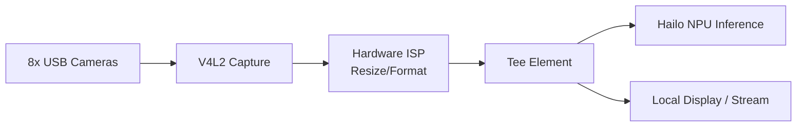

<p align="center">
  
</p>

# 📹 HYDRA-UMC-VISION-STREAMER

<p align="center"><a href="README.md">🇺🇸 English</a> | <a href="README_spa.md">🇪🇸 Español</a> | <a href="README_fra.md">🇫🇷 Français</a> | <a href="README_ita.md">🇮🇹 Italiano</a> | <a href="README_deu.md">🇩🇪 Deutsch</a> | 🇨🇳 <b>简体中文</b> | <a href="README_jpn.md">🇯🇵 日本語</a></p>

### 🚀 面向多摄像头边缘 AI 的优化 GStreamer 流水线

<p align="left">
  
  
  
  
  
</p>

---

## 1. 🛠️ 技术概述

**HYDRA-UMC-VISION-STREAMER** 旨在成为 Vision AI Node 系列的高性能媒体
接入层。其任务是对最多 8 路并发的 USB 3.0 摄像头流进行底层捕获、预处理
和分发，利用博通 BCM2712（CM5）的硬件加速 ISP，在帧到达 Hailo-8 NPU
之前完成色彩空间转换、缩放和归一化处理。

这是集成父项目 **[HYDRA-UMC-VISION-NODE](https://github.com/JuanenRac/HYDRA-UMC-VISION-NODE)** 4 个子项目之一：本项目仅负责捕获/预处理，不运行自己的 Hailo-8 推理、gRPC API 或安全逻辑——这些被刻意拆分到其另外 3 个同族项目中。

### 关键要点

* ✅ **真实 v0 —— 配置、流水线与中继生成：** `config.py` 校验逐摄像头的 JSON 配置（设备、分辨率、fps、格式）；`pipeline.py` 为一台摄像头生成真实的 GStreamer 流水线描述；`mediamtx_config.py` 生成对应的 MediaMTX `paths.yml`。通过下方的 `config validate`/`config gst`/`config mediamtx` 暴露——运行或测试都不需要 GStreamer 运行时、V4L2 或物理摄像头。
* 🔁 **真实 v0 —— 有界缓冲与重连：** `buffer.py` 的 `FrameBuffer` 是一个固定容量的队列，满了之后会丢弃最旧的（而不是最新的）条目——这是一个实时中继所需要的真实背压策略，能确保一个慢速消费者永远不会让本进程的内存无限增长。`reconnect.py` 的 `ConnectionTracker` 是针对断开的摄像头/中继链路的真实的、确定性的指数退避重连策略。通过下方的 `stream simulate` 暴露——完全无需 GStreamer 或物理摄像头即可测试。
* 📡 **RTSP/WebRTC 支持（部分计划中）：** RTSP 中继路径（`rtspclientsink` → MediaMTX）已经设计完成，其配置在上方已真实生成；真正运行它需要本环境不具备的 GStreamer 运行时。WebRTC 输出仍完全处于计划阶段。
* 🔌 **HailoRT 集成边界，先于模块本身准备就绪：** `hailo_runtime.py` 依据真实、已确认的 `hailo_platform` API(`VDevice`、`HEF`、`ConfigureParams`)编写——采用延迟导入,因此即使没有安装 `hailort` 包或没有 Hailo-8 模块存在,本仓库也能干净地安装/测试——此外还具备真实的预检验证,在向设备推送任何一帧之前,确认摄像头配置的分辨率确实与已加载模型的输入张量形状相匹配。*(已实现,仅为集成边界——真正运行推理并解析真实模型的 NMS 输出仍是未来的工作。)*
* ⚡ **零拷贝流水线（计划中）：** 设计 V4L2 与 HailoRT 之间的缓冲区交接，以避免不必要的帧拷贝。*（未来工作——需要本环境尚不具备的真实 V4L2/HailoRT 运行时。）*
* 🌈 **硬件预处理（计划中）：** 使用树莓派的 ISP 进行实时缩放和像素格式转换，卸载原本每帧都需 CPU 承担的工作。*（未来工作，原因相同。）*
* 🛠️ **动态配置：** 逐摄像头的分辨率、帧率和像素格式今天已经真实存在并会被校验（`config.py`）；曝光/增益控制需要真实的 V4L2 设备，属于未来工作。
* 🧩 **为何作为独立项目存在：** 捕获/ISP 调优所需的技能和故障域与模型推理或安全逻辑不同——将其保持在独立进程中，意味着一个捕获方面的漏洞不会波及 [HYDRA-UMC-SAFETY-ZONES](https://github.com/JuanenRac/HYDRA-UMC-SAFETY-ZONES)，并且两者可以独立开发/测试。

**诚实说明——今天实际运行的内容：** 配置校验、GStreamer 流水线描述生成、以及 MediaMTX 中继配置生成，以及真实的 HailoRT 集成边界（`config.py`、`pipeline.py`、`mediamtx_config.py`、`buffer.py`、`reconnect.py`、`hailo_runtime.py`）都是真实的并已经过测试（65 个测试）。其中没有任何一处会打开 V4L2 设备、导入 GStreamer，或与物理摄像头通信——真正运行生成的流水线需要本环境不具备的真实运行时和硬件。具体已交付内容请参见
[`CHANGELOG.md`](CHANGELOG.md)，尚待完成的内容请参见下方"当前状态与
后续步骤"章节。

---

## 2. 🔄 目标流水线架构

下图是本项目正朝其构建的目标数据流——其*形态*（哪个元素供给哪个、`Tee` 分支）由 `pipeline.py` 固定，并且今天已生成为真实的 `gst-launch-1.0` 语法，但这张图中的内容都还没有真正运行：那需要真实的 V4L2/GStreamer/Hailo-8 运行时和物理 USB 摄像头。



---

## 3. 🧠 高级技术信息

### 为何这里没有 `hardware/`、`firmware/`、`os/` 或 `models/`

与 [HYDRA-UMC](https://github.com/JuanenRac/HYDRA-UMC) 内部定制的
STM32H745/STM32G474 板卡不同，CM5 + Hailo-8 是现成硬件，没有需要自行
设计的板卡——因此 5 个 Vision AI Node 项目中都不存在
`hardware/`/`firmware/` 文件夹。`os/`（共享的 HydraOS 镜像）和
`models/`（实际提供给 NPU 的已编译 `.hef` 文件）仅存在于集成父项目
[HYDRA-UMC-VISION-NODE](https://github.com/JuanenRac/HYDRA-UMC-VISION-NODE) 中，因为它是持有 CM5 主机镜像和 Hailo-8 设备句柄的进程——在这里携带独立副本只会增加需要同步的状态，而没有任何好处。

### 计划中的流水线形态

上图中的 `Tee` 元素是已在实现之前做出的关键设计决策：捕获/预处理后的帧
被设计为同时分发给两个消费者——Hailo-8 推理路径（供给
[HYDRA-UMC-VISION-NODE](https://github.com/JuanenRac/HYDRA-UMC-VISION-NODE)）以及用于人工监控的可选本地显示/RTSP-WebRTC 流——而不让监控路径给推理路径增加延迟。

### 已做出的设计决策

* **版本从已安装的包元数据读取，而非硬编码** —— `main.py` 调用 `importlib.metadata.version("hydra-umc-vision-streamer")`，而非第二个 `__version__` 字符串，因此 `bump_version.py` 永远只有一处需要修改，两者永远不会失步。
* **里程表式递增只自动触及 `PATCH`/`MINOR`** —— `bump_version.py` 在 `PATCH` 超过 9 时进位到 `MINOR`，`MINOR` 超过 9 时进位到 `MAJOR`，但从不自行递增 `MAJOR`；这是一个刻意的人为决策，与 `HYDRA-UMC-EDITOR-URDF/bump_version.py` 和 `HYDRA-UMC-SUITE/bump_version.py` 的惯例相同。
* **MediaMTX 的 YAML 是手写的，而非基于 PyYAML** —— `mediamtx_config.py` 的输出形态（一个扁平的 `paths:` 映射，每台摄像头一条 `source: publisher` 条目）足够简单和固定，尚不足以证明引入一个真实依赖的合理性。如果逐摄像头配置增加了嵌套或列表值字段，届时再重新考虑。
* **流水线和 MediaMTX 配置必须在每台摄像头的一条 RTSP 路径上保持一致** —— `rtsp_url_for()` 是唯一推导该路径的地方（根据摄像头名称），因此 `config gst` 和 `config mediamtx` 永远不会在某台摄像头的流位于何处这件事上产生分歧。
* **`FrameBuffer` 在满了之后丢弃的是最旧的条目，而不是最新的。** 实时视频对不断增长的过期帧积压毫无用处——最新的一帧才始终是有用的。一个转而阻塞生产者的队列会危及真正的采集线程本身，而一个只是不断增长的队列则会正好带来这道关卡想要防止的无界内存故障。
* **`reconnect.py` 从不休眠，也从不亲自触碰真实的套接字。** `ConnectionTracker` 只跟踪状态，并把调用方应该等待多久返回给调用方——正是这种分离，让整个退避时间表（包括在达到 `max_attempts` 后诚实地放弃）在测试中可以精确复现，无需真实时钟或真实的摄像头链路参与。

---

## 📂 目录结构

```text
HYDRA-UMC-VISION-STREAMER/
├── src/                 # 源代码（hydra_umc_vision_streamer 包）
│   └── hydra_umc_vision_streamer/
│       ├── config.py           # 逐摄像头配置的解析/校验
│       ├── pipeline.py         # GStreamer 流水线描述生成
│       ├── buffer.py           # 真实的有界缓冲区（drop-oldest 背压策略）
│       ├── reconnect.py        # 真实的确定性重连/退避策略
│       ├── mediamtx_config.py  # MediaMTX paths.yml 生成
│       ├── hailo_runtime.py    # 真实的 HailoRT(hailo_platform)集成边界,延迟导入
│       ├── mjpeg_server.py     # 真实的 MJPEG 服务器 - 真正通过 HTTP 提供 USB 摄像头画面
│       └── main.py             # CLI 入口点（裸调用 + `config`/`stream`）
├── tests/               # 真实 pytest 套件（config、pipeline、mediamtx、buffer、reconnect、hailo_runtime、mjpeg_server、CLI）
├── docs/                # 文档与调优指南
├── build/               # 构建输出（本地 .venv 也存放于此）
├── images/              # 媒体与图表
├── systemd/
│   ├── hydra-umc-vision-streamer@.service  # 按摄像头实例化的 systemd 单元
│   └── cameras.env.example                 # 每实例环境文件示例
├── tools/
│   ├── build_test.py    # 不递增版本号的构建检查
│   └── ci_validate.py   # CI 使用的清单/CHANGELOG/文档校验
├── pyproject.toml       # 包元数据、依赖项、里程表版本号
├── bump_manifest_version.py # 将 hydra-umc.project.json 的版本与原生版本同步(--sync)
├── bump_version.py      # 里程表式版本递增（由 build.sh/.bat 运行）
├── build.sh / build.bat # venv + 可编辑安装 + 编译检查 + 测试
├── run.sh / run.bat     # 从本地 venv 运行入口点
└── CHANGELOG.md         # 逐版本历史（里程表方案，无日期）
```

没有 `hardware/`、`firmware/`、`os/` 或 `models/` 文件夹——原因见上方
"高级技术信息"。`os/` 和 `models/` 仅存在于集成父项目
[HYDRA-UMC-VISION-NODE](https://github.com/JuanenRac/HYDRA-UMC-VISION-NODE) 中。

---

## 🏗️ 构建与运行

### 前提条件

* `PATH` 中存在 **Python 3.10 或更新版本**（脚本先尝试 `python3`，再回退到 `python`）。
* 目前不需要任何 GStreamer、V4L2 工具或其他原生依赖——此阶段**没有任何第三方运行时依赖**（`pyproject.toml` 中 `dependencies = []`）。
* 本地虚拟环境（`.venv/` 下）需要数十 MB 磁盘空间。

### 逐步说明

```bash
# Linux / macOS
./build.sh
```

1. **里程表式版本递增** —— 运行 `bump_version.py`，每次构建时在 `pyproject.toml` 中递增 `PATCH`（按上述规则进位到 `MINOR`/`MAJOR`）。
2. **虚拟环境** —— 若 `.venv/` 不存在则创建；否则复用。
3. **可编辑安装** —— `pip install -e ".[dev]"`，使 `src/` 下的修改立即生效，安装 `pytest`，并注册 `hydra-umc-vision-streamer` 控制台入口点。
4. **编译检查** —— `python -m compileall -q src` 对 `src/` 下每个文件进行字节码编译，即使某个文件从未被 `main.py` 导入，也能在整个生态系统范围内捕获语法错误。
5. **真实测试套件** —— `python -m pytest tests/ -q`（65 个测试，覆盖 config、pipeline、MediaMTX 生成、缓冲/重连策略、HailoRT 集成边界和 CLI）。

`set -euo pipefail` 会在第一个失败步骤处停止脚本；只有全部 5 个步骤均
成功时，构建才会报告成功。

```bash
./run.sh
```

在 `.venv` 内定位解释器（同时处理 POSIX 和 Windows 的 `.venv` 目录结构），
运行 `python -m hydra_umc_vision_streamer.main` 并转发所有参数——裸调用会
打印名称 + 版本 + 角色。

真实示例——校验一份摄像头配置，生成其 GStreamer 流水线，并生成对应的 MediaMTX 中继配置：

```bash
./run.sh config validate --config cameras.json
# 2 camera(s) in cameras.json
#   cam0: /dev/video0 1920x1080@30 MJPG
#   cam1: /dev/video1 640x480@15 YUYV
# config OK

./run.sh config gst --config cameras.json --camera cam0
# v4l2src device=/dev/video0 ! image/jpeg,width=1920,height=1080,framerate=30/1 ! jpegdec ! videoconvert ! tee name=t t. ! queue ! appsink name=cam0_hailo_sink t. ! queue ! rtspclientsink location=rtsp://localhost:8554/cam0

./run.sh config mediamtx --config cameras.json
# paths:
#   cam0:
#     source: publisher
#   cam1:
#     source: publisher
```

真实示例——模拟一个慢速消费者对抗一个有界缓冲区，以及一次断开的连接
被真实的重连策略处理：

```bash
./run.sh stream simulate --buffer-size 8 --frames 1000 --consumer-rate 1000
# Pushed 1000 frame(s) through a buffer capped at 8
# Max buffer size observed: 8 (must never exceed 8)
# Frames dropped by backpressure: 972
#
# Simulated disconnect at frame 500
# Reconnect backoff schedule (s): [0.5, 1.0, 2.0, 4.0]
# Final connection state: given_up
```

```bat
:: Windows - 步骤相同，批处理语法
build.bat
run.bat
```

### 故障排查

* **找不到 `python`/`python3`** —— 安装 Python 3.10+ 并确保其在 `PATH` 中。
* **`compileall` 失败** —— 意味着 `src/` 下确实引入了语法错误；构建会故意在不触及安装的情况下停止。
* **`run.sh`/`run.bat` 提示"未找到 `.venv`"** —— 先至少运行一次 `build.sh`/`build.bat`；`run` 自身从不创建环境。
* **可编辑安装过期** —— 删除 `.venv/` 并重新构建；由于 `pip install -e .` 通常能实时识别源代码变更，这种情况很少需要。

---

## 🚀 当前状态与后续步骤

**今天已实现的内容：** 配置校验、GStreamer 流水线描述生成、以及 MediaMTX 中继配置生成（`config.py`、`pipeline.py`、`mediamtx_config.py`），一个真实的、可证明有界的缓冲区和一个真实的确定性重连策略（`buffer.py`、`reconnect.py`、`stream simulate`），一个真实的 HailoRT 集成边界（`hailo_runtime.py`），一旦真实的 Hailo-8 模块接入即可使用，以及一个真实的 v0 采集+推送路径（`mjpeg_server.py`、`stream serve`），通过 OpenCV 打开真实的 V4L2 设备并通过 HTTP 提供真实的 MJPEG - 可通过 `HYDRA-UMC-OS` 自身的 `provisioning/install_vision_streamer.sh` 安装到 CM5 上（每个由管理员分配的摄像头槽位对应一个 systemd 实例，`systemd/hydra-umc-vision-streamer@.service`），并已被 `HYDRA-UMC-SERVER` 的 `GET /api/camera/:id/stream` 代理和 `HYDRA-UMC-STUDIO` 的摄像头视图实时使用 - 共 65 个测试，再加上一个真实的、可安装的 Python 包，带有已验证的入口点，以及一个
已接入构建流程的里程表式版本递增机制。具体已捕获的构建/运行输出见 [`CHANGELOG.md`](CHANGELOG.md)。

**仍待完成、顺序不分先后、无既定时间表、且受限于真实硬件的内容：**

* 真正运行*已生成的流水线* - 完整的 GStreamer/PyGObject tee 到 Hailo-8 推理分支，而不是上面更简单的 OpenCV v0（`stream serve`） - 通过真实运行时。
* 硬件 ISP 缩放/格式转换（需要真实的 CM5 ISP）。
* 真正通过 `hailo_runtime.py` 运行推理（需要真实的 Hailo-8 模块和真实编译的 `.hef`），并解析该真实模型的 NMS 输出格式 - 在没有设备验证的情况下故意不做猜测。
* WebRTC 输出，以及逐摄像头曝光/增益控制（需要真实的 V4L2 设备）。
* `stream serve` 尚未针对真实物理连接的 USB 摄像头进行过验证 - 仅针对在模块边界处模拟的 `cv2.VideoCapture` 进行过验证（见 `tests/test_mjpeg_server.py`）。

---

## 🔗 相关项目

本项目是同一作者(JuanenRac / Electro Hobby 3D)打造的 HYDRA-UMC 机器人生态系统的一部分。值得了解,因为某个请求实际上可能是关于这些项目之一,而非本仓库本身。

**父项目**
- **[HYDRA-UMC-VISION-NODE](https://github.com/JuanenRac/HYDRA-UMC-VISION-NODE)** — 面向 Hailo-8 视觉流水线的集成中枢,具备逐阶段的真实硬件就绪检测;本仓库是其自身感知流水线中一个具体阶段或消费者所属的父项目。

**兄弟项目** —— HYDRA-UMC-VISION-NODE 自身 Hailo-8 感知流水线中的其他阶段/消费者
- **[HYDRA-UMC-DETECTION-HEF](https://github.com/JuanenRac/HYDRA-UMC-DETECTION-HEF)** — 具备 Hailo 架构/校验和安全加载验证的真实编译模型注册表。
- **[HYDRA-UMC-SAFETY-ZONES](https://github.com/JuanenRac/HYDRA-UMC-SAFETY-ZONES)** — 具备校准新鲜度强制检查的真实区域入侵检测与 E-STOP 请求。
- **[HYDRA-UMC-VISUAL-SERVOING-API](https://github.com/JuanenRac/HYDRA-UMC-VISUAL-SERVOING-API)** — 具备真实 Position-Based Visual Servoing 修正律，并依据上游区域状态进行安全门控。

**生态系统中的其他项目**

*核心硬件与平台*
- **[HYDRA-UMC](https://github.com/JuanenRac/HYDRA-UMC)** — 机器人手臂的真实主板——CM5 主机 + 双核 STM32H745，通过 CAN-OTA/SPI-OTA 协调最多 8 条工具臂。
- **[HYDRA-UMC-OS](https://github.com/JuanenRac/HYDRA-UMC-OS)** — 面向 CM5 的可复现 Raspberry Pi OS 产品层——只读代理、经过验证的配置/配置文件、WiFi 首次配网。
- **[HYDRA-UMC-SDK](https://github.com/JuanenRac/HYDRA-UMC-SDK)** — 每个桥接都据此校验自身指令的共享 JSON-Schema 契约与安全门限边界。

*核心后端与客户端*
- **[HYDRA-UMC-SERVER](https://github.com/JuanenRac/HYDRA-UMC-SERVER)** — 每个控制客户端真正通信的真实无头后端(REST/WebSocket)。
- **[HYDRA-UMC-STUDIO](https://github.com/JuanenRac/HYDRA-UMC-STUDIO)** — 具有实时多机器人 3D 可视化的网页控制面板。
- **[HYDRA-UMC-SUITE](https://github.com/JuanenRac/HYDRA-UMC-SUITE)** — 面向多台服务器的桌面(PySide6)集群指挥中心，打包为独立可执行文件。
- **[HYDRA-UMC-ANDROID-CONTROL](https://github.com/JuanenRac/HYDRA-UMC-ANDROID-CONTROL)** — 具有生物识别登录和配对 Wear OS 伴侣应用的原生 Android 控制应用。
- **[HYDRA-UMC-IOS-CONTROL](https://github.com/JuanenRac/HYDRA-UMC-IOS-CONTROL)** — 具有实时 WebSocket 同步的 iOS/iPadOS 控制应用(Flutter)。
- **[HYDRA-UMC-DSI](https://github.com/JuanenRac/HYDRA-UMC-DSI)** — 面向机载 7 英寸 DSI 触摸屏的原生触控界面，直接嵌入 CM5 本体。
- **[HYDRA-UMC-EDITOR-URDF](https://github.com/JuanenRac/HYDRA-UMC-EDITOR-URDF)** — 将完成的模型推送到 STUDIO 自身目录的桌面版图形化 URDF 创建/编辑工具。
- **[HYDRA-UMC-BRIDGE-AMR](https://github.com/JuanenRac/HYDRA-UMC-BRIDGE-AMR)** — 通过真实的 VDA 5050 MQTT 发布者为 AGV/AMR 车队提供的协调边界。
- **[HYDRA-UMC-BRIDGE-CNC](https://github.com/JuanenRac/HYDRA-UMC-BRIDGE-CNC)** — 具备真实 GRBL 状态/控制字节访问能力的高层 CNC 单元协调器。
- **[HYDRA-UMC-BRIDGE-DROIDS](https://github.com/JuanenRac/HYDRA-UMC-BRIDGE-DROIDS)** — 面向足式/人形机器人的协调边界，具备真实的 Boston Dynamics Spot 指令发送器。
- **[HYDRA-UMC-BRIDGE-LASER](https://github.com/JuanenRac/HYDRA-UMC-BRIDGE-LASER)** — 读取 3 项真实钥匙/外壳/联锁 GPIO 安全信号的激光单元安全协调器。
- **[HYDRA-UMC-BRIDGE-OPENPNP](https://github.com/JuanenRac/HYDRA-UMC-BRIDGE-OPENPNP)** — 面向 OpenPnP 贴片机板级流程的安全高层协调器。
- **[HYDRA-UMC-BRIDGE-PRINTER3D](https://github.com/JuanenRac/HYDRA-UMC-BRIDGE-PRINTER3D)** — 面向 Moonraker/Klipper 3D 打印机的安全协调边界，具备真实的受控作业指令。
- **[HYDRA-UMC-BRIDGE-ROS2](https://github.com/JuanenRac/HYDRA-UMC-BRIDGE-ROS2)** — 具备真实的惰性导入 rclpy ROS 2 传输层的安全协调器。
- **[HYDRA-UMC-BRIDGE-UAV](https://github.com/JuanenRac/HYDRA-UMC-BRIDGE-UAV)** — 面向搭载摄像头的无人机的协调边界，具备真实的 MAVLink 指令发送器。

*URTC 工具平台*
- **[URTC](https://github.com/JuanenRac/URTC)** — 面向实体 Universal Robot Tool Controller 板卡的固件，通过 CAN 总线支持 25 种以上工具配置。
- **[URTC-FLASHER](https://github.com/JuanenRac/URTC-FLASHER)** — 面向 URTC 板卡的桌面图形烧录工具，支持 CAN-OTA 以及全芯片 SWD/JTAG。
- **[URTC-TESTER](https://github.com/JuanenRac/URTC-TESTER)** — 面向 URTC 板卡的桌面实时 CAN 总线诊断工具，每种工具配置对应一个面板。
- **[URTC-WEB-STUDIO](https://github.com/JuanenRac/URTC-WEB-STUDIO)** — 通过 Web Serial API 实现的浏览器版 URTC-TESTER 替代方案，无需本地安装。

*认知 AI 节点(Hailo-10)*
- **[HYDRA-UMC-COGNITIVE-NODE](https://github.com/JuanenRac/HYDRA-UMC-COGNITIVE-NODE)** — 面向 Hailo-10 认知流水线(LLM/VLA/语音编排)的集成中枢。
- **[HYDRA-UMC-VLA-ENGINE](https://github.com/JuanenRac/HYDRA-UMC-VLA-ENGINE)** — 面向 Vision-Language-Action 模型的真实动作 token 编解码与轨迹生成。
- **[HYDRA-UMC-VOICE-UI](https://github.com/JuanenRac/HYDRA-UMC-VOICE-UI)** — 具备受限、需确认的 Watch 中继的真实语音前端(VAD + 意图解析)。
- **[HYDRA-UMC-SEMANTIC-PLANNER](https://github.com/JuanenRac/HYDRA-UMC-SEMANTIC-PLANNER)** — 基于真实规则的任务分解，以及针对 MCU 错误码的语义化错误恢复。
- **[HYDRA-UMC-DOCS-QA](https://github.com/JuanenRac/HYDRA-UMC-DOCS-QA)** — 面向本生态系统自身 Markdown 文档的真实纯标准库 TF-IDF 文档检索。

*编排与集群*
- **[HYDRA-UMC-ORCHESTRATOR](https://github.com/JuanenRac/HYDRA-UMC-ORCHESTRATOR)** — 具备真实 gRPC/Protobuf 健康报告契约与任务状态机的集成中枢。
- **[HYDRA-UMC-JOB-DISPATCHER](https://github.com/JuanenRac/HYDRA-UMC-JOB-DISPATCHER)** — 基于真实 HTTP API 的真实优先级任务队列，支持去重。
- **[HYDRA-UMC-NODE-HEALING](https://github.com/JuanenRac/HYDRA-UMC-NODE-HEALING)** — 具备重试/退避与身份不匹配检测的真实基于 gRPC 的车队健康看门狗。
- **[HYDRA-UMC-PATH-PLANNER-3D](https://github.com/JuanenRac/HYDRA-UMC-PATH-PLANNER-3D)** — 具备真实障碍物/工作空间碰撞校验的真实基于 RRT 的三维路径规划器。
- **[HYDRA-UMC-SWARM-SYNC](https://github.com/JuanenRac/HYDRA-UMC-SWARM-SYNC)** — 经过多单元收敛属性测试的真实 CRDT LWW-Element-Map 状态同步。

*数字孪生与仿真*
- **[HYDRA-UMC-TWIN](https://github.com/JuanenRac/HYDRA-UMC-TWIN)** — 面向数字孪生引擎的集成中枢，具备真实的版本兼容性同步契约。
- **[HYDRA-UMC-HIL-BRIDGE](https://github.com/JuanenRac/HYDRA-UMC-HIL-BRIDGE)** — 在仿真与真实硬件之间路由指令的真实硬件在环安全联锁。
- **[HYDRA-UMC-PHYSICS-REPLICA](https://github.com/JuanenRac/HYDRA-UMC-PHYSICS-REPLICA)** — 面向真实 URDF 子集的真实正向运动学与关节限位校验。
- **[HYDRA-UMC-SYNTHETIC-DATA-GEN](https://github.com/JuanenRac/HYDRA-UMC-SYNTHETIC-DATA-GEN)** — 具备 YOLO/COCO 标注导出功能的真实程序化 2D 场景生成器。

*数据与分析*
- **[HYDRA-UMC-DATALAKE](https://github.com/JuanenRac/HYDRA-UMC-DATALAKE)** — 具备真实数据摄入/查询 HTTP API 的真实 sqlite3 时序数据存储。
- **[HYDRA-UMC-ANOMALY-DETECTOR](https://github.com/JuanenRac/HYDRA-UMC-ANOMALY-DETECTOR)** — 具备漂移监测能力的真实 FFT + 统计基线异常检测器。
- **[HYDRA-UMC-PRODUCTION-REPORTS](https://github.com/JuanenRac/HYDRA-UMC-PRODUCTION-REPORTS)** — 基于 DATALAKE 历史数据的真实 OEE/可用率计算，支持可复现的 CSV 导出。
- **[HYDRA-UMC-TELEMETRY-COLLECTOR](https://github.com/JuanenRac/HYDRA-UMC-TELEMETRY-COLLECTOR)** — 面向 DATALAKE 的真实 CAN/WebSocket 数据摄入管道，支持序列去重。

*工业网关*
- **[HYDRA-UMC-GATEWAY-INDUSTRIAL](https://github.com/JuanenRac/HYDRA-UMC-GATEWAY-INDUSTRIAL)** — 中继至工业协议的集成中枢，具备真实的指令白名单/背压控制层。
- **[HYDRA-UMC-OPCUA-SERVER](https://github.com/JuanenRac/HYDRA-UMC-OPCUA-SERVER)** — 经真实二进制协议客户端会话验证的真实 OPC-UA 地址空间。
- **[HYDRA-UMC-MQTT-BROKER](https://github.com/JuanenRac/HYDRA-UMC-MQTT-BROKER)** — 具备可选按客户端认证与主题 ACL 的真实 MQTT 代理。
- **[HYDRA-UMC-MTCONNECT-ADAPTER](https://github.com/JuanenRac/HYDRA-UMC-MTCONNECT-ADAPTER)** — 具备降级模式输出的真实 MTConnect `/probe` 与 `/current` XML 端点。

*辅助工具与生态系统运维*
- **[HYDRA-UMC-DASHBOARD-AI](https://github.com/JuanenRac/HYDRA-UMC-DASHBOARD-AI)** — 基于 DATALAKE/ANOMALY-DETECTOR 的智能摘要与异常高亮面板，具备诚实的统计回退机制。
- **[HYDRA-UMC-TOOL-CLI](https://github.com/JuanenRac/HYDRA-UMC-TOOL-CLI)** — 具备真实、稳定退出码契约的车队 CLI，是 HYDRA-UMC-SERVER 自身 API 的真实在线客户端。
- **[HYDRA-UMC-WATCH](https://github.com/JuanenRac/HYDRA-UMC-WATCH)** — 具备真实触觉提醒与配对手机语音中继功能的 WearOS 伴侣应用。
- **[URTC-SMART-RACK](https://github.com/JuanenRac/URTC-SMART-RACK)** — 面向板卡安装机架的固件，具备真实的工具 ID 解码与 Smart Idle 预热逻辑。
- **[URTC-VISION-TOOL](https://github.com/JuanenRac/URTC-VISION-TOOL)** — 面向热成像/RGB 检测工具头的固件及真实 Python 视觉伴侣程序。
- **[HYDRA-UMC-UPDATER](https://github.com/JuanenRac/HYDRA-UMC-UPDATER)** — 发现、克隆并更新本生态系统中每个仓库的管理类桌面工具。

---

## 👤 作者
**JuanenRac** (Electro Hobby 3D)
📧 electrohobby3d@gmail.com
📺 [youtube.com/@electrohobby3d](https://youtube.com/@electrohobby3d)

## 📜 许可证
GPL-3.0 —— 详见 LICENSE。
