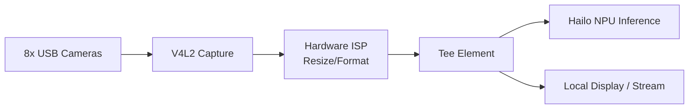

<p align="center">
  
</p>

# 📹 HYDRA-UMC-VISION-STREAMER

<p align="center"><a href="README.md">🇺🇸 English</a> | <a href="README_spa.md">🇪🇸 Español</a> | <a href="README_fra.md">🇫🇷 Français</a> | <a href="README_ita.md">🇮🇹 Italiano</a> | <a href="README_deu.md">🇩🇪 Deutsch</a> | 🇨🇳 <b>简体中文</b> | <a href="README_jpn.md">🇯🇵 日本語</a></p>

### 🚀 面向多摄像头边缘 AI 的优化 GStreamer 流水线

<p align="left">
  
  
  
  
  
</p>

---

## 1. 🛠️ 技术概述

**HYDRA-UMC-VISION-STREAMER** 旨在成为 Vision AI Node 系列的高性能媒体
接入层。其任务是对最多 8 路并发的 USB 3.0 摄像头流进行底层捕获、预处理
和分发，利用博通 BCM2712（CM5）的硬件加速 ISP，在帧到达 Hailo-8 NPU
之前完成色彩空间转换、缩放和归一化处理。

这是集成父项目 **[HYDRA-UMC-VISION-NODE](https://github.com/JuanenRac/HYDRA-UMC-VISION-NODE)** 4 个子项目之一：本项目仅负责捕获/预处理，不运行自己的 Hailo-8 推理、gRPC API 或安全逻辑——这些被刻意拆分到其另外 3 个同族项目中。

### 关键要点

* ⚡ **零拷贝流水线（计划中）：** 设计 V4L2 与 HailoRT 之间的缓冲区交接，以避免不必要的帧拷贝。
* 🌈 **硬件预处理（计划中）：** 使用树莓派的 ISP 进行实时缩放和像素格式转换，卸载原本每帧都需 CPU 承担的工作。
* 📡 **RTSP/WebRTC 支持（计划中）：** 可选的低延迟对外流媒体输出，用于无需经过完整检测流水线的远程监控。
* 🛠️ **动态配置（计划中）：** 逐摄像头的曝光、增益和分辨率控制。
* 🧩 **为何作为独立项目存在：** 捕获/ISP 调优所需的技能和故障域与模型推理或安全逻辑不同——将其保持在独立进程中，意味着一个捕获方面的漏洞不会波及 [HYDRA-UMC-SAFETY-ZONES](https://github.com/JuanenRac/HYDRA-UMC-SAFETY-ZONES)，并且两者可以独立开发/测试。

**诚实说明——今天实际运行的内容：** 本仓库目前处于骨架阶段。真正的入口点
（`src/hydra_umc_vision_streamer/main.py`）会打印项目名称、已安装的版本
号，以及一行角色说明，然后以退出码 0 结束。上文描述的 GStreamer 流水线、
V4L2 捕获、ISP 集成或流媒体逻辑均尚未在代码中实现。具体已交付内容请参见
[`CHANGELOG.md`](CHANGELOG.md)，尚待完成的内容请参见下方"当前状态与
后续步骤"章节。

---

## 2. 🔄 目标流水线架构

下图是本骨架项目正朝其构建的目标数据流，而非当前已运行的流水线。



---

## 3. 🧠 高级技术信息

### 为何这里没有 `hardware/`、`firmware/`、`os/` 或 `models/`

与 [HYDRA-UMC](https://github.com/JuanenRac/HYDRA-UMC) 内部定制的
STM32H745/STM32G474 板卡不同，CM5 + Hailo-8 是现成硬件，没有需要自行
设计的板卡——因此 5 个 Vision AI Node 项目中都不存在
`hardware/`/`firmware/` 文件夹。`os/`（共享的 HydraOS 镜像）和
`models/`（实际提供给 NPU 的已编译 `.hef` 文件）仅存在于集成父项目
[HYDRA-UMC-VISION-NODE](https://github.com/JuanenRac/HYDRA-UMC-VISION-NODE) 中，因为它是持有 CM5 主机镜像和 Hailo-8 设备句柄的进程——在这里携带独立副本只会增加需要同步的状态，而没有任何好处。

### 计划中的流水线形态

上图中的 `Tee` 元素是已在实现之前做出的关键设计决策：捕获/预处理后的帧
被设计为同时分发给两个消费者——Hailo-8 推理路径（供给
[HYDRA-UMC-VISION-NODE](https://github.com/JuanenRac/HYDRA-UMC-VISION-NODE)）以及用于人工监控的可选本地显示/RTSP-WebRTC 流——而不让监控路径给推理路径增加延迟。

### 本骨架中已做出的设计决策

* **版本从已安装的包元数据读取，而非硬编码** —— `main.py` 调用 `importlib.metadata.version("hydra-umc-vision-streamer")`，而非第二个 `__version__` 字符串，因此 `bump_version.py` 永远只有一处需要修改，两者永远不会失步。
* **里程表式递增只自动触及 `PATCH`/`MINOR`** —— `bump_version.py` 在 `PATCH` 超过 9 时进位到 `MINOR`，`MINOR` 超过 9 时进位到 `MAJOR`，但从不自行递增 `MAJOR`；这是一个刻意的人为决策，与 `HYDRA-UMC-EDITOR-URDF/bump_version.py` 和 `HYDRA-UMC-SUITE/bump_version.py` 的惯例相同。

---

## 📂 目录结构

```text
HYDRA-UMC-VISION-STREAMER/
├── src/                 # 源代码（hydra_umc_vision_streamer 包）
├── docs/                # 文档与调优指南
├── build/               # 构建输出（本地 .venv 也存放于此）
├── images/              # 媒体与图表
├── scripts/             # 实用脚本
├── pyproject.toml       # 包元数据、依赖项、里程表版本号
├── bump_version.py      # 里程表式版本递增（由 build.sh/.bat 运行）
├── build.sh / build.bat # venv + 可编辑安装 + 编译检查
├── run.sh / run.bat     # 从本地 venv 运行入口点
└── CHANGELOG.md         # 逐版本历史（里程表方案，无日期）
```

没有 `hardware/`、`firmware/`、`os/` 或 `models/` 文件夹——原因见上方
"高级技术信息"。`os/` 和 `models/` 仅存在于集成父项目
[HYDRA-UMC-VISION-NODE](https://github.com/JuanenRac/HYDRA-UMC-VISION-NODE) 中。

---

## 🏗️ 构建与运行

### 前提条件

* `PATH` 中存在 **Python 3.10 或更新版本**（脚本先尝试 `python3`，再回退到 `python`）。
* 目前不需要任何 GStreamer、V4L2 工具或其他原生依赖——此阶段**没有任何第三方运行时依赖**（`pyproject.toml` 中 `dependencies = []`）。
* 本地虚拟环境（`.venv/` 下）需要数十 MB 磁盘空间。

### 逐步说明

```bash
# Linux / macOS
./build.sh
```

1. **里程表式版本递增** —— 运行 `bump_version.py`，每次构建时在 `pyproject.toml` 中递增 `PATCH`（按上述规则进位到 `MINOR`/`MAJOR`）。
2. **虚拟环境** —— 若 `.venv/` 不存在则创建；否则复用。
3. **可编辑安装** —— `pip install -e .`，使 `src/` 下的修改立即生效，并注册 `hydra-umc-vision-streamer` 控制台入口点。
4. **编译检查** —— `python -m compileall -q src` 对 `src/` 下每个文件进行字节码编译，即使某个文件从未被 `main.py` 导入，也能在整个生态系统范围内捕获语法错误。

`set -euo pipefail` 会在第一个失败步骤处停止脚本；只有全部 4 个步骤均
成功时才打印 `== Build OK ==`。

```bash
./run.sh
```

在 `.venv` 内定位解释器（同时处理 POSIX 和 Windows 的 `.venv` 目录结构），
运行 `python -m hydra_umc_vision_streamer.main`，打印名称 + 版本 + 角色。

```bat
:: Windows - 步骤相同，批处理语法
build.bat
run.bat
```

### 故障排查

* **找不到 `python`/`python3`** —— 安装 Python 3.10+ 并确保其在 `PATH` 中。
* **`compileall` 失败** —— 意味着 `src/` 下确实引入了语法错误；构建会故意在不触及安装的情况下停止。
* **`run.sh`/`run.bat` 提示"未找到 `.venv`"** —— 先至少运行一次 `build.sh`/`build.bat`；`run` 自身从不创建环境。
* **可编辑安装过期** —— 删除 `.venv/` 并重新构建；由于 `pip install -e .` 通常能实时识别源代码变更，这种情况很少需要。

---

## 🚀 当前状态与后续步骤

**今天已实现的内容：** 一个真实的、可安装的 Python 包，带有已验证的入口点
（具体已捕获的构建/运行输出见 [`CHANGELOG.md`](CHANGELOG.md)），以及一个
已接入构建流程的里程表式版本递增机制。

**仍待完成的内容（顺序不分先后，无既定时间表）：**

* 真实的 GStreamer 流水线（捕获、`Tee`、ISP 集成）。
* 来自最多 8 路 USB 3.0 摄像头的 V4L2 捕获以及硬件 ISP 缩放/格式转换。
* 向 [HYDRA-UMC-VISION-NODE](https://github.com/JuanenRac/HYDRA-UMC-VISION-NODE) 所拥有的 Hailo-8 运行时的零拷贝交接。
* 可选的 RTSP/WebRTC 输出以及逐摄像头动态配置（曝光、增益、分辨率）。

---

## 🔗 相关项目

本项目是同一作者（JuanenRac / Electro Hobby 3D）打造的更大规模机器人生态
系统的一部分，涵盖固件、控制软件、AI 节点和车队工具。值得了解，因为某个
需求实际上可能是关于这些项目之一，而非本仓库。

### 项目族

**父项目：** **[HYDRA-UMC-VISION-NODE](https://github.com/JuanenRac/HYDRA-UMC-VISION-NODE)** —— 本流水线所供给的集成父项目。

**同族项目：**
- **[HYDRA-UMC-DETECTION-HEF](https://github.com/JuanenRac/HYDRA-UMC-DETECTION-HEF)** —— 编译父项目加载到其 Hailo-8 NPU 上的 `.hef` 模型。
- **[HYDRA-UMC-SAFETY-ZONES](https://github.com/JuanenRac/HYDRA-UMC-SAFETY-ZONES)** —— 将父项目的感知结果转化为入侵检测和 E-STOP 触发。
- **[HYDRA-UMC-VISUAL-SERVOING-API](https://github.com/JuanenRac/HYDRA-UMC-VISUAL-SERVOING-API)** —— 将父项目的感知结果转化为运动学位姿修正。

本项目在 Vision AI Node 系列之外没有直接关联的项目（根据生态系统自身的
关系图谱）——其余所有内容请见下方"生态系统的其余部分"。

### 生态系统的其余部分

**HYDRA-UMC 平台** —— 多机器人微工厂单元
- **[HYDRA-UMC](https://github.com/JuanenRac/HYDRA-UMC)** —— 协调最多 8 条机械臂的 CM5 + STM32H745 主板。
- **[HYDRA-UMC-SERVER](https://github.com/JuanenRac/HYDRA-UMC-SERVER)** —— 每个控制客户端所对接的 Express/WebSocket 后端。
- **[HYDRA-UMC-STUDIO](https://github.com/JuanenRac/HYDRA-UMC-STUDIO)** —— 基于 Web 的控制仪表盘，多机器人 3D 可视化。
- **[HYDRA-UMC-ANDROID-CONTROL](https://github.com/JuanenRac/HYDRA-UMC-ANDROID-CONTROL)** —— 通过 Wi-Fi/蓝牙的 Android 控制应用。
- **[HYDRA-UMC-IOS-CONTROL](https://github.com/JuanenRac/HYDRA-UMC-IOS-CONTROL)** —— 基于 Flutter 构建的 iOS/iPadOS 控制应用。
- **[HYDRA-UMC-SUITE](https://github.com/JuanenRac/HYDRA-UMC-SUITE)** —— 桌面端集群指挥中心（Python/PySide6）。
- **[HYDRA-UMC-EDITOR-URDF](https://github.com/JuanenRac/HYDRA-UMC-EDITOR-URDF)** —— 用于机器人目录的桌面端 URDF 模型编辑器。
- **[HYDRA-UMC-DSI](https://github.com/JuanenRac/HYDRA-UMC-DSI)** —— 机载 DSI 触摸屏的原生触控 UI。

**URTC 平台** —— 每台 HYDRA-UMC 机械臂搭载的工具头控制器
- **[URTC](https://github.com/JuanenRac/URTC)** —— CAN 总线工具头控制器，25 种工具配置。
- **[URTC-FLASHER](https://github.com/JuanenRac/URTC-FLASHER)** —— 桌面端 CAN-OTA + SWD/JTAG 刷写工具。
- **[URTC-TESTER](https://github.com/JuanenRac/URTC-TESTER)** —— 桌面端实时 CAN 总线诊断工具。
- **[URTC-WEB-STUDIO](https://github.com/JuanenRac/URTC-WEB-STUDIO)** —— 通过 Web Serial API 的浏览器端替代方案。

**🧠 认知 AI 节点（Hailo-10）**
- [HYDRA-UMC-COGNITIVE-NODE](https://github.com/JuanenRac/HYDRA-UMC-COGNITIVE-NODE)
- [HYDRA-UMC-VLA-ENGINE](https://github.com/JuanenRac/HYDRA-UMC-VLA-ENGINE)
- [HYDRA-UMC-VOICE-UI](https://github.com/JuanenRac/HYDRA-UMC-VOICE-UI)
- [HYDRA-UMC-SEMANTIC-PLANNER](https://github.com/JuanenRac/HYDRA-UMC-SEMANTIC-PLANNER)
- [HYDRA-UMC-DOCS-QA](https://github.com/JuanenRac/HYDRA-UMC-DOCS-QA)

**🐝 编排与集群**
- [HYDRA-UMC-ORCHESTRATOR](https://github.com/JuanenRac/HYDRA-UMC-ORCHESTRATOR)
- [HYDRA-UMC-SWARM-SYNC](https://github.com/JuanenRac/HYDRA-UMC-SWARM-SYNC)
- [HYDRA-UMC-PATH-PLANNER-3D](https://github.com/JuanenRac/HYDRA-UMC-PATH-PLANNER-3D)
- [HYDRA-UMC-JOB-DISPATCHER](https://github.com/JuanenRac/HYDRA-UMC-JOB-DISPATCHER)
- [HYDRA-UMC-NODE-HEALING](https://github.com/JuanenRac/HYDRA-UMC-NODE-HEALING)

**🎮 数字孪生与仿真**
- [HYDRA-UMC-TWIN](https://github.com/JuanenRac/HYDRA-UMC-TWIN)
- [HYDRA-UMC-PHYSICS-REPLICA](https://github.com/JuanenRac/HYDRA-UMC-PHYSICS-REPLICA)
- [HYDRA-UMC-HIL-BRIDGE](https://github.com/JuanenRac/HYDRA-UMC-HIL-BRIDGE)
- [HYDRA-UMC-SYNTHETIC-DATA-GEN](https://github.com/JuanenRac/HYDRA-UMC-SYNTHETIC-DATA-GEN)

**📊 数据与分析**
- [HYDRA-UMC-DATALAKE](https://github.com/JuanenRac/HYDRA-UMC-DATALAKE)
- [HYDRA-UMC-TELEMETRY-COLLECTOR](https://github.com/JuanenRac/HYDRA-UMC-TELEMETRY-COLLECTOR)
- [HYDRA-UMC-ANOMALY-DETECTOR](https://github.com/JuanenRac/HYDRA-UMC-ANOMALY-DETECTOR)
- [HYDRA-UMC-PRODUCTION-REPORTS](https://github.com/JuanenRac/HYDRA-UMC-PRODUCTION-REPORTS)

**🏭 工业网关**
- [HYDRA-UMC-GATEWAY-INDUSTRIAL](https://github.com/JuanenRac/HYDRA-UMC-GATEWAY-INDUSTRIAL)
- [HYDRA-UMC-OPCUA-SERVER](https://github.com/JuanenRac/HYDRA-UMC-OPCUA-SERVER)
- [HYDRA-UMC-MQTT-BROKER](https://github.com/JuanenRac/HYDRA-UMC-MQTT-BROKER)
- [HYDRA-UMC-MTCONNECT-ADAPTER](https://github.com/JuanenRac/HYDRA-UMC-MTCONNECT-ADAPTER)

**🛠️ 配套工具**
- [URTC-SMART-RACK](https://github.com/JuanenRac/URTC-SMART-RACK)
- [URTC-VISION-TOOL](https://github.com/JuanenRac/URTC-VISION-TOOL)
- [HYDRA-UMC-WATCH](https://github.com/JuanenRac/HYDRA-UMC-WATCH)
- [HYDRA-UMC-TOOL-CLI](https://github.com/JuanenRac/HYDRA-UMC-TOOL-CLI)
- [HYDRA-UMC-DASHBOARD-AI](https://github.com/JuanenRac/HYDRA-UMC-DASHBOARD-AI)

---

## 👤 作者
**JuanenRac**（Electro Hobby 3D）
📧 electrohobby3d@gmail.com

## 📜 许可证
GPL-3.0 —— 详见 LICENSE。

## 关联项目

> Canonical public ecosystem relationship map.

**Direct integrations:**
[HYDRA-UMC-OS](https://github.com/JuanenRac/HYDRA-UMC-OS) · [HYDRA-UMC-SDK](https://github.com/JuanenRac/HYDRA-UMC-SDK) · [HYDRA-UMC-SERVER](https://github.com/JuanenRac/HYDRA-UMC-SERVER) · [URTC](https://github.com/JuanenRac/URTC) · [HYDRA-UMC-VISION-NODE](https://github.com/JuanenRac/HYDRA-UMC-VISION-NODE) · [HYDRA-UMC-DETECTION-HEF](https://github.com/JuanenRac/HYDRA-UMC-DETECTION-HEF) · [HYDRA-UMC-SAFETY-ZONES](https://github.com/JuanenRac/HYDRA-UMC-SAFETY-ZONES)

**Platform and contracts:**
[HYDRA-UMC-OS](https://github.com/JuanenRac/HYDRA-UMC-OS) · [HYDRA-UMC-SDK](https://github.com/JuanenRac/HYDRA-UMC-SDK)

**Rest of the ecosystem:**
All remaining public repositories are grouped by the seven ecosystem layers in the [JuanenRac ecosystem dashboard](https://juanenrac.github.io/JuanenRac/).
